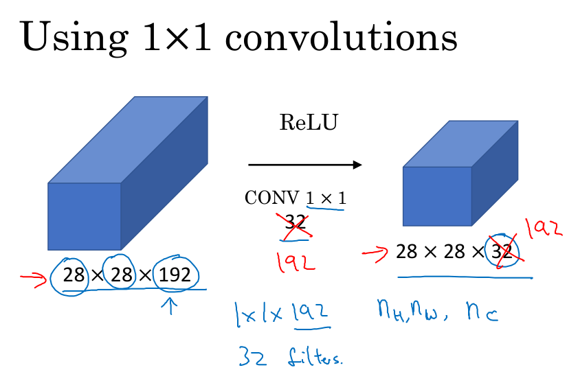
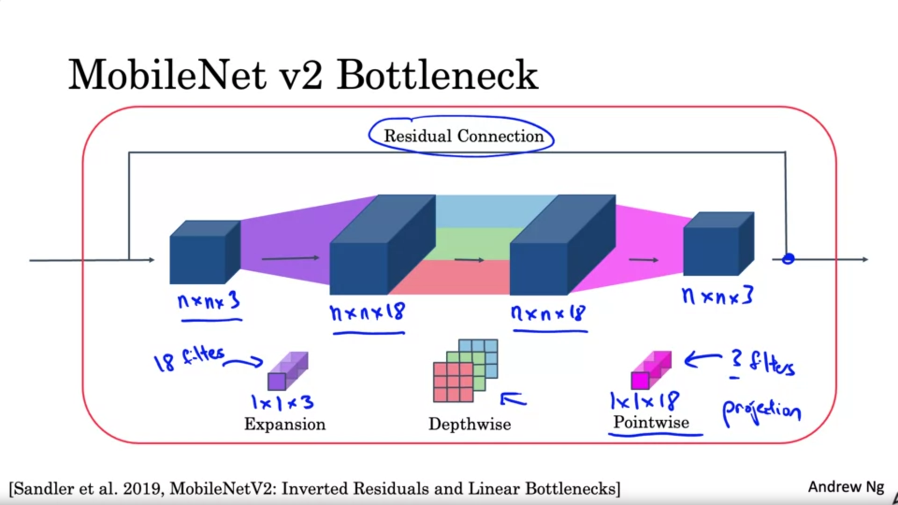
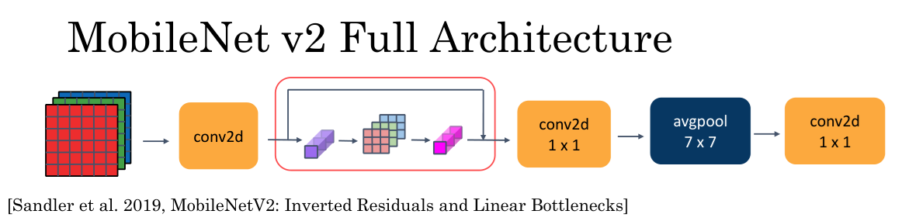

# Classic Networks

In this chapter, we'll see some of the classic neural network architecture starting with LeNet-5, and then AlexNet, and then VGGNet. Then we'll see ResNets, Inception network, the MobileNet and EfficientNet architectures.

## LeNet-5 architecture

Here is the LeNet-5 architecture. You start off with an image which say, 32 by 32 by 1. And the goal of LeNet-5 was to recognize handwritten digits. LeNet-5 was trained on grayscale images, which is why it's 32 by 32 by 1. 

In the first step, you use a set of six, 5 by 5 filters with a stride of one and no padding. The image dimensions reduces from 32 by 32 down to 28 by 28. 

Then the LeNet neural network applies average pooling and with a filter width 2 by 2 and a stride of two, you end up reducing the input dimensions, the height and width by a factor of two: so we now end up with a 14 by 14 by 6 volume.
Back then when this paper was written, people use average pooling much more. If you're building a modern variant, you probably use max pooling instead. 

Next, you apply another convolutional layer. This time you use a set of 16 filters, with 5 by 5 size, so you end up with 16 channels to the next volume.  Back when this paper was written in 1998, people were always using valid convolutions, which is why every time you apply convolutional layer, they heightened with strengths. So that's why, here, you go from 14 to 14 down to 10 by 10. 

Then another pooling layer, that reduces the height and width by a factor of two, then you end up with 5 by 5. And if you multiply all these numbers 5 by 5 by 16, this multiplies up to 400. 

And the next layer is then a fully connected layer that fully connects each of these 400 nodes with every one of 120 neurons. 

And then another fully connected layer. The final step is it uses these essentially 84 features and uses it with one final output. You could draw one more node here to make a prediction for ŷ. And ŷ took on 10 possible values corresponding to recognising each of the digits from 0 to 9. A modern version of this neural network, we'll use a softmax layer with a 10 way classification output. 

Back then, LeNet-5 actually use a different classifier at the output layer, one that's useless today. So this neural network was small by modern standards, had about 60,000 parameters. And today, you often see neural networks with anywhere from 10 million to 100 million parameters, and it's not unusual to see networks that are literally about a thousand times bigger than this. 

One thing you do see is that as you go deeper in a network, so as you go from left to right, the height and width tend to go down. So you went from 32 by 32, to 28 to 14, to 10 to 5. Whereas the number of channels does increase: it goes from 1 to 6 to 16 as you go deeper into the layers of the network. 

One other pattern you see in this neural network that's still often repeated today is that you might have some or more convolutional layers followed by pooling layer, then still one or more convolutional layers followed by a pooling layer, then some fully connected layers and finally the outputs. So this type of arrangement of layers is quite common. 

### Paper details

Now finally, this is maybe only for those of you that want to try reading the paper. There's an interesting historical footnote. 

So it turns out that if you read the original paper, back then, people used sigmoid and tanh nonlinearities, and people weren't using ReLU nonlinearities back then. 

And there are also some funny ways about this network was wired that is funny by modern standards. So for example, you've seen how if you have a nh by nw by nc network with nc channels then you use f by f by nc dimensional filter, where everything looks at every one of these channels. But back then, computers were much slower. And so to save on computation as well as some parameters, the original LeNet-5 had some crazy complicated way where different filters would look at different channels of the input block. And so the paper talks about those details, but the more modern implementation wouldn't have that type of complexity these days. 

And then one last thing that was done back then I guess but isn't really done right now is that the original LeNet-5 had a non-linearity after pooling, and I think it actually uses sigmoid non-linearity after the pooling layer. 

This paper is one of the harder ones to read than the ones we'll go over in the next parts. In later sections of the paper the authors talked about some other ideas: the graph transformer network, which isn't widely used today. 

So if you do try to read this paper, I recommend focusing really on section two which talks about this architecture, and maybe take a quick look at section three which has a bunch of experiments and results, which is pretty interesting. 

## AlexNet

The second example of a neural network I want to show you is AlexNet, named after Alex Krizhevsky, who was the first author of the paper describing this work. The other author's were Ilya Sutskever and Geoffrey Hinton. 

So, AlexNet input starts with 227 by 227 by 3 images. And then the first layer applies a set of 96, 11 by 11 filters with a stride of four. And because it uses a large stride of four, the dimensions shrinks to 55 by 55. So roughly, going down by a factor of 4 because of a large stride. 

And then it applies max pooling with a 3 by 3 filter. So f equals three and a stride of two. So this reduces the volume to 27 by 27 by 96, and then it performs a 5 by 5 same convolution (same padding), so you end up with 27 by 27 by 276. 

Max pooling again, this reduces the height and width to 13. And then another same convolution, so same padding. So it's 13 by 13 by now 384 filters. 

And then 3 by 3, same convolution again. Then 3 by 3, same convolution. 

Then max pool, brings it down to 6 by 6 by 256. If you multiply all these numbers, 6 times 6 times 256, that's 9216. 

So we're going to unroll this into 9216 nodes. 

And then finally, it has a few fully connected layers. 

And then finally, it uses a softmax to output which one of 1000 causes the object could be. 

So this neural network actually had a lot of similarities to LeNet, but it was much bigger. So whereas the LeNet-5 from previous slide had about 60,000 parameters, this AlexNet that had about 60 million parameters. And the fact that they could take pretty similar basic building blocks that have a lot more hidden units and training on a lot more data, that allowed it to have a just remarkable performance. 

Another aspect of this architecture that made it much better than LeNet was using the ReLU activation function. 

### Paper details

And then some more advanced details about the paper. One is that, when this paper was written, GPUs was still a little bit slower, so it had a complicated way of training on two GPUs. And the basic idea was that, a lot of these layers was actually split across two different GPUs and there was a thoughtful way for when the two GPUs would communicate with each other. 

And the original AlexNet architecture also had another set of a layer called a Local Response Normalization. This type of layer isn't really used much. But the basic idea of Local Response Normalization is, if you look at one of these blocks (like for example the 13 by 13 by 256 block), what Local Response Normalization (LRN) does, is you look at one position: so one position at a certain height and width, and look down this across all the channels, look at all 256 numbers and normalize them. And the motivation for this Local Response Normalization was that for each position in this 13 by 13 image, maybe you don't want too many neurons with a very high activation. But subsequently, many researchers have found that this doesn't help that much. 

### Paper considerations

So if you are interested in the history of deep learning, I think even before AlexNet, deep learning was starting to gain traction in speech recognition and a few other areas, but it was really just this paper that convinced a lot of the computer vision community to take a serious look at deep learning and convince them that deep learning really works in computer vision. And then it grew on to have a huge impact not just in computer vision but beyond computer vision as well. And if you want to try reading some of Machine Learning papers, this one is one of the easier ones to read. So whereas AlexNet had a relatively complicated architecture, there's just a lot of hyperparameters that Alex Krizhevsky and his co-authors had to come up with. 

## VGG-16 network

Let me show you the VGG or VGG-16 network.A remarkable thing about the VGG-16 net is that instead of having many hyperparameters, it uses a much simpler network where you focus on just having conv-layers that are just three-by-three filters with a stride of one and always use same padding. And make all your max pulling layers two-by-two with a stride of two. 

Let's go through the architecture. So, you input an image and then the first two layers are convolutions, which are therefore these three-by-three filters. And in the first two layers use 64 filters. You end up with a 224 by 224 because using same convolutions with 64 channels. 

So because VGG-16 is a relatively deep network, I am going to not draw all the volumes here. So what this little picture denotes is a convolution that results in a 224 by 224 by 64 is to be drawn as a deeper volume, and then another layer that results in 224 by 224 by 64. So this conv64 times two, represents that you're doing two conv-layers with 64 filters. And as I mentioned earlier, the filters are always three-by-three with a stride of one and they are always same convolutions. So rather than drawing all these volumes, I am just going to use text to represent this network. 

Next, then it uses a pulling layer: so the pulling layer will reduce the volumes from 224 by 224 down to 112 by 112 by 64. 

And then it has a couple more conv-layers. So this means it has 128 filters and because these are the same convolutions,  it will be 112 by 112 by 128 and then pulling layer. 

And now, three conv-layers with 256 filters to the pulling layer and then a few more conv-layers, pulling layer, more conv-layers, pulling layer. 

Then it takes this final 7 by 7 by 512 into a fully connected layer, fully connected with 4096 units and then a softmax output of 1000 classes. 

By the way, the 16 in the VGG-16 refers to the fact that this has 16 layers that have weights. This is a pretty large network, with a total of about 138 million parameters. And that's pretty large even by modern standards. But the simplicity of the VGG-16 architecture made it quite appealing because his architecture is really quite uniform. 

There is a few conv-layers followed by a pulling layer, which reduces the height and width. So the pulling layers reduce the height and width. 

But then also, if you look at the number of filters in the conv-layers, here you have 64 filters and then you double to 128 double to 256 doubles to 512. And then I guess the authors thought 512 was big enough. But this sort of roughly doubling on every step, or doubling through every stack of conv-layers was another simple principle used to design the architecture of this network. 

And so I think the relative uniformity of this architecture made it quite attractive to researchers. The main downside was that it was a pretty large network in terms of the number of parameters you had to train. 

And if you read the literature, you sometimes see people talk about the VGG-19, that is an even bigger version of this network. And you could see the details in the paper cited at the bottom by Karen Simonyan and Andrew Zisserman. But VGG-16 does almost as well as VGG-19. 

The thing I liked most about this network was that as you go deeper, the height and width goes down by a factor of two because of the pulling layers, whereas the number of channels increases by a factor of two every time you have a new set of conv-layers. So by making the rate at which it goes down and that go up very systematic, I thought this paper was very attractive from that perspective. 

If you want now read some of these papers, I recommend starting with the AlexNet paper followed by the VGG net paper and then the LeNet paper that is a bit harder to read but it is a good classic once you go over that.

## ResNets: the Residual block

Very, very deep neural networks are difficult to train, because of vanishing and exploding gradient types of problems. 

The skip connections allows to take the activation from one layer and suddenly feed it to another layer even much deeper in the neural network. Using that, you can build ResNet which enables you to train very deep networks. 

ResNets are built out of something called a residual block. Here are two layers of a neural network where you start off with some activations in layer a[l], then goes a[l+1] and then the activation two layers later is a[l+2]. 

$a^{[l+1]}=g(z^{[l+1]}); \text{where }  z^{[l+1]}=W^{[l+1]}a^{[l]} + b^{[l+1]}$

$a^{[l+2]}=g(z^{[l+2]}); \text{where }  z^{[l+2]}=W^{[l+2]}a^{[l+1]} + b^{[l+2]}$

$g(.) \text{ corresponds to the ReLU nonlinearity}$

The information to flow rom from a[l] to a[l+2], it needs to go through all of these steps which I'm going to call the main path of this set of layers. 

$a^{[l+2]}=g(z^{[l+2]} + a^{[l]})$

In a residual net, we're going to take a[l], and just first forward it, match further into the neural network before applying the ReLU non-linearity. And I'm going to call this the shortcut. 
So rather than needing to follow the main path, the information from a[l] can now follow a shortcut to go much deeper into the neural network. And what that means is that we have the output a[l+2] is the ReLU non-linearity g applied to z[l+2] as before, plus a[l]. So, the addition of this a[l], it makes this a residual block. In the pictures, you can also see on top the shortcut. 

Sometimes instead of a term short cut, you also hear the term skip connection, and that refers to a[l] just skipping over a layer or kind of skipping over almost two layers in order to process information deeper into the neural network. So, the inventors of ResNet: Kaiming He, Xiangyu Zhang, Shaoqing Ren and Jian Sun, found that using residual blocks allows you to train much deeper neural networks. And the way you build a ResNet is by taking many of these residual blocks, blocks, and stack them together to form a deep network. 

So, let's look at this network. This is not the residual network, this is called as a plain network. This is the terminology of the ResNet paper. And it turns out that if you use your standard optimization algorithm such as a gradient descent or Adam to the train the plain network, you find that as you increase the number of layers, the training error will tend to decrease after a while but then they'll tend to go back up. 

In theory as you make a neural network deeper, it should only do better and better on the training set. But in practice or in reality, having a plain network that is very deep means that all your optimization algorithm just has a much harder time training. And so, in reality, your training error gets worse if you pick a network that's too deep. 

To turn this into a ResNet, what you do is you add all those skip connections although those short like a connections like so. So every two layers ends up with that additional change that we saw previously to turn each of these into residual block. So this picture shows five residual blocks stacked together, and this is a residual network. 

What happens with ResNet is that even as the number of layers gets deeper, you can have the performance of the training error kind of keep on going down. Even if we train a network with over a hundred layers. This really helps with the vanishing and exploding gradient problems and allows you to train much deeper neural networks without really appreciable loss in performance, and maybe at some point, this will plateau, this will flatten out, and it doesn't help that much going deeper.

### Why ResNets Work?

So, why do ResNets work so well? How you can make networks deeper and deeper without really hurting the ability to do well on the training set? Doing well on the training set is usually a prerequisite to doing well on your hold up or on your depth or on your test sets. 

What we saw was that if you make a network deeper, it can hurt your ability to train the network to do well on the training set. And that's why sometimes you don't want a network that is too deep. But this is at least much less true when you training a ResNet. So let's go through an example. 

Let's say you have X feeding in to some big neural network and just outputs some activation a[l]. Let's say for this example that you are going to modify the neural network to make it a little bit deeper. So, use the same big NN, and this output's a[l], and we're going to add a couple extra layers to this network so let's add one layer there and another layer there. And just for output a[l+2]. 

Only let's make this a ResNet block, a residual block with that extra short cut. And for the sake our argument, let's say throughout this network we're using the ReLU activation functions. So, all the activations are going to be greater than or equal to zero, with the possible exception of the input X. 

$a^{[l+2]}=g(z^{[l+2]} + a^{[l]}) = g(W^{[l+2]}a^{[l+1]} + b^{[l+2]} + a^{[l]})$

Now, let's look at what's a[l+2] will be. Now notice something, if you are using L2 regularisation of weights decay, that will tend to shrink the value of w[l+2]. If you are applying weights decay to B that will also shrink, although in practice you don't apply weights decay to B. But w[l+2] is really the key term to pay attention to here.

$\text{; if } W^{[l+2]}=0, b^{[l+2]}=0$

$a^{[l+2]}= g(a^{[l]})= a^{[l]} \text{; because g() is the ReLU function}$

g of a[l] is the value applied to a non-negative quantity, so you just get back, a[l]. 

So, what this shows is that the identity function is easy for residual block to learn. And it's easy to get a[l+2] equals to a[l] because of this skip connection. And what that means is that adding these two layers in your neural network, it doesn't really hurt your neural network's ability to do as well as this simpler network without these two extra layers, because it's quite easy for it to learn the identity function to just copy a[l] to a[l+2] despite the addition of these two layers. 

But of course our goal is to not just not hurt performance, is to help performance and so you can imagine that if all of these hidden units they actually learned something useful then maybe you can do even better than learning the identity function. 

And what goes wrong in very deep plain network without this residual of the skip connections is that when you make the network deeper and deeper, it's actually very difficult for it to choose parameters that learn, even the identity function: this is why a lot of layers end up making your result worse rather than making your result better. 

And I think the main reason the residual network works is that it's so easy for these extra layers to learn the identity function that you're kind of guaranteed that it doesn't hurt performance and then a lot the time you maybe get lucky and then even helps performance. 

#### Residual networks with different dimensions

So, one more detail in the residual network that's worth discussing which is through this addition, we're assuming that z[l+2] and a[l] have the same dimension. And so what you see in ResNet is a lot of use of same convolutions so that the dimension of z[l+2] and a[l] is equal. So we can actually do this short circle connection, because the same convolution preserve dimensions. 

In case the input and output have different dimensions so for example, if z[l+2] is 128 dimensional and a[l] is 256 dimensional, what you would do is add an extra matrix Ws that in this example would be a[l] 256 by 128 dimensional matrix. So then Ws times a[l] becomes 256 dimensional and the addition between z[l+2] and a[l] is now between two 256 dimensional vectors.

There are few things you could do with Ws:
- it could be a matrix of parameters we learned,
- it could be a fixed matrix that just implements zero paddings that takes a[l] and then zero pads it to be 256 dimensional
Either of those versions I guess could work. 

#### Let's take a look at ResNets

So finally, let's take a look at ResNets on images. So these are images I got from the paper by Harlow. 

This is an example of a plain network in which you input an image and then have a number of conv layers until eventually you have a softmax output at the end. 

To turn this into a ResNet, you add those extra skip connections. 
And I'll just mention a few details, there are a lot of three by three convolutions here and most of these are three by three same convolutions and that's why you're adding equal dimension feature vectors. So rather than a fully connected layer, these are actually convolutional layers but because the same convolutions, the dimensions are preserved and so the z[l+2] plus a[l] by addition makes sense. 

And similar to what you've seen in a lot of NetRes before, you have a bunch of convolutional layers and then there are occasionally pulling layers. And whenever one of those things happen, then you need to make an adjustment to the dimension as we saw previously. You can do it using the matrix Ws, and then as is common in these networks, you have [Conv Conv Conv Pull], [Conv Conv Conv Pull], [Conv Conv Conv Pull] and then at the end you now have a fully connected layer that then makes a prediction using a Softmax.

## Networks in Networks and 1x1 Convolutions

In terms of designing content architectures, one of the ideas that really help is using a one-by-one convolution. 

Here's a one-by-one filterin the case of six by six by one channel images. I put a number 2 there. If you take this six-by-six image, six by six by one, and convolve it with this one-by-one-by-one filter, you end up just taking the emission multiplied by two. So 1, 2, 3 ends up being 2, 4, 6, and so on. A convolution by a one-by-one filter doesn't seem particularly useful. You just multiply it by some number. But that's the case of six by six by one channel images. 

If you have a six-by-six by 32 instead of by one, then a convolution with a one-by-one filter can do something that makes much more sense. In particular, what a one-by-one convolution will do is it will look at each of the 36 different slices 6 x 6. It will take the element-wise product between 32 numbers on the left and the 32 numbers in the filter, and then apply a ReLU, nonlinearity to it after that and you end up with a single real number. Which then gets plotted in one of the outputs like that. 

In fact, one way to think about the 32 numbers you have in the 1by1 by 32 filter is to think at it as if you have one neuron that is taking as input 32 numbers. Multiplying each of these 32 numbers by 32 weights and then summing them up; applying a ReLU, nonlinearity to it and then outputting the corresponding number. 

More generally, if you have not just one filter, but if you have multiple filters, then it's as if you have multiple units to taking as input all the numbers in one slice and then building them up into an output. You end up with an output that is six-by-six by the number of filters. This can carry out a pretty non-trivial computation on your input volume. 

This idea is often called a one-by-one convolution, but it's sometimes also called network in network. 
It's described in this paper by M. Lin, Q. Chen, S. Yan and this idea has influenced many other neural network architectures, including the Inception network. 

To give you an example of where one-by-one convolution is useful, here's something you could do with it. Let's say you have a 28 by 28 by 192 volume. If you want to shrink the height and width, you can use a pooling layer, so we know how to do that. But one of the number of channels has gotten too big and you want to shrink that. How do you shrink it to a 28 by 28 by 32 dimensional volume? Well, you can use, 32 filters that are one-by-one, and technically each filter would be of dimension one by one by 192, because the number of channels in your filter has to match the number of channels in your input volume. Because you use 32 filters, the output of this process will be 28 by 28 by 32 volume. 
Whereas pooling layer are used just to shrink nh and nw, the height and width of these volumes. The idea of one-by-one convolutions allows you to shrink the number of channels and therefore save on computation in some networks. The effect of a one-by-one convolution is it just has nonlinearity. 

You've now seen how a one-by-one convolution operation is actually doing a pretty non-trivial operation and allows you to shrink the number of channels in your volumes or keep it the same or even increase it if you want. In the next section, you see that this can be used to build up the inception network.

## Inception Network

### Inception Network module

When designing a layer for a ConvNet, you might have to pick a 1 by 3 filter, or 3 by 3, or 5 by 5, or a pooling layer. What the inception network does is to take them all. This makes the network architecture more complicated, but it also works remarkably well. Let's see how this works. 

Let's say for the sake of example that you have inputted a 28 by 28 by 192-dimensional volume. So what the inception layer does is:
- use a 1 by 1 convolution, and that will output a 28 by 28 by 64 output, and you have a volume there
- use 128 filters of size 3 by 3, that might output a 28 by 28 by 128 volume, using a same convolution. And then what you do is just stack up this second volume next to the first volume. So the output dimension is still 28 by 28, same as the input dimension in terms of height and width. 
- use a 5 by 5 filter so to have an output of 28 by 28 by 32. And again you use the same convolution to keep the dimensions the same. 
- let's apply pooling, and that comes withs some other output and let's stack that up as well. Now in order to make all the dimensions match, you actually need to use padding for max pooling. So you need to use the same padding as well as a stride of one for pooling and you end up with a pooling output of 28 by 28 by 32.

With a inception module like this, you will have an input 28 by 28 by 192, and output 28 by 28 by 256 that you will obtain by adding up all these numbers: 32 plus 32 plus 128 plus 64, that's equal to 256. And this is the heart of the inception network which is due to Christian Szegedy, Wei Liu, Yangqing Jia, Pierre Sermanet, Scott Reed, Dragomir Anguelov, Dumitru Erhan, Vincent Vanhoucke and Andrew Rabinovich. And the basic idea is that instead of you needing to pick one of these filter sizes or pooling, you can do them all and just concatenate all the outputs, and let the network learn whatever parameters it wants to use, whatever the combinations of these filter sizes it wants. 

Now it turns out that there is a problem with the inception layer, which is computational cost. 
Let's figure out what's the computational cost of this 5 by 5 filter resulting in this block over here. We had as input a 28 by 28 by 192 block, and you implement a 5 by 5 same convolution of 32 filters to output 28 by 28 by 32. 

So you have 32 filters because the outputs has 32 channels, and each filter is going to be 5 by 5 by 192. 

And so the output size is 28 by 28 by 32, and so you need to compute 28 by 28 by 32 numbers. 

And for each number in the output volume, you need to do these many multiplications: 5 by 5 by 192. 

So the total number of multiplies you need is 28 by 28 by 32 numbers times 5 by 5 by 192. And if you multiply all of these numbers, this is equal to 120 million. 

And so, while you can do 120 million multiplies on the modern computer, this is still a pretty expensive operation. Using the idea of 1 by 1 convolutions, you'll be able to reduce the computational costs by about a factor of 10. To go from about 120 million multiplies to about one-tenth of that. 

#### The bottleneck layer

Here is an alternative architecture for inputting 28 by 28 by 192, and outputting 28 by 28 by 32, which is the following. You are going to use a 1 by 1 convolution to reduce the input volume to 16 channels instead of 192 channels, and then on this much smaller volume, run your 5 by 5 convolution to give you your final output. So notice the input and output dimensions are still the same as the previous example. 

But what we've done is we're taking this huge volume we had on the left, and we shrunk it to this much smaller intermediate volume, which only has 16 instead of 192 channels. Sometimes this is called a bottleneck layer. So in the same way, the bottleneck layer is the smallest part of this network. We shrink the representation before increasing the size again. 

Now let's look at the computational costs involved in the computation of this first convolutional layer. To apply this 1 by 1 convolution, we have 16 filters. Each of the filters is going to be of dimension 1 by 1 by 192. The output volume is 28 by 28 by 16. For each of these outputs you need to do 192 multiplications. And so the cost of computing this is 28 by 28 by 16 volume times 1 by 1 by 192. And if you multiply this out, this is 2.4 millions. 

How about the computational cost of this second convolutional layer? The output volume is 28 by 28 by 32. And then for each of the outputs, you have to apply a 5 by 5 by 16 dimensional filter. And 28 by 28 by 32 times 5 by 5 by 16 is equals to 10 millions. 

So the total number of multiplications you need to do is the sum of the computational cost of both convolutional layers which is 2.4 + 10 millions = 12.4 million multiplications. And you compare this with what we had previously and you reduce the computational cost from about 120 million multiplies, down to about one-tenth of that, to 12.4 million multiplications. And the number of additions you need to do is about very similar to the number of multiplications you need to do. So that's why I'm just counting the number of multiplications. 

#### Summary
So to summarize, if you are building a layer of a neural network and you don't want to have to decide the filters: do you want a 1 by 1, or 3 by 3, or 5 by 5, or pooling layer; the inception module lets you say let's do them all, and let's concatenate the results. And then we run to the problem of computational cost. And what you saw here was how using a 1 by 1 convolution, you can create this bottleneck layer thereby reducing the computational cost significantly. 

Now you might be wondering, does shrinking down the representation size so dramatically, does it hurt the performance of your neural network? It turns out that so long as you implement this bottleneck layer within reason, you can shrink down the representation size significantly, and it doesn't seem to hurt the performance, but saves you a lot of computation.

#### Inception Network

You've already seen the basic building block of the Inception network. Now, let's see how you can put these building blocks together to build your own Inception network.

- So the inception module takes as input the activation or the output from some previous layer. So let's say this is 28 by 28 by 192. 

- Convolutional block made up of 1 by 1 by 192 with 64 filters, that will output a 28 by 28 by 64 channels volume.
- Convolutional block made up of 1 by 1 by 192 with 96 channels and then the 3 by 3 by 96 with 128 filters that will output a 28 by 28 by 128 channels volume.
- Convolutional block made up of 1 by 1 by 192 with 16 channels and then the 5 by 5 by 16 with 32 filters that will output a 28 by 28 by 32 channels volume.
- Then finally there is the MAX pulling layer, stride 1 and padding "same" that outputs a volume 28 by 28 by 192, followed by a 1 by 1 by 192 with 32 filters that will output a 28 by 28 by 32 channels volume. 

In order to really concatenate all of these outputs at the end we used the "same" type of padding for pooling. So that the output height and width is still 28 by 28. But notice that if you do max-pooling, with same padding, 3 by 3 filter and stride 1, the output here will be 28 by 28, by 192. It will have the same number of channels and the same depth as the input. So what we did was to add one more 1 by 1 by 192 conv layer with 32 filters, to strengthen the number of channels. So it gets down to 28 by 28 by 32. And the way you do that, is to use 32 filters, of dimension 1 by 1 by 192. That's why the output dimension has a number of channels shrunk down to 32.

And finally you take all of these blocks and you do channel concatenation. Just concatenate across this 64 plus 128 plus 32 plus 32 and this if you add it up this gives you a 28 by 28 by 256 dimension output. So this is one inception module, and what the inception network does, is, more or less, put a lot of these modules together.

Here's a picture of the inception network, taken from the paper by Szegedy et al.

And you notice a lot of repeated blocks. Maybe this picture looks really complicated. But if you look at one of the blocks there, that block is basically the inception module that you saw on the previous slide. 

There's also some extra max pooling layers to change the dimension of the height and width of input volumes. These max pooling layers are then followed by other inception blocks. The inception network is just a lot of these blocks repeated to different positions of the network. 

#### Inception predictions

It turns out that there's one last detail to the inception network if we read the optional research paper. Which is that there are these additional side-branches. What do they do? Well, the last few layers of the network is a fully connected layer followed by a softmax layer to try to make a prediction. What these side branches do is it takes some hidden layer and it tries to use that to make a prediction. So there is actually a softmax output. And you should think of this as maybe just another detail of the inception that's worked. 
It helps to ensure that the features computed even in the hidden units, at intermediate layers are not too bad for predicting the output cause of an image. And this appears to have a regularizing effect on the inception network and helps prevent this network from overfitting.

#### Fun facts

And by the way, this particular Inception network was developed by authors at Google. Who called it GoogLeNet, spelled like that, to pay homage to the LeNEt you learned earlier.

Where does the name inception network come from?

The inception paper actually cites a meme for we need to go deeper. And if you've seen the movie titled The Inception, maybe this meme will make sense to you. But the authors actually cite this meme as motivation for needing to build deeper new networks. And that's how they came up with the inception architecture.

#### Summarize

So to summarize, if you understand the inception module, then you understand the inception network. Which is largely the inception module repeated a bunch of times throughout the network. Since the development of the original inception module, the author and others have built on it and come up with other versions as well. So there are research papers on newer versions of the inception algorithm. And you sometimes see people use some of these later versions as well in their work, like inception v2, inception v3, inception v4. There's also an inception version that is combined with ResNET idea of having skipped connections, and that sometimes works even better.

## MobileNet

### MobileNet module

MobileNets is another foundational convolutional neural network architecture used for computer vision. Using MobileNets will allow you to build and deploy new networks that work even in low compute environment, such as a mobile phone. 

#### Depthwise Separable Convolution 

Let's first revisit what the normal convolution does, and then we'll modify it to build the depthwise separable convolution. In the normal convolution, you may have an input image that is some n by n by n_c, where n_c is the number of channels (6 by 6 by 3 channels in this case), and you want to convolve it with n_c' filters that are f by f by n_c (in this 5 filters of 3 by 3 by 3). 

The way you do this is you would take this filter, as a three-dimensional yellow block and put the yellow filter over the input. There are 27 multiplications you have to do, sum it up, and then that gives you the first scalar result. Then shift a filter over, multiply the 27 pairs of numbers, add that up that gives you the second number, and you keep going, until you have computed all 4 by 4 output values of the first slice. Repeat the operation n_c' times as the number of f by f by n_c filters.

We didn't use padding in this case, and we use a stride of 1, which is why the output size n_out by n_out is a bit smaller than the input size. 

Let's figure out what is the computational cost of what we just did. It turns out the total number of computations needed to compute this output is given by the number of filter parameters which is 3 by 3 by 3 in this case, multiplied by the number of filter positions (that is a number of places where we place this big yellow block), which is 4 by 4, and then multiplied by the number of filters, which is 5 in this case. 

If you multiply these numbers out, this turns out to be 2,160. 

Let us see how the depthwise separable convolution does that. 

In contrast to the normal convolution, the depthwise separable convolution has two steps: 
- you're going to first use a depthwise convolution, 
- followed by a pointwise convolution. 

It is these two steps which together make up this depthwise separable convolution. Let's see how each of these two steps work. 

##### Depthwise Convolution

Let's flesh out how the depthwise convolution works. As before we have an input that is 6 by 6 by 3, so n by n by n_c, 3 channels. The filter and depthwise convolution is going to be f by f, and the number of filters is n_c, which in this case is 3.

The way that you will compute the 4 by 4 by 3 output is that you apply one of each of these filters to one of each of these input channels saparately. Let's focus on the first of the three filters, just the red one. Then take the red filter and position over the first input channel and carry out the nine multiplications, and add them up. That will give you the first value on the first output slice. Then shift it over, and continue the process until you get to the last of these 16 values. Next, we go to the second channel, and let's look at the green filter. It will produce the second slice of the output volume. The same for the last filter. 

The size of the output after this step will be n_out by n_out, 4-by-4, by n_c, where n_c is the number of input channels. 

Let's look at the computational cost of what we've just done. Because to generate each of these output values, each of these 4 by 4 by 3 output values, it required nine multiplications. 

The total computational cost is 3 by 3 times the number of filter positions, (that is the number of positions each of these filters was placed on top of the image on the left) 4 by 4, and then finally, times the number of filters, which is 3. Another way to look at this is that you have 4 by 4 by 3 outputs, and for each of those outputs, you needed to carry out nine multiplications. The total computational cost is 3 times 3 times 4 times 4 times 3. If you multiply all these numbers, it turns out to be 432.

This is a depth-wise convolution part of the depth wise separable convolution. There's one more step, which is, we need to take this 4 by 4 by 3 intermediate value (n_out by n_out by n_c set of values) and apply a pointwise convolution in order to get the output we want which will be 4 by 4 by 5. 

##### Pointwise Convolution

Let's see how the pointwise convolution works. Here's the pointwise convolution. 

We are going to take the intermediate set of values, which is n_out by n_out by n_c, and convolve it with n_c'=5 filters that are 1 by 1 by n_c, 1 by 1 by 3 in this case. Well, you take this pink filter, 1 by 1 by 3 block, and apply it to upper left-most position, carry out the three multiplications, add them up, and that gives you the first value of the first slice of the output volume; shift the pink filter over by one, and repeat so on. You keep going until you've filled out all 16 values of this output. Now, we've done this with just one filter in order to get another 4 by 4 output. To obtain the 4 by 4 by 5 dimensional outputs, you would actually do this with n_c' filters. 

Let's figure out the computational cost of what we just did. For every one of these 4 by 4 by 5 output values, we had to apply this pink filter to part of the input. That cost three operations or 1 by 1 by 3, which is number of filter parameters. The filtered had to be placed in 4 by 4 different positions, and we had five filters. To tell the cost of what we just did here is, 1 by 1 by 3 times 4 by 4 by 5, which is 240 multiplications. 

##### Cmputational Cost summary

In the example with the normal convolution, we took as input a 6 by 6 by 3 input, and end up with a 4 by 4 by 5 output. Same for the depthwise separable convolution, except we did it in two steps with a depthwise convolution, followed by a pointwise convolution. Now, what were the computational costs of all of these operations? 
- In the case of the normal convolution, we needed 2160 multiplications to compute the output. 
- For the depthwise separable convolution, there was first, the depthwise step, where we had 432 multiplications and then the pointwise step, where we had 240 multiplications, and so adding these up, we end up with 672 multiplications. 

If we look the ratio between these two numbers, 672 over 2160, this turns out to be about 0.31. In this example, the depthwise separable convolution was about 31 percent as computationally expensive as the normal convolution. 

The authors of the MobileNets paper showed that in general, the ratio of the cost of the depthwise separable convolution compared to the normal convolution, that turns out to be equal to:

$\text{Cost of the depthwise separable convolution: } \frac{1}{n_c^{'}} + \frac{1}{f^2}$

in the general case. In our case, this was 1/5 plus $1/3^2$, which is 0.31. 

In a more typical neural network example, n_c' will be much bigger. So It may be, say, 1/512 if you have 512 channels in your output plus one over three squared, this would be a fairly typical parameters or new network: this is one-ninth and so roughly 10 times cheaper in computational costs.  That's why the depthwise separable convolution as a building block of a convnet, allows you to carry out inference much more efficiently than using a normal convolution. 

The depthwise separable convolution works for any number of input channels n_c. 

##### Summary

You've learned about the depthwise separable convolution, which comprises two main steps, the depthwise convolution and the pointwise convolution. This operation can be designed to have the same inputs and output dimensions as the normal convolutional operation, but it can be done in much lower computational cost. Let's now take this building block and use it to build the MobileNet, we'll do that in the next section.

##### Notation

A small notation warning: in order to make the diagrams in the section look a little bit simpler, even when the number of channels n_c is greater than 3, I'm still going to draw the depthwise convolution operation as if it was this stack of 3 filters. Going to use a similar notation to denote pointwise convolution. Rather than expanding the stack of values to be 1 by 1 by n_c, I'm going to continue to use this pink set of filters that looks like it only has 3 filters. 

### MobileNet Architecture

Welcome back, in the last video you learned about the depth-wise separable convolution. Let's now put this into a neural network in order to build the MobileNet. The idea of MobileNet is everywhere that you previously have used an expensive convolutional operation. You can now instead use a much less expensive depthwise separable convolutional operation, comprising the depthwise convolution operation and the pointwise convolution operation. The MobileNet v1 paper had a specific architecture in which it use a block like this, 13 times. It would use a depthwise convolutional operation to genuine outputs and then have a stack of 13 of these layers in order to go from the original raw input image to finally making a classification prediction. Just to provide a few more details after these 13 layers, the neural networks last few layers are the usual Pooling layer, followed by a fully connected layer, followed by a Softmax in order for it to make a classification prediction. This turns out to perform well while being much less computationally expensive than earlier algorithms that used a normal convolutional operation. In this video, I want to share with you one more improvements on this basic MobileNet architecture, which is the MobileNets v2 architecture. I'm going to go through this quite quickly to just give you a rough sense of what the algorithm does without digging into all of the details. But this is a paper published by Mark Sandler and his colleagues that make mobile network even better. In MobileNet v2, there are two main changes. One is the addition of a residual connection. This is just a residual connections that you learned about in the ResNet videos. This residual connection or skip connection, takes the input from the previous layer and sums it or passes it directly to the next layer, does allow ingredients to propagate backward more efficiently. The second change is that it also as an expansion layer, which you learn more about on the next slide, before the depthwise convolution, followed by the pointwise convolution, which we're going to call projection in a point-wise convolution. Is really the same operation, but we'll give it a different name, for reasons that you see on the next slide. What MobileNet v2 does, is it uses this block and repeats this block some number of times, just like we had 13 times here, the MobileNet v2 architecture happened to choose to do this 17 times, surpass the inputs through 17 of these blocks, and then finally ends up with the usual pooling fully-connected softmax, in order to make a classification prediction. But the key idea is really how blocks like this, or like this reduces computational cost. This block over here is also called the bottleneck block. Let's dig into the details of how the MobileNet v2 block works. Given an input that is say, n by n by three, the MobileNet v2 bottleneck will pass that input via the residual connection directly to the output, just like in the Resnet. Then in this main non-residual connection parts of the block, you'll first apply an expansion operator, and what that means is you'll apply a 1 by 1 by n c. In this case, one by one by three-dimensional filter. But you apply a fairly large number of them, say 18 filters, so that you end up with an n by n by 18-dimensional block over here. A factor of expansion of six is quite typical in MobileNet v2 which is why your inputs goes from n by n by three to n by n by 18, and that's why we call it an expansion as well, it increases the dimension of this by a factor of six, the next step is then a depthwise separable convolution. With a little bit of padding, you can then go from n by n by 18 to the same dimension. In the last video, we went from 6 by 6 by 3 to 4 by 4 by 3 because we didn't use padding. But with padding, you can maintain the n by n by 18 dimension, so it doesn't shrink when you apply the depthwise convolution. Finally, you apply a pointwise convolution, which in this case means convolving with a 1 by 1 by 18-dimensional filter. If you have, say, three filters and c prime filters, then you end up with an output that is n by n by 3 because you have three such filters. In this last step, we went from n by n by 18 down to n by n by three, and in the MobileNet v2 bottleneck block. This last step is also called a projection step because you're projecting down from n by n by 18 down to n by n by 3. You might be wondering, why do we meet these bottleneck blocks? It turns out that the bottleneck block accomplishes two things, One, by using the expansion operation, it increases the size of the representation within the bottleneck block. This allows the neural network to learn a richer function. There's just more computation over here. But when deploying on a mobile device, on edge device, you will often be heavy memory constraints. The bottleneck block uses the pointwise convolution or the projection operation in order to project it back down to a smaller set of values, so that when you pass this the next block, the amount of memory needed to store these values is reduced back down. The clever idea, The cool thing about the bottleneck block is that it enables a richer set of computations, thus allow your neural network to learn richer and more complex functions, while also keeping the amounts of memory that is the size of the activations you need to pass from layer to layer, relatively small. That's why the MobileNet v2 can get a better performance than MobileNet v1, while still continuing to use only a modest amount of compute and memory resources. Putting It all together again, here's our earliest slide describing MobileNet v1 and v2. The MobileNet v2 architecture will repeat this bottleneck block 17 times. Then if your goal is to make a classification, then as usual will have this pooling fully-connected softmax layer to generate the classification output. You now know the main ideas of MobileNet v1 and v2. If you want to see a few additional details such as the exact dimensions of the different layers as you flow the data from left to right. You can also take a look at the paper by Mark Sandler and others as well. Congrats on making it to the end of this video, you now know how MobileNet v1 and v2 work by using depthwise separable convolutions and by using the bottleneck blocks that you saw in this video. If you are thinking of building efficient neural networks, there's one other idea to found very useful, and I hope you will learn about as well, which is efficient nets. Let's touch on that idea very briefly in the next video.

## EfficientNet

MobileNet V1 and V2 gave you a way to implement a neural network, that is more computationally efficient. 

But is there a way to tune MobileNet, or some other architecture, to your specific device? Maybe you're implementing a computer vision algorithm for different brands of mobile phones with different amounts of compute resources, or for different edge devices. If you have a little bit more computation, maybe you have a slightly bigger neural network and hopefully you get a bit more accuracy, or if you are more computationally constraint, maybe you want a slightly smaller neural network that runs a bit faster, at the cost of a little bit of accuracy. 

How can you automatically scale up or down neural networks for a particular device? 

EfficientNet, gives you a way to do so. 

Let's say you have a baseline neural network architecture, where the input image has a certain resolution r, and your new network has a certain depth d, and the layers has a certain width w. The authors of the EfficientNet paper, Mingxing Tan and my former PhD student, Quoc Le, observed that the three things you could do to scale things up or down are:
- you could use a high resolution image
- you can also vary the width of these layers
- you can  vary the depth of the network.

The question is, given a particular computational budget, what's the good choice of r, d, and w? 

Or depending on the computational resources you have, you can also use compound scaling, where you might simultaneously scale up or simultaneously scale down the resolution of the image, and the depth, and the width of the neural network. Now the tricky part is, if you want to scale up r, d, and w, what's the rate at which you should scale up each of these? Should you double the resolution and leave depth with the same, or maybe you should double the depth, but leave the others the same, or increase resolution by 10 percent, increase depth by 50 percent, and width by 20 percent? What's the best trade-off between r, d, and w, to scale up or down your neural network, to get the best possible performance within your computational budget? 

If you are ever looking to adapt a neural network architecture for a particular device, look at one of the open source implementations of EfficientNet, which will help you to choose a good trade-off between r, d, and w. With EfficientNet, you can also find a way to scale up or down these neural networks based on the resources of a device you may be working on.

## Transfer Learning

If you're building a computer vision application rather than training the ways from scratch, from random initialization, you often make much faster progress if you download ways that someone else has already trained on the network architecture and use that as pre-training and transfer that to a new task that you might be interested in. The computer vision research community has been pretty good at posting lots of data sets on the Internet so if you hear of things like Image Net, or MS COCO, or Pascal types of data sets, these are the names of different data sets that people have post online and a lot of computer researchers have trained their algorithms on. Sometimes these training takes several weeks and might take many GP use and the fact that someone else has done this and gone through the painful high-performance search process, means that you can often download open-source ways that took someone else many weeks or months to figure out and use that as a very good initialization for your own neural network. And use transfer learning to sort of transfer knowledge from some of these very large public data sets to your own problem. Let's take a deeper look at how to do this. Let's start with the example, let's say you're building a cat detector to recognize your own pet cat. According to the internet, Tigger is a common cat name and Misty is another common cat name. Let's say your cats are called Tiger and Misty and there's also neither. You have a classification problem with three clauses. Is this picture Tigger, or is it Misty, or is it neither. And in all the case of both of you cats appearing in the picture. Now, you probably don't have a lot of pictures of Tigger or Misty so your training set will be small. What can you do? I recommend you go online and download some open-source implementation of a neural network and download not just the code but also the weights. There are a lot of networks you can download that have been trained on for example, the Init Net data sets which has a thousand different clauses so the network might have a softmax unit that outputs one of a thousand possible clauses. What you can do is then get rid of the softmax layer and create your own softmax unit that outputs Tigger or Misty or neither. In terms of the network, I'd encourage you to think of all of these layers as frozen so you freeze the parameters in all of these layers of the network and you would then just train the parameters associated with your softmax layer. Which is the softmax layer with three possible outputs, Tigger, Misty or neither. By using someone else's free trade ways, you might probably get pretty good performance on this even with a small data set. Fortunately, a lot of people learning frameworks support this mode of operation and in fact, depending on the framework it might have things like trainable parameter equals zero, you might set that for some of these early layers. In others they just say, don't train those ways or sometimes you have a parameter like freeze equals one and these are different ways and different deep learning program frameworks that let you specify whether or not to train the ways associated with particular layer. In this case, you will train only the softmax layers ways but freeze all of the earlier layers ways. One other neat trick that may help for some implementations is that because all of these early leads are frozen, there are some fixed-function that doesn't change because you're not changing it, you not training it that takes this input image acts and maps it to some set of activations in that layer. One of the trick that could speed up training is we just pre-compute that layer, the features of re-activations from that layer and just save them to disk. What you're doing is using this fixed-function, in this first part of the neural network, to take this input any image X and compute some feature vector for it and then you're training a shallow softmax model from this feature vector to make a prediction. One step that could help your computation as you just pre-compute that layers activation, for all the examples in training sets and save them to disk and then just train the softmax clause right on top of that. The advantage of the safety disk or the pre-compute method or the safety disk is that you don't need to recompute those activations everytime you take a epoch or take a post through a training set. This is what you do if you have a pretty small training set for your task. Whether you have a larger training set. One rule of thumb is if you have a larger label data set so maybe you just have a ton of pictures of Tigger, Misty as well as I guess pictures neither of them, one thing you could do is then freeze fewer layers. Maybe you freeze just these layers and then train these later layers. Although if the output layer has different clauses then you need to have your own output unit any way Tigger, Misty or neither. There are a couple of ways to do this. You could take the last few layers ways and just use that as initialization and do gradient descent from there or you can also blow away these last few layers and just use your own new hidden units and in your own final softmax outputs. Either of these matters could be worth trying. But maybe one pattern is if you have more data, the number of layers you've freeze could be smaller and then the number of layers you train on top could be greater. And the idea is that if you pick a data set and maybe have enough data not just to train a single softmax unit but to train some other size neural network that comprises the last few layers of this final network that you end up using. Finally, if you have a lot of data, one thing you might do is take this open-source network and ways and use the whole thing just as initialization and train the whole network. Although again if this was a thousand of softmax and you have just three outputs, you need your own softmax output. The output of labels you care about. But the more label data you have for your task or the more pictures you have of Tigger, Misty and neither, the more layers you could train and in the extreme case, you could use the ways you download just as initialization so they would replace random initialization and then could do gradient descent, training updating all the ways and all the layers of the network. That's transfer learning for the training of ConvNets. In practice, because the open data sets on the internet are so big and the ways you can download that someone else has spent weeks training has learned from so much data, you find that for a lot of computer vision applications, you just do much better if you download someone else's open-source ways and use that as initialization for your problem. In all the different disciplines, in all the different applications of deep learning, I think that computer vision is one where transfer learning is something that you should almost always do unless, you have an exceptionally large data set to train everything else from scratch yourself. But transfer learning is just very worth seriously considering unless you have an exceptionally large data set and a very large computation budget to train everything from scratch by yourself.
Required
en
​

## Data Augmentation

Most computer vision task could use more data. And so data augmentation is one of the techniques that is often used to improve the performance of computer vision systems. I think that computer vision is a pretty complicated task. You have to input this image, all these pixels and then figure out what is in this picture. And it seems like you need to learn the decently complicated function to do that. And in practice, there almost all competing visions task having more data will help. This is unlike some other domains where sometimes you can get enough data, they don't feel as much pressure to get even more data. But I think today, this data computer vision is that, for the majority of computer vision problems, we feel like we just can't get enough data. And this is not true for all applications of machine learning, but it does feel like it's true for computer vision. So, what that means is that when you're training in computer vision model, often data augmentation will help. And this is true whether you're using transfer learning or using someone else's pre-trained ways to start, or whether you're trying to train something yourself from scratch. Let's take a look at the common data augmentation that is in computer vision. Perhaps the simplest data augmentation method is mirroring on the vertical axis, where if you have this example in your training set, you flip it horizontally to get that image on the right. And for most computer vision task, if the left picture is a cat then mirroring it is though a cat. And if the mirroring operation preserves whatever you're trying to recognize in the picture, this would be a good data augmentation technique to use. Another commonly used technique is random cropping. So given this dataset, let's pick a few random crops. So you might pick that, and take that crop or you might take that, to that crop, take this, take that crop and so this gives you different examples to feed in your training sample, sort of different random crops of your datasets. So random cropping isn't a perfect data augmentation. What if you randomly end up taking that crop which will look much like a cat but in practice and worthwhile so long as your random crops are reasonably large subsets of the actual image. So, mirroring and random cropping are frequently used and in theory, you could also use things like rotation, shearing of the image, so that's if you do this to the image, distort it that way, introduce various forms of local warping and so on. And there's really no harm with trying all of these things as well, although in practice they seem to be used a bit less, or perhaps because of their complexity. The second type of data augmentation that is commonly used is color shifting. So, given a picture like this, let's say you add to the R, G and B channels different distortions. In this example, we are adding to the red and blue channels and subtracting from the green channel. So, red and blue make purple. So, this makes the whole image a bit more purpley and that creates a distorted image for training set. For illustration purposes, I'm making somewhat dramatic changes to the colors and practice, you draw R, G and B from some distribution that could be quite small as well. But what you do is take different values of R, G, and B and use them to distort the color channels. So, in the second example, we are making a less red, and more green and more blue, so that turns our image a bit more yellowish. And here, we are making it much more blue, just a tiny little bit longer. But in practice, the values R, G and B, are drawn from some probability distribution. And the motivation for this is that if maybe the sunlight was a bit yellow or maybe the in-goal illumination was a bit more yellow, that could easily change the color of an image, but the identity of the cat or the identity of the content, the label y, just still stay the same. And so introducing these color distortions or by doing color shifting, this makes your learning algorithm more robust to changes in the colors of your images. Just a comment for the advanced learners in this course, that is okay if you don't understand what I'm about to say when using red. There are different ways to sample R, G, and B. One of the ways to implement color distortion uses an algorithm called PCA. This is called Principles Component Analysis, which I talked about in the ml-class.org Machine Learning Course on Coursera. But the details of this are actually given in the AlexNet paper, and sometimes called PCA Color Augmentation. But the rough idea at the time PCA Color Augmentation is for example, if your image is mainly purple, if it mainly has red and blue tints, and very little green, then PCA Color Augmentation, will add and subtract a lot to red and blue, where it balance [inaudible] all the greens, so kind of keeps the overall color of the tint the same. If you didn't understand any of this, don't worry about it. But if you can search online for that, you can and if you want to read about the details of it in the AlexNet paper, and you can also find some open-source implementations of the PCA Color Augmentation, and just use that. So, you might have your training data stored in a hard disk and uses symbol, this round bucket symbol to represent your hard disk. And if you have a small training set, you can do almost anything and you'll be okay. But the very last training set and this is how people will often implement it, which is you might have a CPU thread that is constantly loading images of your hard disk. So, you have this stream of images coming in from your hard disk. And what you can do is use maybe a CPU thread to implement the distortions, yet the random cropping, or the color shifting, or the mirroring, but for each image, you might then end up with some distorted version of it. So, let's see this image, I'm going to mirror it and if you also implement colors distortion and so on. And if this image ends up being color shifted, so you end up with some different colored cat. And so your CPU thread is constantly loading data as well as implementing whether the distortions are needed to form a batch or really many batches of data. And this data is then constantly passed to some other thread or some other process for implementing training and this could be done on the CPU or really increasingly on the GPU if you have a large neural network to train. And so, a pretty common way of implementing data augmentation is to really have one thread, almost four threads, that is responsible for loading the data and implementing distortions, and then passing that to some other thread or some other process that then does the training. And often, this and this, can run in parallel. So, that's it for data augmentation. And similar to other parts of training a deep neural network, the data augmentation process also has a few hyperparameters such as how much color shifting do you implement and exactly what parameters you use for random cropping? So, similar to elsewhere in computer vision, a good place to get started might be to use someone else's open-source implementation for how they use data augmentation. But of course, if you want to capture more in variances, then you think someone else's open-source implementation isn't, it might be reasonable also to use hyperparameters yourself. So with that, I hope that you're going to use data augmentation, to get your computer vision applications to work better.

## State of Computer Vision

Deep learning has been successfully applied to computer vision, natural language processing, speech recognition, online advertising, logistics, many, many, many problems. There are a few things that are unique about the application of deep learning to computer vision, about the status of computer vision. In this video, I will share with you some of my observations about deep learning for computer vision and I hope that that will help you better navigate the literature, and the set of ideas out there, and how you build these systems yourself for computer vision. So, you can think of most machine learning problems as falling somewhere on the spectrum between where you have relatively little data to where you have lots of data. So for example, I think that today we have a decent amount of data for speech recognition and it's relative to the complexity of the problem. And even though there are reasonably large data sets today for image recognition or image classification, because image recognition is just a complicated problem to look at all those pixels and figure out what it is. It feels like even though the online data sets are quite big like over a million images, feels like we still wish we had more data. And there are some problems like object detection where we have even less data. So, just as a reminder image recognition was the problem of looking at a picture and telling you is this a cattle or not. Whereas object detection is look in the picture and actually you're putting the bounding boxes are telling you where in the picture the objects such as the car as well. And so because of the cost of getting the bounding boxes is just more expensive to label the objects and the bounding boxes. So, we tend to have less data for object detection than for image recognition. And object detection is something we'll discuss next week. So, if you look across a broad spectrum of machine learning problems, you see on average that when you have a lot of data you tend to find people getting away with using simpler algorithms as well as less hand-engineering. So, there's just less needing to carefully design features for the problem, but instead you can have a giant neural network, even a simpler architecture, and have a neural network. Just learn whether we want to learn we have a lot of data. Whereas, in contrast when you don't have that much data then on average you see people engaging in more hand-engineering. And if you want to be ungenerous you can say there are more hacks. But I think when you don't have much data then hand-engineering is actually the best way to get good performance. So, when I look at machine learning applications I think usually we have the learning algorithm has two sources of knowledge. One source of knowledge is the labeled data, really the (x,y) pairs you use for supervised learning. And the second source of knowledge is the hand-engineering. And there are lots of ways to hand-engineer a system. It can be from carefully hand designing the features, to carefully hand designing the network architectures to maybe other components of your system. And so when you don't have much labeled data you just have to call more on hand-engineering. And so I think computer vision is trying to learn a really complex function. And it often feels like we don't have enough data for computer vision. Even though data sets are getting bigger and bigger, often we just don't have as much data as we need. And this is why this data computer vision historically and even today has relied more on hand-engineering. And I think this is also why that either computer vision has developed rather complex network architectures, is because in the absence of more data the way to get good performance is to spend more time architecting, or fooling around with the network architecture. And in case you think I'm being derogatory of hand-engineering that's not at all my intent. When you don't have enough data hand-engineering is a very difficult, very skillful task that requires a lot of insight. And someone that is insightful with hand-engineering will get better performance, and is a great contribution to a project to do that hand-engineering when you don't have enough data. It's just when you have lots of data then I wouldn't spend time hand-engineering, I would spend time building up the learning system instead. But I think historically the fear the computer vision has used very small data sets, and so historically the computer vision literature has relied on a lot of hand-engineering. And even though in the last few years the amount of data with the right computer vision task has increased dramatically, I think that that has resulted in a significant reduction in the amount of hand-engineering that's being done. But there's still a lot of hand-engineering of network architectures and computer vision. Which is why you see very complicated hyper frantic choices in computer vision, are more complex than you do in a lot of other disciplines. And in fact, because you usually have smaller object detection data sets than image recognition data sets, when we talk about object detection that is task like this next week. You see that the algorithms become even more complex and has even more specialized components. Fortunately, one thing that helps a lot when you have little data is transfer learning. And I would say for the example from the previous slide of the tigger, misty, neither detection problem, you have soluble data that transfer learning will help a lot. And so that's another set of techniques that's used a lot for when you have relatively little data. If you look at the computer vision literature, and look at the sort of ideas out there, you also find that people are really enthusiastic. They're really into doing well on standardized benchmark data sets and on winning competitions. And for computer vision researchers if you do well and the benchmark is easier to get the paper published. So, there's just a lot of attention on doing well on these benchmarks. And the positive side of this is that, it helps the whole community figure out what are the most effective algorithms. But you also see in the papers people do things that allow you to do well on a benchmark, but that you wouldn't really use in a production or a system that you deploy in an actual application. So, here are a few tips on doing well on benchmarks. These are things that I don't myself pretty much ever use if I'm putting a system to production that is actually to serve customers. But one is ensembling. And what that means is, after you've figured out what neural network you want, train several neural networks independently and average their outputs. So, initialize say 3, or 5, or 7 neural networks randomly and train up all of these neural networks, and then average their outputs. And by the way. it is important to average their outputs y hats. Don't average their weights that won't work. Look and you say seven neural networks that have seven different predictions and average that. And this will cause you to do maybe 1% better, or 2% better. So is a little bit better on some benchmark. And this will cause you to do a little bit better. Maybe sometimes as much as 1 or 2% which really help win a competition. But because ensembling means that to test on each image, you might need to run an image through anywhere from say 3 to 15 different networks quite typical. This slows down your running time by a factor of 3 to 15, or sometimes even more. And so ensembling is one of those tips that people use doing well in benchmarks and for winning competitions. But that I think is almost never use in production to serve actual customers. I guess unless you have huge computational budget and don't mind burning a lot more of it per customer image. Another thing you see in papers that really helps on benchmarks, is multi-crop at test time. So, what I mean by that is you've seen how you can do data augmentation. And multi-crop is a form of applying data augmentation to your test image as well. So for example, let's see a cat image and just copy it four times including two more versions. There's a technique called the 10-crop, which basically says let's say you take this central region that crop, and run it through your crossfire. And then take that crop up the left hand corner run through a crossfire, up right hand corner shown in green, lower left shown in yellow, lower right shown in orange, and run that through the crossfire. And then do the same thing with the mirrored image. Right. So I'll take the central crop, then take the four corners crops. So, that's one central crop here and here, there's four corners crop here and here. And if you add these up that's 10 different crops that you mentioned. So hence the name 10-crop. And so what you do, is you run these 10 images through your crossfire and then average the results. So, if you have the computational budget you could do this. Maybe you don't need as many as 10-crops, you can use a few crops. And this might get you a little bit better performance in a production system. By production I mean a system you're deploying for actual users. But this is another technique that is used much more for doing well on benchmarks than in actual production systems. And one of the big problems of ensembling is that you need to keep all these different networks around. And so that just takes up a lot more computer memory. For multi-crop I guess at least you keep just one network around. So it doesn't suck up as much memory, but it still slows down your run time quite a bit. So, these are tips you see and research papers will refer to these tips as well. But I personally do not tend to use these methods when building production systems even though they are great for doing better on benchmarks and on winning competitions. Because a lot of the computer vision problems are in the small data regime, others have done a lot of hand-engineering of the network architectures. And a neural network that works well on one vision problem often may be surprisingly, but they just often would work on other vision problems as well. So, to build a practical system often you do well starting off with someone else's neural network architecture. And you can use an open source implementation if possible, because the open source implementation might have figured out all the finicky details like the learning rate, case scheduler, and other hyper parameters. And finally someone else may have spent weeks training a model on half a dozen GP use and on over a million images. And so by using someone else's pretrained model and fine tuning on your data set, you can often get going much faster on an application. But of course if you have the compute resources and the inclination, don't let me stop you from training your own networks from scratch. And in fact if you want to invent your own computer vision algorithm, that's what you might have to do. So, that's it for this week, I hope that seeing a number of computer vision architectures helps you get a sense of what works. In this week's programming exercises you actually learn another programming framework and use that to implement resonance. So, I hope you enjoy that programming exercise and I look forward to seeing you next week.

## Notes

### Recall: Vanishing and Exploding Gradients in Neural Network

Vanishing and exploding gradients are common issues encountered during the training of deep neural networks, particularly in networks with many layers. These problems can hinder the convergence of the network and make training difficult or even impossible.

#### Vanishing Gradients:

Definition: Vanishing gradients occur when the gradients of the loss function with respect to the parameters of the network become extremely small as they are backpropagated through the network layers.

Causes: This typically occurs in deep networks with many layers, especially in recurrent neural networks (RNNs) or networks utilizing activation functions with limited derivative values such as sigmoid or tanh.

Effects: When gradients vanish, it means that the updates to the parameters during training are minimal, leading to very slow learning or a complete halt in learning.

##### Solutions:

Use activation functions with more favorable properties regarding gradient flow, such as ReLU (Rectified Linear Unit) or variants like Leaky ReLU.

Batch normalization can also help mitigate vanishing gradients by normalizing the inputs to each layer.

Residual connections, as seen in ResNet architectures, allow gradients to flow directly through shortcut connections, bypassing potentially vanishing pathways.

#### Exploding Gradients:

Definition: Exploding gradients occur when the gradients of the loss function with respect to the parameters of the network become extremely large during training.

Causes: This often happens when the network is initialized with large weights or when gradients are amplified through deep networks during backpropagation.

Effects: Exploding gradients can lead to large updates to the network parameters, causing instability and making the optimization process erratic.

##### Solutions:

Gradient clipping: Limiting the magnitude of gradients during training can prevent them from becoming too large. This involves scaling gradients if they exceed a certain threshold.

Weight initialization techniques: Initializing network weights properly, such as using Xavier or He initialization, can help mitigate exploding gradients by preventing large initial values.

Using gradient normalization techniques like L2 or L1 normalization can help stabilize gradient magnitudes.

Reduce the learning rate: Sometimes, simply reducing the learning rate can help prevent gradient explosions by slowing down the updates to network parameters.

Both vanishing and exploding gradients are critical challenges in training deep neural networks, and addressing them appropriately is essential for achieving successful training and convergence.

#### Recall: Data Normalization

When I normalize the input data, the input can be +-1 right? The normalization or relative numbers is still a relative numeber?

When you normalize input data, you typically scale it so that it falls within a specific range, often between 0 and 1 or -1 and 1. However, whether the normalized data can range from -1 to 1 specifically depends on the normalization technique you choose and the nature of your data.

Normalization is about scaling the values of features so that they fall within a specific range without distorting differences in the ranges of values. The purpose is to make different features more comparable and to ensure that one feature doesn't dominate due to its larger scale.

For instance, in min-max normalization, you scale the data to a range between 0 and 1:

If you want to normalize to a range of -1 to 1, you can modify this equation as follows:

In standardization (z-score normalization), the data is scaled to have a mean of 0 and a standard deviation of 1. In this case, the normalized values can be both positive and negative, but they won't necessarily fall within the range of -1 to 1.

So, whether the normalized input can be within the range of +-1 depends on the normalizaation technique used and the distribution of your data. However, even if the normalized values fll within that range, they are still relative numbers in the sense that they represent the data's relationship within its own distribution.

