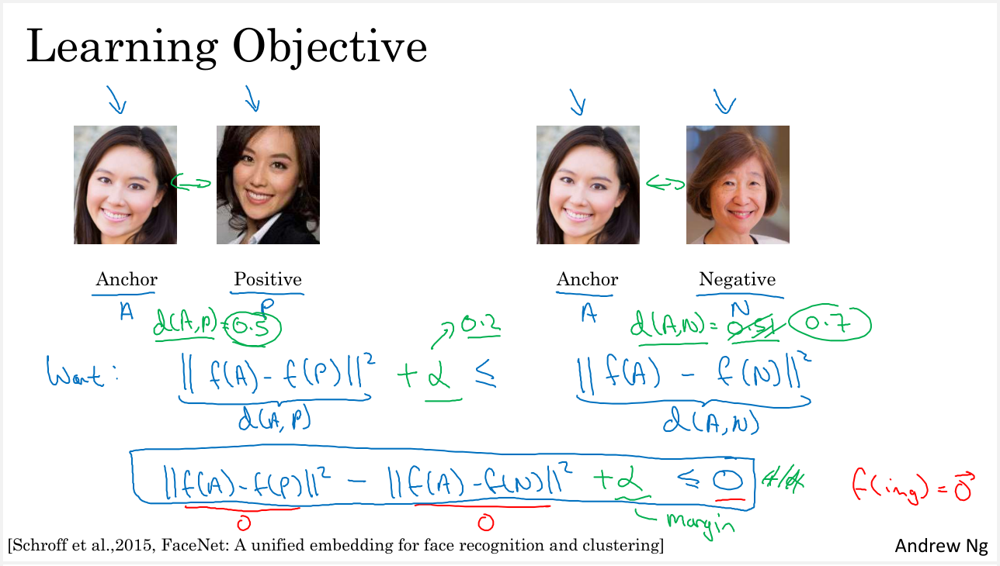
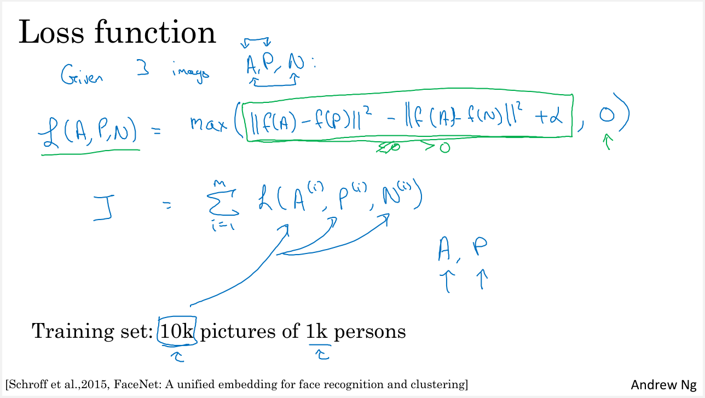
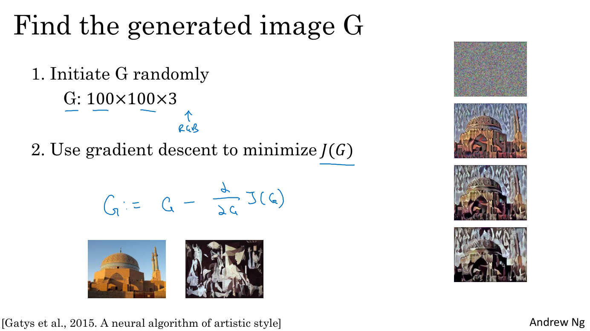
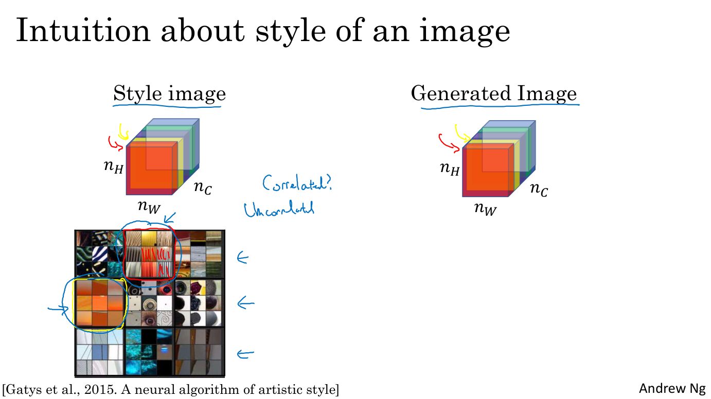
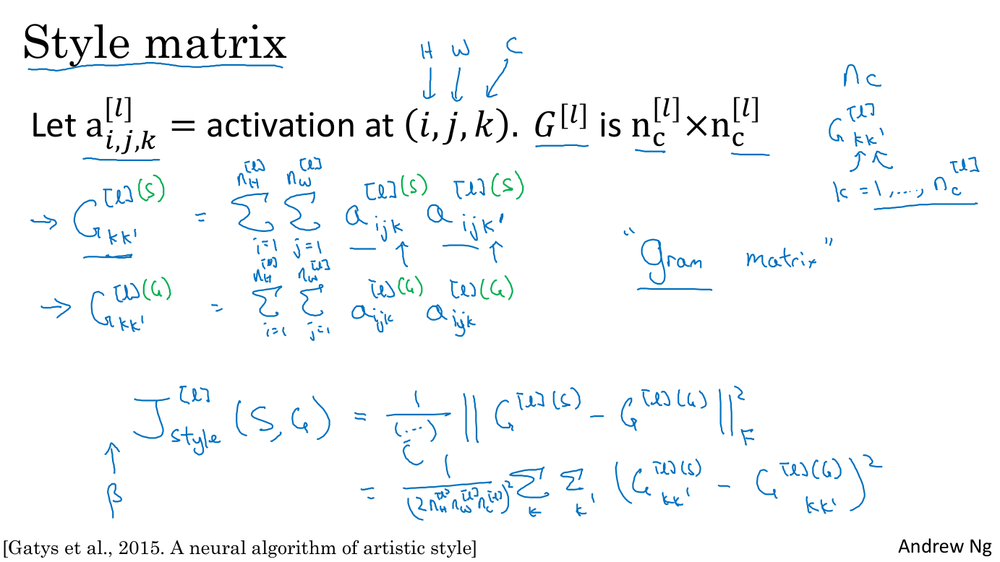
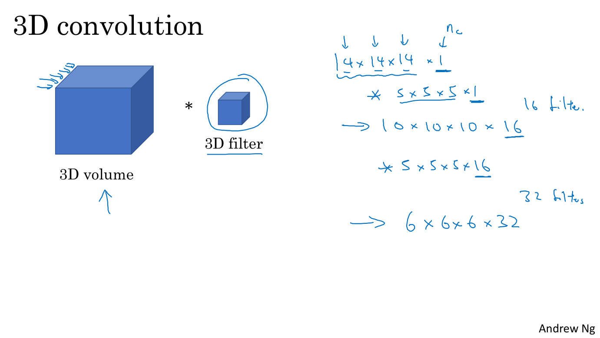

## What is Face Recognition?

Let's see a couple of important special applications of ConvNets. We'll start the face recognition, and then go on later to neuro style transfer. Besides to face recognition, it exists as well the liveness detection. The latter meaning making sure that you are a live human. It turns out liveness detection can be implemented using supervised learning as well to predict live human versus not live human.

I want to focus our time on talking about how to build the face recognition system. In the face recognition literature, people often talk about face verification and face recognition.

The face verification problem consists in if you're given an input image as well as a name or ID of a person and the job of the system is to verify whether or not the input image is that of the claimed person. So, sometimes this is also called a one to one problem where you just want to know if the person is the person they claim to be.

The recognition problem is much harder than the verification problem. To see why, let's say, you have a verification system that's 99 percent accurate. So, 99 percent might not be too bad, but if you apply this system to a recognition task with 100 people in your database, you now have 1 over a hundred times of chance of making a mistake, if the chance of making mistakes on each person is just one percent.

So, if you have a database of a 100 persons, and if you want an acceptable recognition error, you might actually need a verification system with maybe 99.9 or even higher accuracy before you can run it on a database of 100 persons.

## One Shot Learning

One of the challenges of face recognition is that you need to solve the one-shot learning problem.

What that means is that for most face recognition applications you need to be able to recognize a person given just one single image, or given just one example of that person's face. And, historically, deep learning algorithms don't work well if you have only one training example. Let's see an example of what this means, and talk about how to address this problem.

Let's say you have a database of four pictures of employees in you're organization: Khan, Danielle, Younes, and Thian. Now let's say someone shows up at the office and they want to be let through the turnstile. What the system has to do is, despite ever having seen only one image of Danielle, to recognize that this is actually the same person. And, in contrast, if it sees someone that's not in this database, then it should recognize that this is not any of the four persons in the database.

So in the one shot learning problem, you have to learn from just one example to recognize the person again, because you might have only one picture of each of your employees or of your team members in your employee database.

So one approach you could try is to input the image of the person, feed it too a ConvNet. And have it output a label, y, using a softmax unit with four outputs or maybe five outputs corresponding to each of these four persons or none of the above. So that would be 5 outputs in the softmax. But this really doesn't work well. Because if you have such a small training set it is really not enough to train a robust neural network for this task. And also what if a new person joins your team? So now you have 5 persons you need to recognize, so there should now be six outputs. Do you have to retrain the ConvNet every time? That just doesn't seem like a good approach.

So to carry out face recognition, and so the one-shot learning, what you're going to do instead is learn a similarity function. In particular, you want a neural network to learn a function which going to denote d, which inputs two images and outputs the degree of difference between the two images. So if the two images are of the same person, you want this to output a small number. And if the two images are of two very different people you want it to output a large number.

So during recognition time, if the degree of difference between them is less than some threshold called tau, which is a hyperparameter, then you would predict that these two pictures are the same person. And if it is greater than tau, you would predict that these are different persons. And so this is how you address the face verification problem.

To use this for a recognition task, what you do is, given a new picture and a reference picture, you will use this function d to compare these two images.

$d(img1, img2)$

And maybe I'll output a very large number, let's say 10, for this example. And then you compare this input picture with the second reference image in your database and because these two are the same person, hopefully you output a very small number. You do this for the other images in your database and so on. And based on this, you would figure out that the input picture is is actually that person, which is Danielle.

In contrast, if someone not in your database shows up, as you use the function d to make all of these pairwise comparisons, hopefully d will output have a very large number for all four pairwise comparisons. And then you say that this is not anyone of the four persons in the database. Notice how this allows you to solve the one-shot learning problem. So you need to learn this function d, which inputs a pair of images and tells you, basically, if they're the same person or different persons. Then if you have someone new join your team, you can add a fifth person to your database, and it just works fine.

## Siamese Network

The job of the function d, which you learned about in the last section, is to input two faces and tell you how similar or how different they are. A good way to do this is to use a Siamese network. Let's take a look.

You're used to seeing pictures of ConvNet like these where you input an image, let's say x1, and through a sequence of convolutional, pulling and fully connected layers, you end up with a feature vector. And sometimes this is fed to a softmax unit to make a classification. We're not going to use a softmax unit now, instead, we're going to focus on that vector of 128 numbers computed by some fully connected layer that is deeper in the network. And I'm going to give this list of 128 numbers a name: I'm going to call this f(x1).

you should think of f(x1) as an encoding of the input image x1. So it has taken the input image (the picture of Kian), and is re-representing it as a vector of 128 numbers.

The way you can build a face recognition system is then that if you want to compare two pictures, let's say this first picture (x1) with this second picture x2. What you can do is feed this second picture to the same neural network with the same parameters and get a different vector of 128 numbers, which encodes this second picture.

So I'm going to call this encoding of this second picture f(x2), and here I'm using x1 and x2 just to denote two input images.

Finally, if you believe that these encodings are a good representation of these two images, what you can do is then define the distance d between x1 and x2 as the norm of the difference between the encodings of these two images.

$d(x^{(1)}, x^{(2)}) = || f(x^{(1)}) - f(x^{(2)})||_{2}^{2}$

So this idea of running two identical, convolutional neural networks on two different inputs and then comparing them, sometimes is called a Siamese neural network architecture. And many of the ideas I'm presenting here came from a paper due to Yaniv Taigman, Ming Yang, Marc'Aurelio Ranzato, and Lior Wolf in the research system that they developed called DeepFace.

### How do you train this Siamese neural network?

Remember that these two neural networks have the same parameters. So what you want to do is really train the neural network so that the encoding that it computes results in a function d that tells you when two pictures are of the same person. So more formally, the parameters of the neural network define an encoding f(xi).

So given any input image xi, the neural network outputs this 128 dimensional encoding f(xi). So more formally, what you want to do is learn parameters so that if two pictures, xi and xj, are of the same person, then you want that distance between their encodings to be small. And in contrast, if xi and xj are of different persons, then you want that distance between their encodings to be large.

So as you vary the parameters in all of these layers of the neural network, you end up with different encodings. And what you can do is use back propagation to vary all those parameters in order to make sure these conditions are satisfied.

So you've learned about the Siamese network architecture and have a sense of what you want the neural network to output for you in terms of what would make a good encoding. But how do you actually define an objective function to make a neural network learn to do what we just discussed here? Let's see that in the next section using the triplet loss function.

## Triplet Loss

One way to learn the parameters of the neural network, so that it gives you a good encoding for your pictures of faces, is to define and apply gradient descent on the triplet loss function. Let's see what that means.

To apply the triplet loss you need to compare pairs of images. For example, given this pair of images, you want their encodings to be similar because these are the same person. Whereas given another pair of images, you want their encodings to be quite different because these are different persons.

In the terminology of the triplet loss, what you're going to do is always look at one anchor image, and then you want the distance between the anchor and a positive image (meaning is the same person), to be similar. Whereas when the anchor is compared to a negative example you want their distance to be much further apart.

### Triplet loss term

This is what gives rise to the term triplet loss: which is that you always be looking at three images at a time. You'll be looking at an anchor image, a positive image, as well as a negative image. I'm going to abbreviate anchor, positive, and negative as A, P, and N.

To formalize this, what you want is for the parameters of your neural network or of your encoding to have the following property:

$d(A, P) = || f(A) - f(P) ||^2$
$d(A, N) = || f(A) - f(N) ||^2$
$d(A, P) \leqslant d(A, N)$

you want the encoding between the anchor minus the encoding of the positive example to be small, and in particular, you want this to be less than or equal to the distance (or the squared norm) between the encoding of the anchor and the encoding of the negative.
You can think of d as a distance function, which is why we named it with the alphabet d.
Now, if we move the term from the right side of this equation to the left side, what you end up with is:

$d(A, P) - d(A, N) \leqslant 0$

One trivial way to make sure this is satisfied is to just learn everything equals zero. If f always output zero, then f(A) is 0, f(P) is 0, f(N) is 0, their differences will also be 0.

Another way for the neural network to give a trivial outputs is if the encoding for every image was identical to the encoding to every other image, in which case you again get 0 minus 0.

To make sure that the neural network doesn't just output zero for all the encodings, or to make sure that it doesn't set all the encodings equal to each other, what we're going to do is modify this objective to say that this doesn't need to be just less than equal to zero, it needs to be quite a bit smaller than zero.

$d(A, P) - d(A, N) \leqslant -α$

In particular, if we say this needs to be less than negative Alpha, where Alpha is another hyperparameter then this prevents a neural network from outputting the trivial solutions. By convention, usually, we write plus Alpha instead of negative Alpha there.

$d(A, P) - d(A, N) + α \leqslant 0$

This is also called a margin, which is terminology that you'd be familiar with if you've also seen the literature on support vector machines. We can also modify this equation on top by adding this margin parameter.

$d(A, P) + α \leqslant d(A, N)$

Let's give an example: let's say the margin α is set to 0.2. If in this example d(A,P)=0.5, then you won't be satisfied if d(A,N)=0.51. Even though d(A,N) is bigger than d(A,P), you're saying that's not good enough. We want d(A,N) to be much bigger than d(A,P). In particular, you want d(A,N) to be at least 0.7 or higher. To achieve this margin or this gap of at least 0.2, you could either push d(A,N) up or push d(A,P) down so that there is at least this gap of this hyperparameter Alpha 0.2 between the distance between d(A,P) versus d(A,N).

That's what having a margin parameter α here does. Which is it pushes the anchor-positive pair and the anchor-negative pair further away from each other. Let's take this previous equation and formalize it and define the triplet loss function.

The triplet loss function is defined on triples of images. Given three images: A, P, and N, the anchor positive and negative examples, so the positive examples is of the same person as the anchor, but the negative is of a different person than the anchor. We're going to define the loss as follows.

The loss on this example, which is really defined on a triplet of images is:

$|| f(A) - f(P) ||^2 - || f(A) - f(N) ||^2 + α \leqslant 0$

What you want is for this to be less than or equal to zero. To define the loss function, let's take the max between this and zero.

$L(A, P, N) = max(|| f(A) - f(P) ||^2 - || f(A) - f(N) ||^2 + α, 0)$

The effect of taking the max here is that so long as the first part is less than or equal to zero, then the loss is zero because the max is something less than equal to zero with zero, is going to be zero.

But if on the other hand, if the first part is greater than zero, then if you take the max, the max will end up selecting this right part underlined in green and so you'd have a positive loss.

By trying to minimize this, this has the effect of trying to send this first part in green to be zero or less than zero. Then so long as this zero or less than equal to zero, the neural network doesn't care how much further negative it is. This is how you define the loss on a single triplet.

### Setup the cost function

The overall cost function for your neural network can be sum over a training set of these individual losses on different triplets. If you have a training set of say, 10,000 pictures with 1,000 different persons, what you'd have to do is take your 10,000 pictures and use it to select triplets and then train your learning algorithm using gradient descent with this type of cost function, that is defined on triplets of images drawn from your training set.

Notice that in order to define this dataset of triplets, you do need some pairs of A and P: pairs of pictures of the same person. For the purpose of training your system, you do need a dataset where you have multiple pictures of the same person. That's why in this example I said if you have 10,000 pictures of 1,000 different persons, so maybe you have ten pictures, on average of each of your 1,000 persons to make up your entire dataset.

If you had just one picture of each person, then you can't actually train this system. But of course, after having trained a system, you can then apply it to your one-shot learning problem where for your face recognition system, maybe you have only a single picture of someone you might be trying to recognize. But for your training set, you do need to make sure you have multiple images of the same person, at least for some people in your training set, so that you can have pairs of anchor and positive images.

### How do you actually choose these triplets to form your training set?

One of the problems is if you choose A, P, and N randomly from your training set, subject to A and P being the same person and A and N being different persons, one of the problems is that if you choose them so that they're random, then this constraint is very easy to satisfy.

Because given two randomly chosen pictures of people, chances are A and N are much different than A and P. If A and N are two randomly chosen different persons, then there's a very high chance that d(A, N) will be much bigger than the margin helper, then the Neural Network won't learn much from it.

To construct your training set, what you want to do is to choose triplets, A, P, and N, they're the ''hard'' to train on. In particular, what you want is for all triplets that this constraint be satisfied.

A triplet that is ''hard'' would be if you choose values for A, P, and N so that may be d(A, P) is actually quite close to d(A, N). In that case, the learning algorithm has to try extra hard to take this thing on the right d(A, N) and try to push it up or take this thing on the left d(A, P) and try to push it down so that there is at least a margin of alpha between the left side and the right side.

The effect of choosing these triplets is that it increases the computational efficiency of your learning algorithm. If you choose the triplets randomly, then too many triplets would be really easy and gradient descent won't do anything because you're Neural Network would get them right pretty much all the time. It's only by choosing ''hard'' triplets that the gradient descent procedure has to do some work to try to push these quantities d(A, P) further away from those quantities d(A, N).

### FaceNet

If you're interested, the details are presented in this paper by Florian Schroff, Dmitry Kalenichenko, and James Philbin, where they have a system called FaceNet, which is where a lot of the presented ideas come from.

By the way, this is also a fun fact about how algorithms are often named in the Deep Learning World, which is if you work in a certain domain called Blank, then we call that Blank. You often have a system called Blank Net or Deep Blank. We've been talking about Face recognition. This paper is called FaceNet, and in the last section, you just saw Deep Face. But this idea of Blank Net or Deep Blank is a very popular way of naming algorithms in the Deep Learning World.

You should feel free to take a look at that paper if you want to learn some of these other details for speeding up your algorithm by choosing the most useful triplets to train on; it is a nice paper.

### Summary

Just to wrap up, to train on triplet loss, you need to take your training set and map it to a lot of triplets. A triplet is composed by an Anchor image, a Positive one both of the same person and a Negative image of a different person. What you do, having to find this training set of Anchor, Positive, and Negative triples is use gradient descent to try to minimize the cost function J we defined on an earlier slide.

That will have the effect of backpropagating to all the parameters of the Neural Network in order to learn an encoding so that d of two images will be small when these two images are of the same person and they'll be large when these are two images of different persons.

That's it for the triplet loss and how you can use it to train a Neural Network to output a good encoding for face recognition. Now, it turns out that today's Face recognition systems, especially the large-scale commercial face recognition systems are trained on very large datasets. Datasets worth of a million images are not uncommon. Some companies are using worth of 10 million images and some companies have worth of a 100 million images with which they try to train these systems. These are very large datasets, even by modern standards, and these dataset assets are not easy to acquire.

Fortunately, some of these companies have trained these large networks and posted parameters online. Rather than trying to train one of these networks from scratch, this is one domain where because of the sheer data volumes sizes, it might be useful for you to download someone else's pre-trained model rather than do everything from scratch yourself. But even if you do download someone else's pre-trained model, I think it's still useful to know how these algorithms were trained in case you need to apply these ideas from scratch yourself for some application.

## Face Verification and Binary Clasification

The Triplet Loss is one good way to learn the parameters of a ConvNet for face recognition. There's another way to learn these parameters. Face recognition can also be posed as a straight binary classification problem.

Another way to train a neural network, is to take this pair of neural networks, this Siamese Network and have them both compute these embeddings: maybe 128 dimensional embeddings or even higher dimensional. And then have these be input to a logistic regression unit to then just make a prediction. Where the target output will be one if both of these are the same persons, and zero if both of these are of different persons. So, this is a way to treat face recognition just as a binary classification problem. And this is an alternative to the triplet loss for training a system like this.

### What does this final logistic regression unit actually do?

The output y hat will be a sigmoid function, applied to some set of features but rather than just feeding in, these encodings, what you can do is take the differences between the encodings.

$ŷ = \sigma (\sum_{k=1}^{128} \omega_k |f(x^{(i)})_k - f(x^{(j)})_k| + b )$

Note: here is an error in he image, it should be wk and not wi: it has been corrected in the text formula.

I write a sum over K equals 1 to 128 of the absolute value, taken element-wise between the two different encodings i and j. In this notation, f(xi) is the encoding of the image xi, and the substitute k means to just select out the k-th components of this vector. This is taking the element Y's difference in absolute values between these two encodings. And what you might do is think of these 128 numbers as features that you then feed into logistic regression.

You'll find that this regression can have additional parameters w, i, and b similar to a normal logistic regression unit. And you would train appropriate weights on these 128 features in order to predict whether or not these two images are of the same person or of different persons. So, this will be one pretty useful way to learn to predict zero or one whether these are the same person or different persons.

And there are a few other variations on how you can compute this formula that I had underlined in green. For example, another formula could be:

$ŷ = \sigma (\sum_{k=1}^{128} \omega_k \frac{(f(x^{(i)})_k - f(x^{(j)})_k)^2}{f(x^{(i)})_k - f(x^{(j)})_k} + b )$

This is sometimes called the chi-square formula or chi-square similarity. And this and other variations are explored in this DeepFace paper, which I referenced earlier as well.

So in this learning formulation, the input is a pair of images, so this is really your training input x, and the output y is either zero or one depending on whether you're inputting a pair of similar or dissimilar images. And so you're training a Siamese Network so that means that, this neural network up here has parameters that are tied to the parameters in this lower neural network. And this system can work pretty well as well.

### Pre-Computational trick

Lastly, one computational trick that can help neural deployment significantly.
Let's say that you have a new image of an employee walking in hoping that the turnstile will open for him and then you also have the anchor image from your database image. Then instead of having to compute, the anchor embedding every single time, you can actually pre-compute the network, so, when the new employee walks in, what you can do is use this upper components to compute that encoding (normal computation as usual) and then compare it to your pre-computed encoding of the anchor image: finally you can then use both outputs to make a prediction y hat.

In his way, you don't need to store the raw images and also if you have a very large database of employees, you don't need to compute these encodings every single time for every employee database. This idea of free computing some of these encodings can save a significant computation.

And this type of pre-computation works both for this type of Siamese Central architecture where you treat face recognition as a binary classification problem, as well as, when you were learning encodings maybe using the Triplet Loss function as described before.

### Summary

So just to wrap up, to treat face verification as supervised learning, you create a training set of just pairs of images and then of triplets of pairs of images. Where the target label is one, it means that these are a pair of pictures of the same person; whereas where the tag label is zero, it means that these are pictures of different persons. Inthe image you see different pairs of images to train the neural network.

So, this version that you just saw of treating face verification and by extension face recognition as a binary classification problem, this works quite well as well. So this takes to train your own face verification or your own face recognition system, that can do one-shot learning.

## What is Neural Style Transfer?

What is Neural Style Transfer? Let me show you a few examples. Let's say you take an image, this is actually taken from the Stanford University and you want this picture recreated in the style of this image on the right. This is actually Van Gogh's, Starry Night painting. What Neural Style Transfer allows you to do is to generate a new image like the one below which is a picture of the Stanford University Campus painted in the style of the image on the right.

### Notation

In order to describe how you can implement this yourself, I'm going to use:

- C to denote the content image,
- S to denote the style image, and
- G to denote the image you will generate.

Here's another example, let's say you have this content image of the Golden Gate Bridge in San Francisco and you have this style image, this is actually a Pablo Picasso image. You can then combine these to generate this image G which is the Golden Gate painted in the style of that Picasso shown on the right. The examples shown on this slide were generated by Justin Johnson.

In order to implement Neural Style Transfer, you need to look at the features extracted by ConvNet at various layers, the shallow and the deeper layers of a ConvNet. Before diving into how you can implement a Neural Style Transfer, let's have a better intuition about whathever all these layers of a ConvNet really computing.

## What are deep ConvNets learning?

What are deep ConvNets really learning? Here we'll share some visualizations that will help you own your intuition about what the deeper layers of a ConvNet really are doing. And this will help us think through how you can implement neural style transfer as well. Let's start with an example.

Lets say you've trained a ConvNet (in the image there is an AlexNet like network), and you want to visualize what the hidden units in different layers are computing. Here's what you can do.

Let's start with a hidden unit in layer 1. And suppose you scan through your training sets and find out what are the images or what are the image patches that maximize that unit's activation. So in other words pause your training set through your neural network, and figure out what is the image that maximizes that particular unit's activation.

Notice that a hidden unit in layer 1, will see only a relatively small portion of the neural network. And so if you want to plot what activated that unit's activation, it makes makes sense to plot just a small image patch, because that is the part of the image that particular unit sees.

So if you pick one hidden unit and find the nine input images that maximizes that unit's activation, you might find nine image patches like this.

So looks like that in Layer 1, the first hidden unit is looking for an edge or a line, in fact the upper right region (3 by 3 image) shows image patches that represent a diagonal line. So those are the nine image patches that maximally activate one hidden unit's activation.

Now, you can then pick a different hidden unit in layer 1 and do the same thing. Let's pick the second hidden unit and we look at the adjacent group of 3 by 3 patches that maximize that second unit activation. This second hidden unit is looking for another diagonal line (with a negative slope repsect to the first hidden unit) in that portion of its input region. We also call the input region of the hidden unit, receptive field.

Let's pass to the third hidden unit. This unit tends to activate on image patches that seem to have a vertical light edge, but with the preference that the left side should be green.

The forth hidden unit really prefers orange colors, and this is an interesting image patch. This red and green together will make a brownish or a brownish-orangish color, but the neuron is still happy to activate with that, and so on fo other hidden units in the Layer 1.

A small recap: we are looking at the Layer 1, and in it we have nine different representative neurons: for each of the neurons we displayed nine image patches that maximally activate them (we could have displayed more but we stopped at 9 per neuron).

So this gives you a sense that, train hidden units in layer 1, are often looking for relatively simple features such as edge or a particular shade of color. And all of the examples I'm using in this video come from this paper by Mathew Zeiler and Rob Fergus, titled visualizing and understanding convolutional networks. Here I'm just going to use one of the simpler ways to visualize what a hidden unit in a neural network is computing. If you read their paper, they have some other more sophisticated ways of visualizing when the ConvNet is running as well.

What if you do this for some of the hidden units in the deeper layers of the neural network? And what does the neural network is learning at a deeper layers? So in the deeper layers, a hidden unit will see a larger region of the input image: this because as we go deep the size of the kernels decreases while the number of channels increases.

In the deep layers of the neural network, at the extreme end, each pixel could hypothetically affect the output of these later layers. So later units actually see larger image patches, but I'm still going to plot the image patches as the same size on these slides even if they contain a different number of pixels.

So we repeat the procedure we saw for Layer 1 and this is a visualization of what maximally activates nine different hidden units in layer 2.

### Recap about the shown visualization

So I want to be clear about what this visualization is. THe first square of 3 by 3 miages at the top left of the image represents nine patches that cause one hidden unit to be highly activated. And then each 3 by 3 images group is a different set of nine image patches that cause one hidden unit to be activated.

So this visualization shows nine hidden units in layer 2, and for each of them shows nine image patches that causes that hidden unit to have a very large output, a very large activation. And you can repeat these for deeper layers as well. For layer 1 we saw that the first hidden unit was highly activated, if in the region of the input image there's a diagonal edge.

Now let's see layer 2 as well, and do that visualization. Layer 2 looks it's detecting more complex shapes and patterns. So for example, the second hidden unit looks like it's looking for a vertical texture with lots of vertical lines. The 6-th hidden unit looks like its highly activated when there's a rounder shape to the left part of the image. The 7-t hidden unit is looking for very thin vertical lines and so on. So the features the second layer is detecting are getting more complicated.

What about layer 3? It looks like there is a hidden unit that seems to respond highly to a rounder shape in the lower left hand portion of the image, maybe. So that ends up detecting a lot of cars, dogs and wonders is even starting to detect people. And another hidden unit looks like it is detecting certain textures like honeycomb shapes, or square shapes, irregular texture. And for some of these other hidden units it's difficult to look at and manually figure out what is it detecting, but it is clearly starting to detect more complex patterns.

In layer 4 you'll see that the features or the patterns is detecting or even more complex. It looks like this has learned almost a dog detector, but all these dogs likewise similar. But now all those are dogs, but they look relatively similar. Another hidden unit in leyer 4 Looks like is detecting water. Another one looks like it is actually detecting the legs of a bird and so on.

And then layer 5 is detecting even more sophisticated things. So you'll notice there's also a neuron that seems to be a dog detector, but set of dogs detecting here seems to be more varied. And then this seems to be detecting keyboards and things with a keyboard like texture, although maybe lots of dots against background. I think this neuron here may be detecting text, it's always hard to be sure. And then this one here is detecting flowers. So we've gone a long way from detecting relatively simple things such as edges in layer 1 to textures in layer 2, up to detecting very complex objects in the deeper layers.

As small recall deeper hidden units are activated by bigger regions of the input image, while early hidden units just see a smaller part of the input image. So I hope this gives you some better intuition about what the shallow and deeper layers of a neural network are computing.

## Cost function

To build a Neural Style Transfer system, let's define a cost function for the generated image. Then by minimizing this cost function, you can generate the image with the art style you desire.

### Problem formulation

You're given a content image C, given a style image S and you goal is to generate a new image G.

In order to implement neural style transfer, what you're going to do is define a cost function J(G) that measures how good is a particular generated image and we'll use gradient descent to minimize J(G) in order to generate this image.

$J(G) = \alpha J_{content}(C, G) + \beta J_{style}(S, G)$

We're going to define two parts to this cost function.

- J(C, G) is called the content cost. This is a function of the content image and of the generated image and  it measures how similar is the contents of the generated image G to the content of the content image C.
- J(S, G) is the style cost function and measures how similar is the style of the image G to the style of the image S.

Finally, we'll weight these with two hyper parameters alpha and beta to specify the relative weighting between the content costs and the style cost. It seems redundant to use two different hyper parameters to specify the relative cost of the weighting. One hyper parameter seems like it would be enough but the original authors of the Neural Style Transfer Algorithm, use two different hyper parameters and  I'm just going to follow their convention here.

The Neural Style Transfer Algorithm presented here comes from the work of Leon Gatys, Alexander Ecker and Matthias. Their papers is not too hard to read so I certainly encourage you to take a look at their paper as well if you want.

The way the algorithm would run is as follows, having to find the cost function J(G) in order to actually generate a new image what you do is the following. You would initialize the generated image G randomly so it might be 100 by 100 by 3. Then we'll define the cost function J(G).

What you can do is use gradient descent to minimize this so you can update G as G minus the derivative respect to the cost function of J(G):

$G = G - \frac{\alpha}{\alpha G} J(G)$

In this process, you're actually updating the pixel values of this image G which is a 100 by 100 by 3. Here's an example, let's say you start with this content image and this style image that is a Picasso image.

Then when you initialize G randomly, you're initial randomly generated image is just this white noise image with each pixel value chosen at random. As you run gradient descent, you minimize the cost function J(G) slowly through the pixel value so that you get slowly an image that looks more and more like your content image rendered in the style of your style image.

In this section you saw the overall outline of the Neural Style Transfer Algorithm where you define a cost function for the generated image G and minimize it. Next, we need to see how to define the content cost function as well as the style cost function.

## Content Cost Function

The cost function of the neural style transfer algorithm had a content cost component and a style cost component.

$J(G) = \alpha J_{content}(C, G) + \beta J_{style}(S, G)$

Let's start by defining the content cost component.

Let's say that you use hidden layer l to compute the content cost.

If l is a very small number, if you use hidden layer one, then it will really force your generated image to pixel values very similar to your content image.

Whereas, if you use a very deep layer, then it's just asking, "Well, if there is a dog in your content image, then make sure there is a dog somewhere in your generated image."

SO in practice, I usually chose a layer l that is somewhere in the middle of the layers of the neural network, neither too shallow nor too deep. What you can do is then use a pre-trained ConvNet, maybe a VGG network and measure, given a content image and given a generated image, how similar are they in content.

$J_{content}(C,G) = \frac{1}{2} ||a^{[l](C)}-a{[l](G)}||^{2}$

So let a superscript [l](C) and a superscript [l](G) be the activations of layer l on these two images, on the images C and G. So, if these two activations are similar, then that would seem to imply that both images have similar content. So, what we'll do is define J_content(C,G) as how different are these two activations. So, we'll take the element-wise difference between these hidden unit activations in layer l, between when you pass in the content image compared to when you pass in the generated image, and then make it squared. You could have a normalization constant in front or not, like 1/2 or something else. This constant doesn't really matter since this can be adjusted as well by this hyperparameter alpha.

So, just be clear on using this notation as if both $a^{[l](C)}$ and $a^{[l](G)}$ have been unrolled into vectors, so then, this becomes the square root of the L2 norm between $a^{[l](C)}$ and $a^{[l](G)}$, after you've unrolled them both into vectors. There's really just the element-wise sum of squared differences between these two activation. But it's really just the element-wise sum of squares of differences between the activations in layer l, between the images in C and G.

And so, when later you perform gradient descent on J(G) to try to find a value of G, so that the overall cost is low, this will incentivize the algorithm to find an image G, so that these hidden layer activations are similar to what you got for the content image. So, that's how you define the content cost function for the neural style transfer. Next, let's move on to the style cost function.

## Style Cost Function

Previously, you saw how to define the content cost function for the neural style transfer. Next, let's take a look at the style cost function. So, what the style of an image mean?

Let's say you have an input image like this, and let's say you've chosen some layer L, maybe that layer to define the measure of the style of an image. What we need to do is define the style as the correlation between activations across different channels in this layer L activation. So here's what I mean by that.

Let's say you take that layer L activation. So this is going to be nh by nw by nc block of activations, and we're going to ask how correlated are the activations across different channels. So to explain what I mean by this, let's take this block of activations and let me shade the different channels by a different color.

So in this below example, we have say five channels and which is why I have five shades of color here. In practice, of course, in neural network we usually have a lot more channels than five, but using just five makes it drawing easier.

To capture the style of an image, what you're going to do is the following. Let's look at the first two channels. Let's see for the red channel and the yellow channel and say how correlated are the activations in these first two channels.

So, for example, in the lower right hand corner, you have some activation in the first channel and some activation in the second channel. So that gives you a pair of numbers. And what you do is look at different positions across this block of activations and just look at those two pairs of numbers, one in the first channel, the red channel, one in the yellow channel, the second channel. And you just look at these two pairs of numbers across all of these positions (all of these nh by nw positions), how correlated are these two numbers.

So, why does this capture style? Here's one of the visualizations from the earlier section. This comes from again the paper by Matthew Zeiler and Rob Fergus that I have reference earlier. And let's say for the sake of arguments, that the red channel corresponds to the neurons that is trying to figure out if there's this little vertical texture in a particular position of the nh by nw region; and let's say that this second channel, this yellow second channel corresponds to this neuron, which is vaguely looking for orange colored patches.

### What correlated and un-correlated features mean?

What does it mean for these two channels to be highly correlated? Well, if they're highly correlated that means that whatever part of the image has this type of subtle vertical texture, it will also probably have these orange-ish tint.

And what does it mean for them to be uncorrelated? Well, it means that whenever there is this vertical texture, it probably won't have that orange-ish tint.

And so the correlation tells you which of these high level texture components tend to occur or not occur together in a part of an image and that's the degree of correlation that gives you one way of measuring how often these different high level features, such as vertical texture or this orange tint or other things as well, how often they occur and how often they occur together and don't occur together in different parts of an image.

And so, if we use the degree of correlation between channels as a measure of the style, then what you can do is measure the degree to which in your generated image, this first channel is correlated or uncorrelated with the second channel and that will tell you in the generated image how often this type of vertical texture occurs or doesn't occur with this orange-ish tint: this gives you a measure of how similar is the style of the generated image to the style of the input style image.

### The style matrix

So let's now formalize this intuition.

So what you can to do is given an image, computes something called a style matrix, which will measure all those correlations we talked about. So, more formally, let's define $a_{i, j ,k}^{[l]}$ to denote the activation at position (i, j, k) in hidden layer l. So i indexes into the height, j indexes into the width, and k indexes across the different channels.

So, in the previous example, we had five channels so that k will index across those five channels. What the style matrix will do is to compute a matrix called $G^{[l]}$. This is going to be a square matrix with nc by nc dimension. Remember you have nc channels and so you have an nc by nc dimensional matrix in order to measure how correlated each pair of them is.

In particular $G_{k, k'}^{[l]}$ will measure how correlated are the activations in channel k compared to the activations in channel k prime. Well here, k and k prime will range from 1 through nc, the number of channels they're all up in that layer.

So more formally, the way you compute $G^{[l]}$ is going to be the sum over i and j of  the activation at that layer (i, j, k) times the activation at (i, j, k'). So, here, remember i and j index across to a different positions in the block: they index over the height and width.

So i is the sum from one to nh and j is a sum from one to nw and k and k prime index range from one to the total number of channels in that layer of the neural network. So $G^{[l]}_{k, k'}$ is summing over the different positions of the image, over the height and width and just multiplying the activations together of the channels k and k prime. And you do this for every value of k and k prime to compute this matrix G, also called the style matrix.

Notice that if both of these activations tend to be lashed together, then $G^{[l]}_{k, k'}$ will be large, whereas if they are uncorrelated then $G^{[l]}_{k, k'}$. And technically, I've been using the term correlation to convey intuition but this is actually the unnormalized cross covariance because we're not subtracting out the mean and we are just multiplying these elements directly.

So this is how you compute the style of an image. And you'd actually do this for both the style image S and for the generated image G. So the round bracket S in $G^{[l](S)}_{k, k'}$ denotes the style image S and $a_{i, j ,k}^{[l](S)}$ are the activations on the image S.

What you do is then compute the same thing for the generated image GL this function will be called $G^{[l](S)}_{k, k'}$. So it's really the same thing and the summation indices are the same.

Now, you have two matrices and they capture what is the style with the image S and what is the style of the image G: we've been using the alphabet capital G to denote these matrices. In linear algebra, these are also called the grand matrices but I'm just going to use the term style matrix.

$a_{i, j ,k}^{[l]} = \text{activation at (i, j, k), where } i\subset n_h, j\subset n_w, k \subset n_c$

$G_{k, k'}^{[l]}=[n_c^{[l]}, n_c^{[l]}], \text{is called the Grand Matrix, and } k, k' = 1, ..., n_c^{[l]}$

$G_{k, k'}^{[l](S)}= \sum_{i=1}^{n_h^{[l]}}\sum_{j=1}^{n_w^{[l]}} a_{i, j ,k}^{[l](S)} a_{i, j ,k'}^{[l](S)}$
$G_{k, k'}^{[l](G)}= \sum_{i=1}^{n_h^{[l]}}\sum_{j=1}^{n_w^{[l]}} a_{i, j ,k}^{[l](G)} a_{i, j ,k'}^{[l](G)}$

### The style cost function

Finally, the style cost function. If you're doing this on layer l between S and G, you can now define it to be just the difference between these two grand matrices:

$\beta J_{style}^{[l]}(S, G) = \frac{1}{(2n_h^{[l]}n_w^{[l]}n_c^{[l]})^2}||G^{[l](S)} - G^{[l](G)} ||^{2}_{F} = \frac{1}{(2n_h^{[l]}n_w^{[l]}n_c^{[l]})^2} \sum_{k=1}^{n_c^{[l]}}\sum_{k'=1}^{n_c^{[l]}} (G^{[l](S)}_{k, k'} - G^{[l](G)}_{k, k'})^2$

This is just the sum of squares of the element wise differences between these two matrices. The authors actually used this for the normalization constants two times nh, nw, nc in that layer squared. But a normalization constant doesn't matter that much because this cost is multiplied by some hyperparameter beta anyway.

So just to finish up, this is the style cost function defined using layer l and as you saw on the previous slide, this is basically the Frobenius norm between the two grand matrices computed on the image S and on the image G Frobenius norm squared with a normalization constants, which isn't that important.

Finally, it turns out that you get more visually pleasing results if you use the style cost function from multiple different layers.

$J_{style}(S, G) = \sum_{l}^{\lambda^{[l]}} J_{style}^{[l]}(S, G)$

So, the overall style cost function, you can define as sum over all the different layers of the style cost function for that layer weighted by an additional hyperparameters, which we'll denote as lambda l here.

So what it does it allows you to use different layers in a neural network: both the early ones, which measure relatively simpler low level features like edges as well as some later layers, which measure high level features. This cost function formulation cause a neural network to take both low level and high level correlations into account when computing style.

### Summary

$J(G) = \alpha J_{content}(C, G) + \beta J_{style}(S, G)$

You can now define the overall cost function as alpha times the content cost between C and G plus beta times the style cost between S and G. And then just use gradient descent or a more sophisticated optimization algorithm in order to try to find an image G that tries to minimize this cost function J(G).

And if you do that, you'll be able to generate some pretty nice novel artwork.

## 1D and 3D Generalizations

You have learned a lot about ConvNets, everything ranging from the architecture of the ConvNet to how to use it for image recognition, to object detection, to face recognition and neural-style transfer. And even though most of the discussion has focused on images (2D data), it turns out that many of the ideas you've learned about also apply to 1D data as well as to 3D data. Let's take a look. 

You learned about the 2D convolution, where you might input a 14 x 14 image and convolve that with a 5 x 5 filter, and this gives you a 10 x 10 output. If you have a multiple channels image, maybe 14 x 14 x 3, then the filter would be 5 by 5 by 3. And then if you have multiple filters, say 16 filters of size 5 by 5 by 3, you end up with an output of 10 x 10 x 16. 

### Generalization from 2D to 1D

It turns out that a similar idea can be applied to 1D data as well. For example, on the left there is an EKG signal, also called an electrocardioagram. Basically if you place an electrode over your chest, this measures the little voltages that vary across your chest as your heart beats. And so each of these peaks corresponds to one heartbeat. So if you want to use EKG signals to make medical diagnoses, for example, then you would have 1D data because EKG data is a time series showing the voltage at each instant in time. 

So rather than a 14 x 14 dimensional input, maybe you just have a 14 dimensional input. And in that case, you might want to convolve this with a 1 dimensional filter. So rather than the 5 by 5, you just have 5 dimensional filter. What a 1D filter allows you to do is take your 5 dimensional filter and similarly apply that in lots of different positions throughout this 1D signal. And so if you apply this convolution, what you find is that a 14 dimensional time series convolved with this 5 dimensional filter, would give you a 10 dimensional output. This in the case you have just 1 channel: 1 lead or 1 electrode for EKG, so the filter size is 5 by 1. 

And if you have 16 filters, maybe end up with a 10 x 16 output, and this could be one layer of your ConvNet. And then for the next layer of your ConvNet, if you input a 10 x 16 dimensional input, you might convolve that with 32 filters of size 5 by 16. Then the output of this convolution would be 6 x 32. 

And keeping the analogy with the 2D data, this is similar to all of the 10 x 10 x 16 data and convolve it with a 5 x 5 x 16 filter. That will give you a 6 by 6 dimensional output by 32 if you have 32 filters. So all of these ideas apply also to 1D data, where you can have the same feature detector you use in 2D data, applied to a variety of positions. For example, to detect the different heartbeats in an EKG signal. 

For along with 1D data applications, you actually use a recurrent neural network. But some people can also try using ConvNets in these problems. And in the next chapter on sequence models, which we will talk about recurring neural networks and LSTM and other models, we'll talk about the pros and cons of using 1D ConvNets versus some of those other models that are explicitly designed to sequenced data. So that's the generalization from 2D to 1D. 

### Generalization from 2D to 3D

How about 3D data? In this case, instead of having a 1D list of numbers or a 2D matrix of numbers, you now have a 3D block, a three dimensional input volume of numbers. 

So here's the example of that which is if you take a CT scan, this is a type of X-ray scan that gives a three dimensional model of your body. But what a CT scan does is it takes different slices through your body. So as you scan through a CT scan, you can look at different slices of the human torso to see how they look and so this data is fundamentally three dimensional. 

One way to think of this data is if your data now has some height, some width, and then also some depth. So if you want to apply a ConvNet to detect features in this three dimensional CT scan, then you can generalize the ideas from the previous example to three dimensional convolutions as well. 

So if you have a 3D volume, and it is 14 x 14 x 14 that corresponds to the height, width, and depth of the input CT scan. And again, just like images a 3D volume doesn't have to be a perfect cube as well. So the height and width of a image can be different, and in the same way the height and width and the depth of a CT scan can be different. I'm just using 14 x 14 x 14 here to simplify the discussion. 

If you convolve this with one filter of size 5 x 5 x 5 filter, so you're filters now are also three dimensional then this would give you a 10 x 10 x 10 by 1 volume: where by 1 is because of the number of channels. So this is just a 3D volume, but your data can also have different numbers of channels. 

Then if you have 16 filters with size 5 x 5 x 5 x 1 then the output will be a 10 x 10 x 10 x 16.
And if you convolves this again with 32 filters of size 5 x 5 x 5 x 16 dimensional filter, then now you'll end up with a 6 x 6 x 6 volume across 32 channels. So 3D data can also be learned on, sort of directly using a three dimensional ConvNet. And what these filters do is really detect features across your 3D data,

CAT scans, medical scans are one example of 3D volumes. But another example of data, you could treat as a 3D volume would be movie data, where the different slices could be different slices in time through a movie. And you could use this to detect motion or people taking actions in movies. So that's it on generalization of ConvNets from 2D data to also 1D as well as 3D data. Image data is so pervasive that the vast majority of ConvNets are on 2D data, on image data, but I hope that these other models will be helpful to you as well.

# References

## Week 1

[The Sequential model](https://www.tensorflow.org/guide/keras/sequential_model) (TensorFlow Documentation)

[The Functional API](https://www.tensorflow.org/guide/keras/functional) (TensorFlow Documentation)

## Week 2

[Deep Residual Learning for Image Recognition](https://arxiv.org/abs/1512.03385) (He, Zhang, Ren & Sun, 2015)

[deep-learning-models/resnet50.py/](https://github.com/fchollet/deep-learning-models/blob/master/resnet50.py) (GitHub: fchollet)

[MobileNets: Efficient Convolutional Neural Networks for Mobile Vision Applications](https://arxiv.org/abs/1704.04861) (Howard, Zhu, Chen, Kalenichenko, Wang, Weyand, Andreetto, & Adam, 2017)

[MobileNetV2: Inverted Residuals and Linear Bottlenecks](https://arxiv.org/abs/1801.04381) (Sandler, Howard, Zhu, Zhmoginov &Chen, 2018)

[EfficientNet: Rethinking Model Scaling for Convolutional Neural Networks](https://arxiv.org/abs/1905.11946) (Tan & Le, 2019)

## Week 3

[You Only Look Once: Unified, Real-Time Object Detection](https://arxiv.org/abs/1506.02640) (Redmon, Divvala, Girshick & Farhadi, 2015)

[YOLO9000: Better, Faster, Stronger](https://arxiv.org/abs/1612.08242) (Redmon & Farhadi, 2016)

[YAD2K](https://github.com/allanzelener/YAD2K) (GitHub: allanzelener)

[YOLO: Real-Time Object Detection](https://pjreddie.com/darknet/yolo/)

[Fully Convolutional Architectures for Multi-Class Segmentation in Chest Radiographs](https://arxiv.org/abs/1701.08816) (Novikov, Lenis, Major, Hladůvka, Wimmer & Bühler, 2017)

Automatic Brain Tumor Detection and Segmentation Using U-Net Based Fully Convolutional [Networks](https://arxiv.org/abs/1705.03820) (Dong, Yang, Liu, Mo & Guo, 2017)

[U-Net: Convolutional Networks for Biomedical Image Segmentation](https://arxiv.org/abs/1505.04597) (Ronneberger, Fischer & Brox, 2015)

## Week 4

[FaceNet: A Unified Embedding for Face Recognition and Clustering](https://arxiv.org/pdf/1503.03832.pdf) (Schroff, Kalenichenko & Philbin, 2015)

[DeepFace: Closing the Gap to Human-Level Performance in Face Verification](https://research.fb.com/wp-content/uploads/2016/11/deepface-closing-the-gap-to-human-level-performance-in-face-verification.pdf) (Taigman, Yang, Ranzato & Wolf)

[facenet](https://github.com/davidsandberg/facenet) (GitHub: davidsandberg)

[How to Develop a Face Recognition System Using FaceNet in Keras](https://machinelearningmastery.com/how-to-develop-a-face-recognition-system-using-facenet-in-keras-and-an-svm-classifier/) (Jason Brownlee, 2019)

[keras-facenet/notebook/tf_to_keras.ipynb](https://github.com/nyoki-mtl/keras-facenet/blob/master/notebook/tf_to_keras.ipynb) (GitHub: nyoki-mtl)

[A Neural Algorithm of Artistic Style](https://arxiv.org/abs/1508.06576) (Gatys, Ecker & Bethge, 2015)

[Convolutional neural networks for artistic style transfer](https://harishnarayanan.org/writing/artistic-style-transfer/)

[TensorFlow Implementation of "A Neural Algorithm of Artistic Style"](http://www.chioka.in/tensorflow-implementation-neural-algorithm-of-artistic-style)

[Very Deep Convolutional Networks For Large-Scale Image Recognition](https://arxiv.org/pdf/1409.1556.pdf) (Simonyan & Zisserman, 2015)

[Pretrained models](https://www.vlfeat.org/matconvnet/pretrained/) (MatConvNet)
