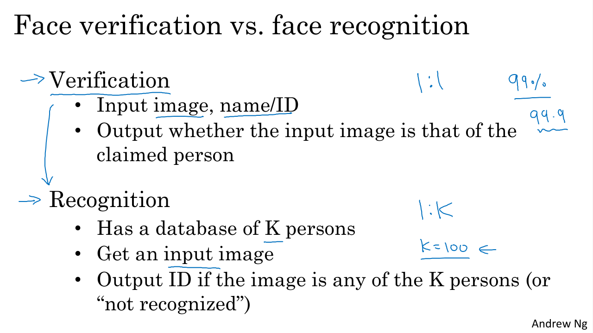
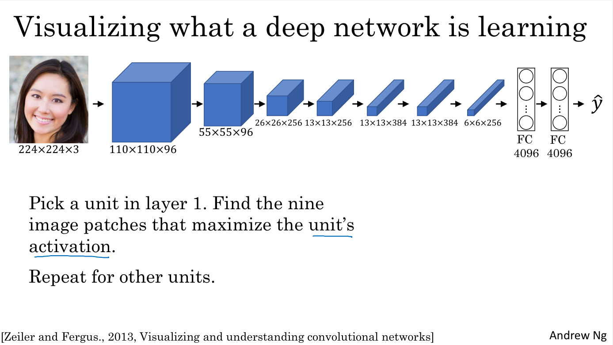
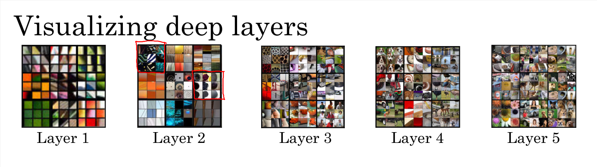
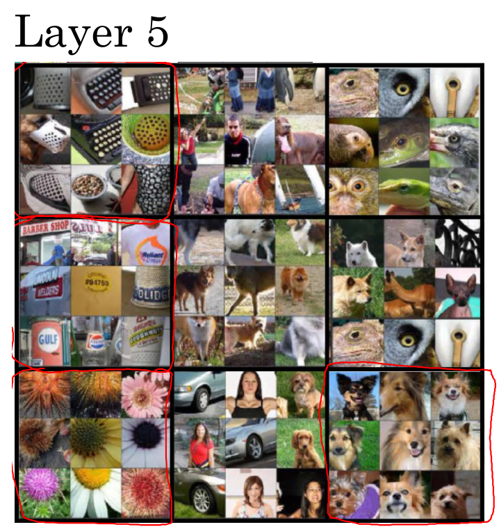
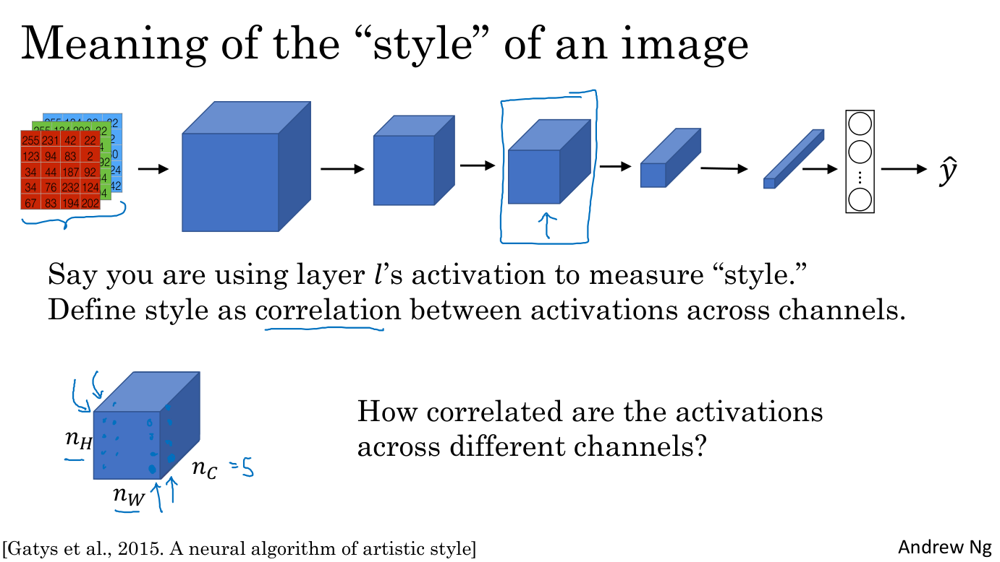
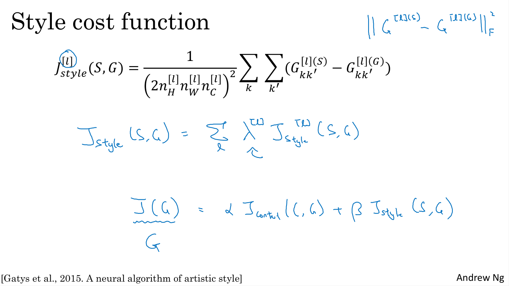

## Why Sequence Models?

In this chapter, you learn about sequence models, one of the most exciting areas in deep learning. Models like recurrent neural networks or RNNs have transformed speech recognition, natural language processing and other areas. Let's start by looking at a few examples of where sequence models can be useful. 
- In speech recognition you are given an input audio clip X and asked to map it to a text transcript Y. Both the input and the output here are sequence data, because X is an audio clip and so that plays out over time and Y, the output, is a sequence of words. So sequence models such as a recurrent neural networks and other variations, have been very useful for speech recognition. 
- Music generation is another example of a problem with sequence data. In this case, only the output Y is a sequence, the input can be the empty set, or it can be a single integer, maybe referring to the genre of music you want to generate or maybe the first few notes of the piece of music you want. 
- In sentiment classification the input X is a sequence, so given the input phrase like, "There is nothing to like in this movie" how many stars do you think this review will be? 
- Sequence models are also very useful for DNA sequence analysis. So your DNA is represented via the four alphabets A, C, G,and T. And so given a DNA sequence can you label which part of this DNA sequence say corresponds to a protein. 
- In machine translation you are given an input sentence, voulez-vou chante avec moi? And you're asked to output the translation in a different language. 
- In video activity recognition you might be given a sequence of video frames and asked to recognize the activity. 
- And in name entity recognition you might be given a sentence and asked to identify the people in that sentence. 

So all of these problems can be addressed as supervised learning with label data X, Y as the training set. But, as you can tell from this list of examples, there are a lot of different types of sequence problems. In some, both the input X and the output Y are sequences, sometimes X and Y can have different lengths, or the same. And in some of these examples only either X or only the opposite Y is a sequence. Sequence models are applicable, so all of these different settings.

## Notation

You saw some of the wide range of applications through which you can apply sequence models. Let's start by defining a notation that we'll use to build up these sequence models. 

### Named-entity recognition

As a motivating example, let's say you want to build a sequence model to input a sentence like this, Harry Potter and Hermione Granger invented a new spell: these are characters by the way, from the Harry Potter sequence of novels by J. K. Rowling. And you want a sequence model to automatically tell you where are the peoples names in this sentence. So, this is a problem called Named-entity recognition and this is used by search engines for example, to index all of say the last 24 hours news of all the people mentioned in the news articles so that they can index them appropriately. And name into the recognition systems can be used to find people's names, companies names, times, locations, countries names, currency names, and so on in different types of text. 

Now, given this input x let's say that you want a model to operate y that has one outputs per input word and the target output the design y tells you for each of the input words if it is that part of a person's name.

Now, the input is the sequence of nine words. So, eventually we're going to have nine sets of features to represent these nine words, and index into the positions and sequence, I'm going to use x and then superscript angle brackets 1, 2, 3 up to nine to index into the different positions: $X=x^{<1>}, x^{<2>}, x^{<3>}, ..., x^{<{t}>}, ..., x^{<9>}$. I'm going to use $x^{<{t}>}$ with t to index into the positions in the sequence and implying that these are temporal sequences

And similarly for the outputs, we're going to refer to these outputs as $Y=y^{<1>}, y^{<2>}, y^{<3>}, ..., y^{<{t}>}, ..., y^{<9>}$. Let's also use $T_{x}=9$ to denote the length of the input sequence, so in this case there are nine words. And we use $T_{y}=9$ to denote the length of the output sequence. 

In the notation we've been using, $x^{(i)<{t}>}$ denotes the i-th training example and $T_{x}^{(i)}$ the length of the i-th training example sequence. Then different examples in your training set can have different lengths. Similarly $y^{(i)<{t}>}$ means the i-th element in the output sequence and $T_{y}^{(i)}$ will be the length of the output sequence in the i-th training example. 

So into this example, $T_{x}^{(i)}=9$ and for a different training example with a sentence of 15 words $T_{x}^{(i)}=15$. 

### Represent individual words in a sentence

Let's next talk about how we would represent individual words in a sentence. 

So, to represent a word in the sentence the first thing you do is come up with a Vocabulary. Sometimes also called a Dictionary and that means making a list of the words that you will use in your representations. So the first word in the vocabulary is "a", the second word is "Aaron" and then a little bit further down is the word "and", and then eventually you get to the words "Harry" then eventually the word "Potter", and then all the way down to maybe the last word in dictionary is "Zulu".

And so, "a" will be word at index one, "Aaron" is word at index two, and in my dictionary the word "and" appears in positional index 367. "Harry" appears in position 4075, "Potter" in position 6830, and "Zulu" is the last word to the dictionary is maybe word 10,000. 

So in this example, I'm going to use a dictionary with size 10,000 words. This is quite small by modern Natural Language Problem (NLP) applications. For commercial applications, dictionary sizes of 30 to 50,000 are more common and 100,000 is not uncommon. Some of the large Internet companies will use dictionary sizes that are maybe a million words or even bigger than that.

### How to chose words in your dictionary

So, if you have chosen a dictionary of 10,000 words, one way to build this dictionary will be to look through your training sets and find the top 10,000 occurring words, also look through some of the online dictionaries that tells you what are the most common 10,000 words in the English Language.

What you can do is then use one hot representations to represent each of these words. For example, $x^{<1>}$ which represents the word "Harry" would be a vector with all zeros except for a 1 in position 4075 because that was the position of "Harry" in the dictionary. And then $x^{<2>}$ will be again similarly a vector of all zeros except for a 1 in position 6830 and then zeros everywhere else. The word "and" was represented as position 367 so $x^{<3>}$ would be a vector with zeros of 1 in position 367 and then zeros everywhere else. And each of these would be a 10,000 dimensional vector if your vocabulary has 10,000 words. 

So in this representation, $x^{<t>}$ for each of the values of t in a sentence will be a one-hot vector, one-hot because there's exactly one 1 and 0 everywhere else, and you will have nine $x^{<t>}$ to represent the nine words in this sentence. 

The goal is given this representation for X to learn a mapping using a sequence model to then target output Y. I will do this as a supervised learning problem.

### Unknown word 

What if you encounter a word that is not in your vocabulary? 
You create a new token or a new fake word called Unknown Word (UNK) or Out Of Vocabulary (OOV) which represents words not in your vocabulary.

## Recurrent Neural Network Model

Now, let's talk about how you can build a neural network to learn the mapping from x to y. 

## Using a standard neural network

One thing you could do is try to use a standard neural network for this task. So, in our previous example, we had nine input words. So, you could imagine trying to take these nine input words, maybe the nine one-hot vectors and feeding them into a standard neural network with few hidden layers. Then the network will output nine values (zero or one) that tell you whether each word is part of a person's name. 

But this turns out not to work well and there are really two main problems of this:
1. the first is that the inputs and outputs can be different lengths over the different examples of the dataset. So, it's not as if every single example had the same input length Tx or the same output length Ty. Maybe if you define that the sentence has a maximum length, then you could pad or zero-pad every inputs up to that maximum length but this still doesn't seem like a good representation. 
2. And then a second and maybe more serious problem is that a naive neural network architecture doesn't share features learned across different positions of texts. For example, if the neural network has learned that the word Harry appears in position one, it would be nice it automatically keeps track of that person name across the text. And this is maybe similar to what you saw in convolutional neural networks where you want things learned for one part of the image to generalize quickly to other parts of the image. We like a similar effects for sequence data as well. And similar to what you saw with ConvNet using a better representation will also let you reduce the number of parameters in your model. Previously, we said that each of the input words is a 10,000 dimensional one-hot vector and so if we were using ConvNet to input the phrase abore, then it would result in a very large input layer if the total input size was maximum number of words times 10,000. A weight matrix of this first layer will end up having an enormous number of parameters. 

### Recurrent Neural Network

A recurrent neural network does not have either of these disadvantages. So, what is a recurrent neural network?

So if you are reading the sentence from left to right, the first word you will read can be denoted as $x^{<1>}$, and we're going to feed it into a neural network layer. We can have the neural network try to predict the output $\hat{y}^{<1>}$: is this part of the person's name or not? 

Then we feed the network with the second word in the sentence, say $x^{<2>}$, and the RNN will predict $\hat{y}^{<2>}$ using $x^{<2>}$ and $a^{<1>}$ that corresponds to the activation value from time step one passed to time step two. 

Then at the next time step, recurrent neural network inputs the third word $x^{<3>}$ and it tries to output some prediction, $\hat{y}^{<3>}$ and so on up until the last time step where it inputs $x^{<{T_{x}}>}$ and then it outputs $\hat{y}^{<{T_{y}}>}$. At least in this example, $T_{x}$ is equal to $T_{y}$ and the architecture will change a bit if $T_{x}$ and $T_{y}$ are not identical. 

So at each time step, the Recurrent Neural Network passes the activation to the next time step for it to use. And we'll also have some made-up activation at time zero called $a_{0}$, that is is usually a vector of zeros (the most common choice). Some researchers will initialized $a_{0}$ randomly. 

In some research papers or in some books, you see this type of neural network drawn with the following diagram in which at every time step you input x and output y_hat. Maybe sometimes there will be a T index: $<T_x>$ and $<T_y>$, and then to denote the recurrent connection, people will draw a loop that the layer feeds back to the cell. Sometimes, they'll draw a shaded box to denote a time delay of one step. 

The recurrent neural network scans through the data from left to right. The parameters it uses for each time step are shared. The parameters governing the connection from $X^{<1>}$ to the hidden layer, is $W_{ax}$ and it is the same parameter $W_{ax}$ that the recurrner neutal network uses for every time step. 

The horizontal connections will be governed by some set of parameters $W_{aa}$ and these same parameters $W_{aa}$ we'll be used on every timestep.

Similarly the same for $W_{ya}$ that governs the output predictions. 

In this recurrent neural network, what this means is that when making the prediction for y3, it gets the information not only from X3 but also from x1 and x2, because the information on x1 can pass through this middle way to help the prediction for $Y^{<3>}$. 

Now, one weakness of this RNN is that it only uses the information that is earlier in the sequence to make a prediction. In particular, when predicting $Y^{<3>}$, it doesn't use information about the words $X^{<4>}$, $X^{<5>}$, $X^{<6>}$ and so on. 

So this is a problem because if you are given a sentence, "He said Teddy Roosevelt was a great president." In order to decide whether or not the word Teddy is part of a person's name, it would be really useful to know not just information from the first two words but to know information from the later words in the sentence as well because the sentence could also have been, "He said teddy bears they're on sale." So given just the first three words is not possible to know for sure whether the word Teddy is part of a person's name. In the first example, it is. In the second example, it is not. But you can't tell the difference if you look only at the first three words. 

So one limitation of this particular neural network structure is that the prediction at a certain time uses inputs or uses information from the inputs earlier in the sequence but not information later in the sequence. We will address this later where we'll talk about bi-directional recurrent neural networks or BRNNs. But for now, this simpler unidirectional neural network architecture will suffice to explain the key concepts. 

$a^{<0>} = 0$
$a^{<1>} = g(W_{aa}a^{<0>} + W_{ax}x^{<1>} + b_{a})$
$\hat{y}^{<1>} = g(W_{ya}a^{<1>} + b_{y})$
$a^{<t>} = g(W_{aa}a^{<t-1>} + W_{ax}x^{<t>} + b_{a}) \text{, with activation tanh/ReLU}$
$\hat{y}^{<t>} = g(W_{ya}a^{<t>} + b_{y}) \text{, with activation sigmoid}$

Here's a recap of the equations of the neural network. Next, this is what forward propagation looks like. Typically, you started off with the input $a^{<0>}$ equals the vector of all zeros. 

You would compute $a^{<1>}$ as an activation function g applied to $W_{aa}$ times $a^{<0>}$ plus $W_{ax}$ times $x^{<1>}$ plus a bias $b_{a}$. 

Then to compute $\hat{y}^{<1>}$ that corresponds to the prediction at times one, there will be an activation function (maybe a different activation function than the one used for $a^{<1>}$), applied to $W_{ya}$ times $a^{<1>}$ plus $b_{y}$. 

The notation convention for the subscripts of these matrices is the following. The second index in $W_{ax}$ means that this $W_{ax}$ is going to be multiplied by some x-like quantity, and the first index a means that this is used to compute some a-like quantity. Similarly, you noticed that here, $W_{ya}$ is multiplied by some a-like quantity to compute a y-type quantity. 

The activation function used to compute the activations will often be a tanh in the choice of an RNN and sometimes ReLU is also used although the tanh is actually a pretty common choice, and we have other ways of preventing the vanishing gradient problem, which we'll talk about later this week. 

Depending on what your output $\hat{y}^{<t>}$ is, if it is a binary classification problem, then I guess you would use a sigmoid activation function, or it could be a softmax if you have a k-way classification problem.

For the name entity recognition task where $\hat{y}$ was either 0 or 1, the second activation function g could be a sigmoid activation function. Then I guess you could write g2 if you want to distinguish that this could be different activation functions but we won't do that in the present notes. 

Then more generally, at time t, $a^{<t>}$ will be $g$ of $W_{aa}$ times $a^{<t-1>$ from the previous time step plus $W_{ax}$ of $x^{<t>}$ from the current time step plus $b_{a}$, and $\hat{y}^{<t>}$ is equal to $g$ (ggain, it could be different activation function) of $W_{ya}$ times $a^{<t>}$ plus $b_{y}$.  but g of Wya times at plus by. 

So, this equation is defined forward propagation in a neural network where you would start off with $a^{<0>}$ is the vector of all zeros, and then using $a^{<0>}$ and $x^{<1>}$, you will compute $a^{<1>}$ and $\hat{y}^{<1>}$, and then you take $x^{<2>}$ and use $x^{<2>}$ and $a^{<1>}$ to compute $a^{<2>}$ and $\hat{y}^{<2>}$, and so on, and you'd carry out forward propagation going from the left to the right of the picture. 

Now, in order to help us develop the more complex neural networks, I'm actually going to take this notation and simplify it a little bit. 

So to simplify the notation a bit, I'm actually going to take this:

$a^{<t>} = g(W_{aa}a^{<t-1>} + W_{ax}x^{<t>} + b_{a}) \text{, with activation tanh/ReLU}$

and write it in a slightly simpler way:

$a^{<t>} = g(W_{a}[a^{<t-1>}, x^{<t>}] + b_{a}) \text{, where } W_{a}=[W_{aa}; W_{ax}]$

So the way we define $W_{a}$ is we'll take this matrix $W_{aa}$, and this matrix $W_{ax}$, and put them side by side and stack them horizontally. So for example, 
- if $a$ was a 100 dimensional,
- and in our running example $x$ was 10 000 dimensional,
- then $W_{aa}$ would have been a [100, 100] dimensional matrix, 
- and $W_{ax}$ would have been a [100, 10 000] dimensional matrix. 
- as we're stacking these two matrices together $W_{a}=[W_{aa}; W_{ax}]$, $W_{a}$ will be a [100, 10 100] dimensional matrix.
- $[a^{<t-1>}, x^{<t>}]$ would be a 10 100 dimensional vector. 

So you can check for yourself that this matrix times this vector just gives you back the original quantity. 

$[W_{aa}; W_{ax}] [a^{<t-1>}, x^{<t>}] = W_{aa}a^{<t-1>} + W_{ax}x^{<t>}$

The advantage of this notation is that rather than carrying around two parameter matrices, $W_{aa}$ and $W_{ax}$, we can compress them into just one parameter matrix $W_{a}$, to simplify our notation for when we develop more complex models. 

Then in a similar way, I'm just going to rewrite this

$\hat{y}^{<t>} = g(W_{ya}a^{<t>} + b_{y}) \text{, with activation sigmoid}$

as the following:

$\hat{y}^{<t>} = g(W_{y}a^{<t>} + b_{y}) \text{, with activation sigmoid}$

So, $W_{y}$ indicates a weight matrix for computing a y-like quantity, and $W_{a}$ and $b_{a}$ are for computing an a-like activation output quantity. So, that's it. You now know what is a basic recurrent neural network. Next, let's talk about back propagation and how you will learn with these RNNs.

## Backpropagation Through Time

We saw the basic structure of an RNN. Now we'll see how backpropagation in a recurrent neural network works. As usual, when you implement this in one of the programming frameworks, often, the programming framework will automatically take care of backpropagation. Neverthless it's still useful to have a rough sense of how backprop works in RNNs. 

For forward propagation, you would computes these activations $a^{<t>}$ from left to right as follows in the neural network, and so you've as outputs all of the predictions $y^{<t>}$. In backprop, you end up carrying backpropagation calculations in basically the opposite direction of the forward prop arrows. 

Let's go through the forward propagation calculation. You're given this input sequence $x^{<1>}, x^{<2>}, x^{<3>}$, up to $x^{<T_{x}>}$. And then using $x^{<1>}$ and $a^{<0>}$, you're going to compute the activation $a^{<0>}$, and then together, $x^{<2>}$ together with $a^{<1>}$ are used to compute $a^{<2>}$, and then $a^{<3>}$, and so on, up to $a^{<T_{x}>}$. 

And then to actually compute $a^{<1>}$, you also need the parameters $W_{a}$ and $b_{a}$, those are the parameters that are used to compute $a^{<1>}$. And these parameters are actually used for every single timestep so, these parameters are actually used to compute $a^{<2>}$, $a^{<3>}$, and so on. All the activations up to last timestep depend on the parameters $W_{a}$ and $b_{a}$. 

Now, given $a^{<1>}$, your neural network can then compute the first prediction, $\hat{y}^{<1>}$, and then at the second timestep, $\hat{y}^{<2>}$, $\hat{y}^{<3>}$, and so on, with $\hat{y}^{<T_{y}>}$. So, to compute $\hat{y}$, you need the parameters, $W_{y}$ as well as $b_{y}$, and these two parameters are used to compute every prediction $\hat{y}^{<t>}$. 

Next, in order to compute backpropagation, you need a loss function. So let's define an element-wise loss function, conceived for a certain word in the sequence. The first word in the sentence is a person's name, so $y^{<t>}=1$. And your neural network outputs some probability of maybe 0.1 ($\hat{y}^{<t>}=0.1$) of the particular word being a person's name. 

So I'm going to define the loss as the standard logistic regression loss, also called the cross entropy loss. This may look familiar to you from where we were previously looking at binary classification problems. 

So $L^{<t>}$ is the loss associated with a single prediction at a single position (or at a single time set) t, for a single word. 

$L^{<t>}(\hat{y}^{<t>},y^{<t>})=-y^{<t>}log\hat{y}^{<t>} -(1-y^{<t>})log(1-\hat{y}^{<t>})$

$L(\hat{y},y)=\sum_{t=1}^{T_{y}}L^{t}(\hat{y}^{<t>}, y^{<t>})$ 

Let's now define the overall loss of the entire sequence, so $L$ will be defined as the sum over all t equals 1 to $T_{x}$ (or $T_{y}$). $T_{x}$ is equals to $T_{y}$ in this example of the losses for the individual timesteps. And then, $L(\hat{y},y)$ (without this superscript <t>, is the loss for the entire sequence. 

So, in a computation graph, you can compute the loss function for the first timestep, for the second timestep, the third timestep, and so on, until the loss function for the final timestep. And then lastly, to compute the overall loss, we will take these previous losses and sum them all up to compute the final L, which is the sum of the individual per timestep losses. 

So, this is the computation problem and from the earlier examples you've seen of backpropagation, backprop then just requires doing computations of parsing messages in the opposite directions. See red arrows conturned by a circle, in figure. And that then, allows you to compute all the appropriate quantities that lets you take the derivatives respect to the parameters, and update the parameters using gradient descent. 

In this back propagation procedure, the most significant recursive calculation is the one (see red arrows conturned by a circle, in figure.) which goes from right to left at the activation level (level where all $a<t>$ are present), and that's why it gives this algorithm as well, a pretty fast full name called backpropagation through time. And the motivation for this name is that for forward prop, you are scanning from left to right, increasing indices of the time, t, whereas, the backpropagation, you're going from right to left, you're kind of going backwards in time. 

So this gives this, I think a really cool name, backpropagation through time, where you're going backwards in time. That phrase really makes it sound like you need a time machine to implement this output, but I just thought that backprop through time is just one of the coolest names for an algorithm. 

So, this gives you a sense of how forward prop and backprop in RNN works. Now, so far, you've only seen this main motivating example in RNN, in which the length of the input sequence was equal to the length of the output sequence. In the next sections, we'll see a much wider range of RNN architecture, so to tackle a much wider set of applications.

## Different Types of RNNs

So far, you've seen an RNN architecture where the number of inputs, $T_{x}$, is equal to the number of outputs, $T_{y}$. In the example of name entity recognition, the input length and the output length are identical. It turns out that for other applications, $T_{x}$ and $T_{y}$ may not always be the same. 

In particular, in the second example (music generation), $T_{x}$ can be length one or even an empty set. Then, if we consider as example the movie sentiment classification, the output $y$ could be just an integer from 1 to 5, whereas the input is a sequence. In machine translation example, a French sentence and an English sentence can have two different numbers of words to say the same thing. So it turns out that we could modify the basic RNN architecture to address all of these problems. 

And the presentation in this video was inspired by a blog post by Andrej Karpathy, titled, The Unreasonable Effectiveness of Recurrent Neural Networks. Let's go through some examples. 

### The many-to-many architecture

The example you've seen so far use $T_{x}$ equals $T_{y}$, where we had an input sequence $x^{<1>}, x^{<2>}$ up to $x^{<T_{x}>}$, and we had a recurrent neural network that works as follows: we would input $x^{<1>}$ to compute $\hat{y}^{<1>}$, $\hat{y}^{<2>}$, and so on up to $\hat{y}^{<T_{y}>}$. 

In earlier diagrams, I was drawing a bunch of circles to denote neurons but I'm just going to omit those little circles for most of this video, just to make the notation simpler. This is what you might call a many-to-many architecture because the input sequence has many inputs as a sequence, and the outputs sequence has also has many outputs. 

Now, let's look at a different example. Let's say, you want to address sentiments classification. Here, $x$ might be a piece of text, such as a movie review that says, "There is nothing to like in this movie." So $x$ is going to be a sequence, and $y$ might be a number from 1 to 5, or maybe 0 or 1. This is a positive review or a negative review, or it could be a number from 1 to 5. Do you think this is a one-star, two-star, three, four, or five-star review? 

So in this case, we can simplify the neural network architecture as follows. 

### A many-to-one architecture
I will input the words one at a time $x^{<1>}, x^{<2>}$. If the input text is: "There is nothing to like in this movie." Then rather than having to use an output at every single time-step, we can just have the RNN read into entire sentence and have it output $y$ at the last time-step when it has already had in input the entire sentence. So, this neural network would be a many-to-one architecture. Because it receives in inputs many words and then it just outputs one number. 

For the sake of completeness, there is also a one-to-one architecture. So this one is maybe less interesting. 

The smaller the standard neural network, we have some input x and we just had some output y. 

### A one-to-many architecture

Now, in addition to many-to-one, you can also have a one-to-many architecture. So an example of a one-to-many neural network architecture will be music generation. And the input x could be maybe just an integer, telling it what genre of music you want or what is the first note of the music you want, and if you don't want to input anything, x could be a null input or it could always be a vector zeroes as well. 

In this last particular circumstance (null input), the neural network architecture would be your input x. And then, have your RNN output. If you want, you can have this input $a^{<0>}$ as well. One technical note is that, when you're actually generating sequences, often you take the preceeding synthesized output $\hat{y}^{<t-1>}$ and feed it to the next layer: as the red arrows in the image exaplain. So the network architecture actually ends up looking like that. 

### A many-to-many architecture with different input/output size
So, we've talked about many-to- many, many-to-one, one-to-many, as well as one-to-one. It turns out there's one more interesting example of many-to-many which is worth describing. Which is when the input and the output length are different. So, in the many-to-many example, you saw just now, the input length and the output length have to be exactly the same. 

For an application like machine translation, the number of words in the input sentence, say a French sentence, and the number of words in the output sentence, say the translation into English, could be of different lengths. So here's an alternative neural network architecture where you have at first a neural network reading the input sentence (say French sentence that you want to translate to English). And then, having done that, you have another neural network that output the translation by means of all those $\hat{y}^{<1>}, \hat{y}^{<2>}, ..., \hat{y}^{<T_{y}>}$.

And so, with this architecture, $T_{x}$ and $T_{y}$ can be of different lengths. Again, you could draw also the $a^{<0>}$ activation. 

And so, this that collinear network architecture has two distinct parts. There's the encoder which takes as input a French sentence, and then there's is a decoder, which having read the input sentence, outputs the translation into a different language. So this would be an example of a many-to-many architecture. 

So, to summarize the wide range of RNN architectures, there is one-to-one, then there is one-to-many as for example the music generation or the sequence generation. And then, there's many-to-one, that would be an example of sentiment classification. Where you might want to read as input all the text with a movie review. And then, try to figure out that they liked the movie or not. 

There is many-to-many, as the name entity recognition, where $T_{x}$ is equal to $T_{y}$. And then, finally, there's this other version of many-to-many, where for applications like machine translation, $T_{x}$ and $T_{y}$ no longer have to be the same. 

So, using the basic building blocks of an RNN, there's already a wide range of models that you might be able put together.

## Language Model and Sequence Generation

Language modeling is one of the most basic and important task in natural language processing. It is also one that RNNs do very well. 

### What is a language model? 

Let's say you're building a speech recognition system and you hear the sentence, the apple and pear salad was delicious. 

What did you just hear me say? Did I say the apple and pair salad? Or did I say the apple and pear salad? 

You probably think the second sentence is much more likely. In fact, that's what a good speech recognition system would output, even though these two sentences sound exactly the same. The way a speech recognition system picks the second sentence is by using a language model which tells it what is the probability of either of these two sentences. 

For example, a language model might say that the chance of the first sentences is $3.2*10^{-13}$, and the chance of the second sentence is $5.7*10^{-10}$. So with these probabilities, the second sentence is much more likely by over a factor of $10^{3}$ compared to the first sentence, and that's why a speech recognition system will pick the second choice. 

Given any sentence, what a language model does is to tell you what is the probability of that particular sentence.

By probability of sentence, I mean, if you were to pick up a random newspaper, open a random email, or pick a random webpage, what is the chance that the next sentence you read will be that particular sentence (like the apple and pear salad)?

This is a fundamental component for both speech recognition systems and for machine translation systems, where translation systems want to output only sentences that are likely. So the basic job of a language model is to input the sentence which I'm going to write as a sequence $y^{<1>}, y^{<2>}$ up to $y^{<T_{y}>},$ and for language model, it'll be useful to represent the sentences as outputs $y$ rather than as inputs $x$. But what a language model does is it estimates the probability of that particular sequence of words.

### How do you build a language model? 

To build such a model using a RNN, you will first need a training set comprising a large corpus of English text or text from whatever language you want to build a language model of. The word corpus is an NLP terminology that just means a large body or a very large set of English sentences. 

Let's say you get a sentence in your training set as follows: cats average 15 hours of sleep a day. The first thing you would do is tokenize the sentence, and that means you would form a vocabulary, and then map each of these words to say one-hot vectors or to indices in your vocabulary. 

One thing you might also want to do is model when sentences end. So another common thing to do is to add an extra token called <EOS> that stands for end of sentence, that can help you figure out when a sentence ends. The <EOS> token can be appended to the end of every sentence in your training set if you want your model to explicitly capture when sentences end. 

In this example, we have $y^{<1>}, y^{<2>}, ..., y^{<9>}$ nine inputs if you append the end of sentence token (EOS) to the end. 

### Punctuation could be a token?

During the tokenization step, you can decide whether or not the period (or other punctuation) should be a token as well, then you could add the period to your vocabulary as well. In this example, I'm just ignoring punctuation. 

### The Out-Of-Vocabulary token

Now, what if some of the words in your training set are not in your vocabulary? If your vocabulary uses 10,000 words, maybe the 10,000 most common words in English, then the term "Mau" might not be in one of your top 10,000 tokens. In that case, you could take the word Mau and replace it with a unique token called <UNK>, which stands for Unknown Word, and we just model the chance of the unknown word instead of the specific word, Mau. 

The tokenization step, basically means taking the input sentence and map it to the individual tokens or the individual words, in your vocabulary. Next, let's build an RNN to model the chance of these different sequences. One of the things we'll see is that you end up setting the inputs $x^{<t>}$ to be equal to $y^{<t-1>}$.

Let's go on to build the RNN model, and I'm going to continue to use the same sentence as the running example. 

At time zero, you're going to end up computing some activation $a^{<1>}$ as a function of some input $x^{<1>}$, and $x^{<1>}$ would just be set to zero vector. The previous $a^{<0>}$ by convention, also set to vector zeros. 

What $a^{<1>}$ does is it will make a Softmax prediction to try to figure out what is the probability of the first word $y$, to be $y^{<1>}$. This step has a Softmax, so it's trying to predict what is the probability of any word in a dictionary: what's the chance that the first word is "Aaron", and then what's the chance that the first word is "cats", all the way up to what's the chance the first word is "Zulu", or what's the chance that the first word is an unknown word <UNK>, or what's the chance that the first words is the End Of the Sentence <EOS> (though it shouldn't happen). 

So $\hat{y}^{<1>}$ is output according to a Softmax and it just predicts what's the chance that the first word being whatever it ends up being. In our example, it ends up being being the word cats. Then $\hat{y}^{<1>}$ would be a 10,000 way Softmax output. If you have 10,000 word vocabulary or 10,002, I guess if you have also unknown word <UKN> and the end of the sentence <EOS> tokens. 

Then the RNN steps forward to the next step and has some activation $a^{<2>}$ in the next step. At this step, it's job is to try to figure out what is the second word. But now we will also give it the correct first word. We'll tell it that the first word $y^{<1>}$ was actually cats. This is why $x^{<1>}$ is equal to $y^{<1>}$. At the second step, the output is again predicted by a Softmax, and the RNN's job is to predict what's the chance of it being whatever word it is, is it Aaron, or cats or Zulu, or unknown word <UNK> or <EOS> or whatever, given what had come previously. In this case, I guess the right answer was "average".

Then you go on to the next step of the RNN where you now compute $a^{<3>}$. But to predict what is the third word which is "15", we can now give it the first two words. We're going to tell that "cats" and "average" are the first two words. This next input here, $x^{<3>}$ will be equal to $y^{<2>}$, so the word "average" is input and its job is to figure out what is the next word in the sequence. In this case the RNN is trying to figure out what is the probability of any words in the dictionary given that what just came before was "cats" and "average". In this case, the right answer is "15" and so on. 

Until the end, when you end up at time step nine, feeding the RNN with $x^{<9>}$ which is equal to $y^{<8>}$ which is the word "day". Then this has $a^{<9>}$ and its job is to predict $y^{<9>}$, and this happens to be the <EOS> token. This last step will predict what's the chance of having the <EOS> token in the sentence whatever has come before. Hopefully it will predict that there's a high chance of a EOS token. 

### The cost function

So, each step in the RNN will look at some set of preceeding words such as the first three words, what is the distribution over the next word? This RNN learns to predict one word at a time going from left to right. Next, to train this through a network, we're going to define the cost function.

At a certain time t, if the true word was $y^{<t>}$ and your network Softmax predicted some $\hat{y}^{<t>}$, then this is the Softmax loss function, and then the overall loss is just the sum over all time steps of the losses associated with the individual predictions. 

$L(\hat{y}^{<t>},y^{<t>})=-\sum _{i} y^{<t>}_{i} log \hat{y}^{<t>}_{i}$
$L = \sum_{t} L^{<t>}(\hat{y}^{<t>},y^{<t>})$

If you train this RNN on a large training set, what it will be able to do is, given any initial set of words such as "cats average 15" or "cats average 15 hours of", it can predict what is the chance of the next word. Given a new sentence with just three words for simplicity, say $y^{<1>}, y^{<2>}, y^{<3>}$, the RNN can figure it out what is the chance of this entire sentence would be. 

$P(y^{<1>},y^{<2>},y^{<3>})=P(y^{<1>})P(y^{<2>}|y^{<1>})P(y^{<3>}|y^{<1>},y^{<2>})$

The first Softmax tells you what's the chance of $y^{<1>}$, be this first output. Then the second one can tell you what's the chance of $y^{<2>}$ given $y^{<1>}$. Then the third one tells you what's the chance of $y^{<3>}$ given $y^{<1>}$ and $y^{<2>}$, and so it's by multiplying out these three probabilities that you end up with the probability of this three words sentence. 

That's the basic structure of how you can train a language model using an RNN. 

## Sampling Novel Sequences

After you train a sequence model, one of the ways you can informally get a sense of what is learned is to have a sample novel sequences. Let's take a look at how you could do that.

So remember that a sequence model, models the chance of any particular sequence of words, and so what we like to do is sample from this distribution to generate noble sequences of words.

So the network was trained using this structure shown at the top. But to sample, you do something slightly different.

### Sample the first word

What you want to do is first sample what is the first word you want your model to generate. 

And so for that you input the usual $x^{<1>}=0$, $a^{<0>}=0$. And now your first timestamp will have some max probability over possible outputs. Then you randomly sample according to this softmax distribution. 

So the softmax distribution tells you what is the chance that $\hat{y}^{<1>}$ refers to "a", what is the chance that it refers to "Aaron", what's the chance it refers to "Zulu", what is the chance that the first word is the Unknown <UKN> word token. Maybe there was a chance that $\hat{y}^{<1>}$ was a end of sentence <EOS> token. 

SO you build a vector of probabilities for each of the words in the vocabulary: 
$\text{vector_of_probabilities = [P("a"), P("Aaron"), P("Zulu"), P("UKN"), P("EOS")]}$

And then you use, for example, the numpy command np.random.choice to sample according to distribution defined by this vector of probabilities, and it will let you sample the first word. 

### Sample the second word

Next you then go on to the second time step, and now remember that the second time step is expecting this $y^{<1>}$ as input. But what you do is you then take the $\hat{y}^{<1>}$ that you just sampled and pass that as the input to the next timestep, and then the softmax will make a prediction for what is $\hat{y}^{<2>}$. 

Example, let's say that after you sample the first word, the first word happened to be "the", which is very common choice of first word. Then you pass in "the" as $x^{<2>}$, which is now equal to $\hat{y}^{<1>}$. And now you're trying to figure out what is the chance of what the second word is given that the first word is "the". And this is going to be $\hat{y}^{<2>}$. 

To obtain $\hat{y}^{<2>}$ then you use again this type of sampling function (np.random.choice) to sample $\hat{y}^{<2>}$. 

### Sample the next words

And then at the next time stamp, you take whatever choice you had represented say as a one hard encoding ($\hat{y}^{<2>}$), and pass that to the next timestep. Then you sample the third word $\hat{y}^{<3>}$ always using the same sampling function , and you keep going until you get to the last time step. 

### How do you know when the sequence ends?

Well, one thing you could do is if the end of sentence token is part of your vocabulary, you could keep sampling until you generate an <EOS> token. And that tells you you've hit the end of a sentence and you can stop. 

Or alternatively, if you do not include this in your vocabulary then you can also just decide to sample 20 words or 100 words or something, and then keep going until you've reached that number of time steps. And this particular procedure will sometimes generate an unknown word token <UKN>. If you want to make sure that your algorithm never generates this token, one thing you could do is just reject any sample that came out as unknown word token <UKN> and just keep resampling from the rest of the vocabulary until you get a word that's not an unknown word <UKN>. Or you can just leave it in the output as well if you don't mind having an unknown word output. 

### A character level RNN

So this is how you would generate a randomly chosen sentence from your RNN language model. Now, so far we've been building a words level RNN, by which I mean the vocabulary are words from English. Depending on your application, one thing you can do is also build a character level RNN. So in this case your vocabulary will just be the : a to z, and as well as maybe space, punctuation if you wish, the digits 0 to 9. And if you want to distinguish the uppercase and lowercase, you can include the uppercase alphabets as well, and one thing you can do as you just look at your training set and look at the characters that appears there and use that to define the vocabulary. 

And if you build a character level language model rather than a word level language model, then your sequence $y^{<1>}, y^{<2>}, y^{<3>}$ would be the individual characters in your training data, rather than the individual words in your training data. 

So for our previous example, the sentence "cats average 15 hours of sleep a day": "c" would be $y^{<1>}$, "a" would be $y^{<2>}$, "t" will be $y^{<3>}$, the space " " will be $y^{<4>}$ and so on. 

Using a character level language model has some pros and cons. 

PROS: 
- One is that you don't ever have to worry about unknown word <UNK> tokens. In particular, a character level language model is able to assign a sequence like "mau", a non-zero probability. Whereas if "mau" was not in your vocabulary for the word level language model, you just have to assign it the unknown word token <UNK>. 

CONS:
- But the main disadvantage of the character level language model is that you end up with much longer sequences. So many english sentences will have 10 to 20 words but may have many, many dozens of characters. And so character language models are not as good as word level language models at capturing long range dependencies between how the the earlier parts of the sentence also affect the later part of the sentence. 
- Character level models are also just more computationally expensive to train. 

So the trend I've been seeing in natural language processing is that for the most part, word level language model are still used, but as computers gets faster there are more and more applications where people are, at least in some special cases, starting to look at more character level models. But they tend to be much hardware, much more computationally expensive to train, so they are not in widespread use today. Except for maybe specialized applications where you might need to deal with unknown words or other vocabulary words a lot. Or they are also used in more specialized applications where you have a more specialized vocabulary. 

So that's it for the basic RNN, and how you can build a language model, using it, as well as sample from the language model that you've trained.

## Vanishing Gradients with RNNs

You've learned about how RNNs work and how they can be applied to problems like name entity recognition as well as to language modeling. You saw how back propagation can be used to train an RNN. It turns out that one of the problems of the basic RNN algorithm is that it runs into vanishing gradient problems. 

You've seen pictures of RNNs that look like this. 

Let's take a language modeling example. Let's say you see these sentences:

- "The cat, which already ate a bunch of food that was delicious, ... was full." 
- "The cats, which already ate a bunch of food that was delicious, ... were full."

In the first sentence for the model to be consistent, it should be "the cat ... was" because the cat is singular. While in the second sentence it should be "the cats ... were". 

This is one example of when language can have very long-term dependencies where the word that comes much earlier can affect what needs to come much later in the sentence. But it turns out that the basic RNN we've seen so far is not very good at capturing very long-term dependencies. 

To explain why, you might remember the vanishing gradients problem occurring when training very deep neural networks. With the neural network in figure, you would carry out forward propagation from left to right and then backpropagation. If this is a very deep neural network (say 100 layers or even much deeper), then the gradient from this output $y$ would have a very hard time propagating back to affect the weights of these earlier layers. It can be quite difficult because of the vanishing gradients problem for the errors of the outpts associated with the later timesteps to affect the computations that are earlier. 

In practice, this means that it might be difficult to get a neural network to realize what it needs to memorize: did it see a singular noun or a plural noun so that later on in the sequence, it can generate either was or were, depending on whether there was singular or plural. Notice that in English this stuff in the middle (between cats and were or between cat and was) could be arbitrarily long. You might need to memorize the singular or plural for a very long time before you get to use that bit of information. 

Because of this problem, the basic RNN model has many local influences: meaning that the output $\hat{y}^{<3>}$ is mainly influenced by values close to $\hat{y}^{<3>}$. It's difficult for the later output to be strongly influenced by an input that was very early in the sequence. This is because, it's just very difficult for the error to backpropagate all the way to the beginning of the sequence, and therefore to modify how the neural network is doing computations earlier in the sequence. 

This is a weakness of the basic RNN algorithm, that if we don't address, then RNNs tend not to be very good at capturing long-range dependencies. 

### Exploding gradients

Even though this discussion has focused on vanishing gradients, very deep neural networks are also affected by the exploding gradients problem. While doing backprop, the gradients could not just decrease exponentially they may also increase exponentially with the number of layers you go through. 

It turns out that vanishing gradients tends to be the biggest problem with training RNNs. Although when exploding gradients happens it can be catastrophic because the exponentially large gradients can cause your parameters to become so large that your neural network parameters get really messed up. 

It turns out that exploding gradients are easier to spot because the parameter has just blow up. You might often see NaNs, (Not A Number), meaning the results of a numerical overflow in your neural network computation. 

#### Gradients Clipping

If you do see exploding gradients, one solution to that is apply gradients clipping. All that means to look at your gradient vectors, and if it is bigger than some threshold, re-scale some of your gradient vectors so that it's not too big, so that is clipped according to some maximum value. 

If you see exploding gradients, if your derivatives do explode the resilience, just apply gradient clipping. That's a relatively robust solution that will take care of exploding gradients. 

But vanishing gradients is much harder to solve. 

To summarize, in an earlier chapters, you saw how we're training a very deep neural network. You can run into vanishing gradient or exploding gradient problems where the derivative either decreases exponentially, or grows exponentially as a function of the number of layers. 

Say an RNN that has basically a 1,000 layer or like a 10,000 layer neural network and that process data over 1,000 times sets, or over 10,000 times sets, could run into these types of problems: exploding gradients (you could solve address by just using gradient clipping) or vanishing gradients (that will take way more to address). What we'll talk in the next chapter are the GRUs (Gated Recurrent Units), which are a very effective solution for addressing the vanishing gradient problem and will allow your neural network to capture much longer range dependencies.

## Gated Recurrent Unit (GRU)

The gated recurrent unit (GRU), has a modification to the RNN hidden layer that makes it much better at capturing long-range connections and helps a lot with the vanishing gradient problems. Let's take a look. 

You've already seen the formula for computing the activations at time t of an RNN. 

$a^{<t>} = g(W_{a}[a^{<t-1>}, x^{<t>}] + b_{a})$

It's the activation function applied to the parameter $W_a$ times the activations for a previous time segment, the current input and then plus the bias. 

The RNN units I'm going to draw are represented as a box which inputs $a^{<t-1>}$, the activation for the last timestep and also inputs $x^{<t>}$, and these two go through some weights. After this type of linear calculation, the RNN unit computes the output of the activation $a^{<t>}$ using g() that could be the tanh activation function. 

The output activation $a^{<t>}$ might also be parsed to a softmax unit that could then be used to outputs $\hat{y}^{<1>}$. The one represented is a visualization of the RNN unit of the hidden layer. I want to show you this picture because we're going to use a similar picture to explain the GRU or the gated recurrent unit. 

A lot of ideas of GRUs were due to these two papers respectively by Junyoung Chung, Caglar, Gulcehre, KyungHyun Cho, and Yoshua Bengio. Sometime is going to refer to this sentence, which we'd seen in the last video, to motivate that given a sentence like this:

"The cat, which already ate ... was full"

where you might need to remember the cat was singular to make sure you use the word "was" and not "were". As we read in this sentence from left to right, the GRU unit is going to have a new variable called C, which stands for cell, for memory cell: what the memory cell do is it will provide a bit of memory. 

Remember, whether cat was singular or plural, so that when it gets much further into the sentence, it can still work on the consideration whether the subject of the sentence was singular or plural. At time $t$, the memory cell will have some value $c(t)$. 
What we'll see is that the GRU unit will actually output an activation value $a(t)$ that's equal to $c(t)$. 

For now I wanted to use different symbols $c$ and $a$ to denote the memory cell value and the output activation value even though they're the same and I'm using this notation because when we will talk about LSTMs a little bit later, these will be two different values. But for now, for the GRU $a(t) = c(t)$. These are the equations that govern the computations of a GRU unit. 

$c^{<t>} = a^{<t>}$
$\tilde{c}^{<t>} = tanh(w_{c} [c^{<t-1>}, x^{<t>}] + b_{c})$
$\Gamma _{u} = \sigma (w_{u} [c^{<t-1>}, x^{<t>}] + b_{u})$
$c^{<t>} = \Gamma_{u} * \tilde{c}^{<t>} + (1-\Gamma_{u}) * c^{<t-1>}$

At every time step, we're going to consider overwriting the memory cell with a value $\tilde{c}^{<t>}$. This going to be a candidate for replacing $c^{<t>}$. We're going to compute $\tilde{c}^{<t>}$ using as activation function, the $tanh$ of $w_c$, ($w_c$ is the parameter matrix we'll pass to the RNN unit), the previous value of the memory cell $c^{<t-1>}$ (equal in this case to the activation value), as well as the current input value $x^{<t>}$ and then a bias $b_{u}$. $\tilde{c}^{<t>}$ is going to be a candidate for replacing $c^{<t>}$. 

Then the important idea of the GRU, is that we'll have a gate. The gate I'm going to call $\Gamma _{u}$, where "u" stands for update. This would be a value between 0 and 1. To develop your intuition about how GRUs work, think of $\Gamma _{u}$ this gate value as being always 0 or 1. In practice, you compute $\Gamma _{u}$ with a sigmoid function $\sigma$. Remember that the sigmoid function always take values between 0 and 1. For most of the possible ranges of the input, the sigmoid function is either very, very close to 0 or very, very close to 1. For intuition, think of $\Gamma _{u}$ as being either 0 or 1 most of the time. I chose the alphabet Gamma for this because it is the Greek alphabet G, like G for gate. 

Then next the key part of the GRU is the last equation, where we come up with a candidate where we're thinking of updating $c$ using $\tilde{c}$ and then the gate $\Gamma _{u}$ will decide whether or not we actually update it. The way to think about it is maybe this memory cell $c$ is going to be set to either zero or one depending on whether the word you're conserving (really the subject of the sentence is singular or plural). 

Because it's singular, let's say that at position 2 (corresponding to the position of the word "cat"), we have $\Gamma _{u}=1$ so we can set $c^{<2>}=1$; if it was plural ("cats"), maybe we would have had $\Gamma _{u}=0$ and also have $c^{<2>}=0$. And then the GRU unit will memorize the value of the $c^{<t>}$ from position 2 to the position corresponding to the verb, where $c^{<t>}$ is still equal to 1 and so that tells it was a singular verb to use. 

The job of the gate $\Gamma _{u}$, is to decide when to update the value $c^{<t>}$. In particular, when you see in the phrase "the cat", you know that you're talking about a new concept, the subject of the sentence is a cat. That would be a good time to update this bit and then when you're done using it, for example you arrive at the verb "the cat, ..., was full" then you don't need to memorize that bit anymore and just forget it. 

The specific equation we'll use for the GRU is the following: the actual value of $c^{<t>}$ would be equal to the gate $\Gamma _{u}$ times the candidate value $\tilde{c}^{<t>}$ plus $(1-\Gamma_{u}) * c^{<t-1>}$. 

Notice that if the gate, that represents the update value is equal to one, then we set the new value $c^{<t>}$ equal to the candidate value $\tilde{c}^{<t>}$. Then for all of these values $x^{t}$ in the middle (between "cat" and "was"), you should have the gate equal to zero. When the gate is equal to zero we don't update the cell $c^{<t>}$, but we just hang on to the old value. If $\Gamma _{u}$ is equal to zero, then $c^{<t>} = c^{<t-1>}$ and so you don't update $c^{<t>}$, just hang on to the old value and don't forget what its value was. Hopefully in the sentece from "cat" to "was" you are just been setting $c^{<t>} = c^{<t-1>}$ all along and still memorizes the cat was singular. 

Here a picture to denote the GRU unit. These types of pictures are quite popular for explaining GRUs as well as we'll see later LSTM units. The GRU unit inputs $c^{<t-1>}$ for the previous time step and this happens to be equal to a^{<t-1>}. Then it also takes the input x^{<t>}. Then these two things get combined together and with some appropriate weights and some activation functions. 

The tanh anctivation function with some weights and bias gives you $\tilde{c}^{<t>}$, which is a candidate for replacing $c^{<t>}$. Then we have a different set of parameters, and through a sigmoid activation function, we get $\Gamma _{u}$, which is the update gate. Then finally, all of these quantities combined together in the box colored in purple, perform the operation represented by the formula in violet. What happens in the purple box is that it takes as input the gate value $\Gamma _{u}$, the candidate new value $\tilde{c}^{<t>}$, and the old value $c^{<t-1>}$, and together they generate the new value for the memory cell $c^{<t>}$ that's $c^{<t>}=a^{<t>}$. 

If you wish, you could also use this output through a softmax to make some prediction for $y^{<t>}$ so that is the GRU units. 

What the GRU is remarkably good at is through the gate, deciding when you're scanning the sentence from left to right, that that's a good time to update one to the memory cell and not change it, until you get to the point where you really needed to use this memory cell that you had set even much earlier in the sentence. 

Now, because the gate is quite easy to set to zero so long as the quantity $(w_{u} [c^{<t-1>}, x^{<t>}] + b_{u})$ is a large negative value, then up to numerical round-off, the update gate will be very close to zero. When that's the case, then the update equation sets $c^{<t>}=$c^{<t-1>}$$ and so this is very good at maintaining the value for the memory cell. And because $\Gamma _{u}$ can be so close to zero (it can be 0.000001 or even smaller than that), it doesn't suffer from the vanishing gradient problem because: if $\Gamma _{u}$ is very close to zero then $c^{<t>} = c^{<t-1>}$ and the value of $c^{<t>}$ is maintained exactly the same even across many times step. This can help significantly with the vanishing gradient problem and therefore allowing your network to learn even very long-range dependencies, such as "cat" and "was" are related even if they are separated by a lot of words in the middle. 

### Vectorization (very important)

Now, I just want to talk over some more details of how you implement this: $c^{<t>}$ can be a vector and if you have 100-dimensional hidden activation values $a^{<t>}$, then $c^{<t>}$ can be 100-dimensional, and so $\tilde{c}^{<t>}$ would also be the same dimension as well as $\Gamma _{u}$. 

In that case, these multiplications in $c^{<t>} = \Gamma_{u} * \tilde{c}^{<t>} + (1-\Gamma_{u}) * c^{<t-1>}$
 are actually element-wise multiplication. 

Here, if the gates is 100-dimensional vector of bits, the values are mostly 0 and 1: the gate tells you which of these elements in the 100-dimensional memory cell, are the bits you want to update with the elements in \tilde{c}^{<t>}. 

Of course in practice, Gamma won't be exactly 0 and 1, sometimes there are also values between 0 and 1 as well. What these element-wise multiplications do is it just tells your GRU which are the dimensions of your memory cell vector to update at every time step. You can choose to keep some bits constant while updating other bits. 

For example, maybe you'll use one-bit to remember the singular or plural cat, and maybe you'll use some other bits to realize that you're talking about food. Because we talked about eating and talk about foods, then you'd expect to talk about whether the cat is full later. You can use different bits and change only a subset of the bits at every point in time. You now understand the most important ideas that a GRU. 

### The full GRU unit

What I presented is actually a slightly simplified GRU unit. Let me describe the full GRU unit. 

For the full GRU units, I'll make one change, which is for the first equation calculating the candidate new value for the memory cell, and then I'm going to add just one term: one more gate. 

$\tilde{h}: \tilde{c}^{<t>} = tanh(w_{c} [\Gamma_{r} * c^{<t-1>}, x^{<t>}] + b_{c})$
$u: \Gamma _{u} = \sigma (w_{u} [c^{<t-1>}, x^{<t>}] + b_{u})$
$r: \Gamma _{r} = \sigma (w_{r} [c^{<t-1>}, x^{<t>}] + b_{r})$
$h: c^{<t>} = \Gamma_{u} * \tilde{c}^{<t>} + (1-\Gamma_{u}) * c^{<t-1>}$

The $\Gamma _{r}$ is another gate, where r is standing for relevance. This gate $\Gamma _{r}$ tells you how relevant is $c^{<t-1>}$ to computing the next candidate for c^{<t>}. This gate $\Gamma _{r}$ is computed pretty much as $\Gamma _{u}$ but with a new parameter matrix $w_{r}$, $b_{r}$ and the same input $x^{<t>}$. 

As you can imagine, there are multiple ways to design these types of neural networks, so why do we have $\Gamma _{r}$? Why not use a simpler version? It turns out that over many years, researchers have experimented how to design these units with many different possible versions to try to have longer range connections and also address vanishing gradient problems. 

The GRU is one of the most commonly used versions that researchers have converged to and then found as robust and useful for many different problems. The other common version is called LSTM, which stands for Long, Short-term Memory, which we'll talk about in the next chapter. But GRUs and LSTMs are two specific instantiations of this set of ideas that are most commonly used. 

### Notation

Just one note on notation. If you look at the academic literature, sometimes you'll see people use an alternative notation, there would be $\tilde{h}, u ,r, h$ to refer to these quantities as well. The GRU, the Gated Recurrent Unit is one of the ideas in RNNs that has enabled them to become much better at capturing very long-range dependencies as made RNNs much more effective.

## Long Short Term Memory (LSTM)

The GRU, the Gated Recurring Unit, allows you to learn very long range connections in a sequence. The other type of unit that allows you to do this very well is the LSTM or the Long Short Term Memory units, and this is even more powerful than the GRU, let's take a look. 

GRU equations:

$\tilde{c}^{<t>} = tanh(w_{c} [\Gamma_{r} * c^{<t-1>}, x^{<t>}] + b_{c}) $
$\Gamma _{u} = \sigma (w_{u} [c^{<t-1>}, x^{<t>}] + b_{u})$
$\Gamma _{r} = \sigma (w_{r} [c^{<t-1>}, x^{<t>}] + b_{r})$
$c^{<t>} = \Gamma_{u} * \tilde{c}^{<t>} + (1-\Gamma_{u}) * c^{<t-1>}$
$a^{<t>} = c^{<t>}$

LSTM equations:

$\tilde{c}^{<t>} = tanh(w_{c} [a^{<t-1>}, x^{<t>}] + b_{c}) $
$\Gamma _{u} = \sigma (w_{u} [a^{<t-1>}, x^{<t>}] + b_{u})$
$\Gamma _{f} = \sigma (w_{f} [a^{<t-1>}, x^{<t>}] + b_{f})$
$\Gamma _{o} = \sigma (w_{o} [a^{<t-1>}, x^{<t>}] + b_{o})$
$c^{<t>} = \Gamma_{u} * \tilde{c}^{<t>} + \Gamma_{f} * c^{<t-1>}$
$a^{<t>} = \Gamma_{o} * tanh(c^{<t>})$

The GRU had $a^{<t>} = c^{<t>}$ and two gates: the update gate ($\Gamma_{u}$) and the relevance gate ($\Gamma_{r}$). $\tilde{c}^{<t>}$ is a candidate for replacing the memory cell. And then we use the update gate $\Gamma_{u}$ to decide whether or not to update $c^{<t>}$ using $\tilde{c}^{<t>}$. 

The LSTM is an even slightly more powerful and more general version of the GRU and it's due to Hochreiter and Jurgen Schmidhuber. And this was a paper, that had a huge impact on sequence modeling, although I think this paper is one of the more difficult ones to read. It goes quite a lot into the theory of vanishing gradients. And so I think more people have learned about the details of LSTM through maybe other places than from this particular paper, even though I think this paper has had a wonderful impact on the deep learning community. 

These are the equations that govern the LSTM, so we will have the memory cell $c^{<t>}$ and the candidate value for updating it $\tilde{c}^{<t>}$. Notice that for the LSTM, we will no longer have the case that $a^{<t>} = c^{<t>}$. Then we will have an update gate same as before. In LSTM instead of having one update gate ($\Gamma_{u}$) that controls both of the terms in the update equation of $c^{<t>}$, we're going to have two separate terms: $\Gamma_{u}$ and $\Gamma_{f}$, where "f" stands for "forgetting".

The asterisks in the equations represent element wise multiplications.

So these are the equations that govern the LSTM. And you can tell it has three gates instead of two. Once again it's traditional to explain these things diagram pictures. 

The particular picture here was very much inspired by a blog post due to Chris Kohler titled Understanding LSTM networks. And the diagram drawn here is quite similar to one that he drew in his blog post. But the key things to take away from this picture is that you use $a^{<t-1>}$ and $x^{<t>}$ to compute all the gate values. 

So in this picture you have $a^{<t-1>}$ and $x^{<t>}$ coming together to compute the forget gate $\Gamma_{f}$, the update gate $\Gamma_{u}$ and the output gate $\Gamma_{o}$; they also go through a $tanh$ activation function to compute $\tilde{c}$. Then these values are combined with element-wise multiplications to get $a^{<t>}$ and $c^{<t>}$ from the previous $c^{<t-1>}$. 

If you hook up a bunch of these diagrams in parallel and you connect them temporarily: there's the input $x^{<1>}, x^{<2>}, x^{<3>}$. So you can take these units and just hook them up, connecting also the quantities $a^{<0>}, a^{<1>}, a^{<2>}$ and $c^{<0>}, c^{<1>}, c^{<2>}$ where the output of one cell becomes the input to the next cell. 

And one cool thing about this, is that this is a line at the top that shows that so long as you set the forget and the update gates, appropriately, it is relatively easy for the LSTM to have some value $c^{<0>}$ passed all the way to the right to have maybe $c^{<3>}=c^{<0>}$. And this is why the LSTM as well as the GRU is very good at memorizing certain values. Even for a long time for certain real values stored in the memory cells even for many, many times steps.

### The Peephole connection

So that's it for the LSTM, as you can imagine, there are also a few variations on this that people use. Perhaps the most common one, is that instead of just having the gate values be dependent only by $a^{<t-1>}$ and $x^{<t>}$, sometimes people also sneak in there the value $c^{<t-1>}$ as well. This is called a peephole connection. If you see peephole connection, what that means is that the gate values may depend not just on $a^{<t-1>}$ and $x^{<t>}$ but also on the previous memory cell value $c^{<t-1>}$. And the peephole connection can go into all three of these gates computations: update, forgetting and output. 

### Vectorization 

One technical detail is that $\Gamma_{u}$, $\Gamma_{f}$, $\Gamma_{o}$ are say 100 dimensional vectors: so you have 100 dimensional hidden memory cell. In this context, for example the 5-th element of $c^{<t-1>}$ affects only the 5-th element of the correspondent gates. 

So that relationship is 1 to 1 where not every element of the 100 dimensional $c^{<t-1>}$ can affect all elements of the gates, but instead the 1st element of $c^{<t-1>}$ affects the first element of the gates. Second element affects second elements and so on. 

If you ever read the paper and see someone talk about the peephole connection, that's what they mean when they say that $c^{<t-1>}$ is used to affect the gate value as well. 

### When should you use a GRU and when should you use an LSTM?

Even though I presented GRUs first in the history of deep learning, LSTMs actually came much earlier and then GRUs were relatively recent invention that were maybe derived as a partly simplification of the more complicated LSTM model. Researchers have tried both of these models on many different problems and both the algorithms won out. 

So there isn't a universally superior algorithm, which is why I want to show you both of them. But I feel like when I am using these, the advantage of the GRU is that it's a simpler model. And so it's actually easier to build a much bigger network only has two gates, so computation runs a bit faster. 

But the LSTM is more powerful and more flexible since there are three gates instead of two. If you want to pick one to use, I think LSTM has been the historically more proven choice. So if you had to pick one, I think most people today will still use the LSTM as the default first thing to try. Although I think the last few years GRUs have been gaining a lot of momentum and I feel like more and more teams are also using GRUs because they're a bit simpler and easier to scale them to even bigger problems.

## Bidirectional RNN

Now you've seen most of the key building blocks of our RNN. But there are just two more ideas that let you build much more powerful models:
1. One is bidirectional RNN, which at a certain point in time, lets you to take information from both earlier and later in the sequence. 
2. The second is deep RNN. 

So that starts with bidirectional RNN. So to motivate bidirectional RNN, let's look at this network which you've seen a few times before in the context of named entity recognition. 

And one of the problems of this network is that, to figure out whether the third word "Teddy" is a part of a person's name, it's not enough to just look at the first part of the sentence. So to tell if $y^{<3>}$ should be 0 or 1 (the problem is entity recognition), you need more information than just the first few words: because the first three words doesn't tell you if they're talking about Teddy bears, or talk about the former US President, Teddy Roosevelt.

In the image the is the representation of a unidirectional or four directional only RNN. And this is true whether these cells are standard RNN blocks, or whether there are GRU units, or whether they're LSTM blocks: all these blocks are in a forward only direction.

What a bidirection RNN (BRNN) does is to fix this issue. Here how a birectional RNN works. I'm going to simplify to use a simplified four input sentence: $x^{<1>},x^{<2>},x^{<3>},x^{<4>}$. So this network's hidden layers will have forward recurring components: $a^{<1>}_{\rightarrow},a^{<2>}_{\rightarrow},a^{<3>}_{\rightarrow},a^{<4>}_{\rightarrow}$. And so each of these four recurrent units receive as input the current $x^{<t>}$ and help predict $\hat{y^{<1>}},\hat{y^{<2>}},\hat{y^{<3>}},\hat{y^{<4>}}$. 

So far I haven't done anything, new. Now what we're going to do is add a backward recurrent there. That would have $a^{<1>}_{\leftarrow},a^{<2>}_{\leftarrow},a^{<3>}_{\leftarrow},a^{<4>}_{\leftarrow}$ with, left arrow to denote a backward connection. And these backward connections will be connected to each other, going backwards in time. 

### The bidirectionality

So notice that this network defines a cyclic draft. And so, given an input sequence $x^{<1>},x^{<2>},x^{<3>},x^{<4>}$, following the the forward sequence we first compute a forward_1, then use that to compute a forward_2, then a forward_3, then a forward_4. 

Whereas the backward sequence will start by computing a backward_4 and then go back and compute a backward_3, so you can then compute backward_2 and backward_1. And notice your computing network activations. 

What we are computing is not properly the backpropagation, it is instead a kind of forward propagation that goes from right to left instead of the conventional forward propagation that goes from left o right. So to recap we are computing the forwared computation in two ways: from left to right and from right to left.

And then finally, once you have computed all activations $a^{<t>}_{\rightarrow}$ and $a^{<t>}_{\leftarrow}$. You can then make your predictions. To make the predictions your network would have:

$\hat{y^{<t>}} = g(w_{y}[a^{<t>}_{\rightarrow}, a^{<t>}_{\leftarrow}] + b_{y})$ 

So if you look at the prediction at time 3 for example ($\hat(y)^{<3>}$), then information from $x^{<1>}$ can flow through $a^{<1>}_{\rightarrow}$ (forward_1) to $a^{<2>}_{\rightarrow}$ (forward_2), to $a^{<3>}_{\rightarrow}$ (forward_3) and so you have $\hat(y)^{<3>}$. So information from $x^{<1>},x^{<2>},x^{<3>}$ are all taken into account while the information from $x^{<4>}$ can flow from a backward_4 $a^{<4>}_{\lefttarrow}$ to a backward_3 $a^{<3>}_{\lefttarrow}$ to $\hat(y)^{<3>}$. 

So this allows the prediction at time 3 $\hat(y)^{<3>}$ to take in input both information from the past, as well as information from the present (which goes into both the forward and backward steps), as well as information from the future. 

So in particular, given a phrase like: "He said, Teddy Roosevelt ..." to predict whether Teddy was part of a person's name, the BRNN takes into account both information from the past and from the future.

### Conclusions

So this is the bidirectional recurrent neural network. And these blocks can be not just the standard RNN block, but they can also be GRU blocks, or LSTM blocks. In fact, for a lot of NLP problems (text or natural language processing problems), a bidirectional RNN with a LSTM appears to be commonly used. 

So, if you have an NLP problem, and you have a complete sentence and you're trying to label things in the sentence, a bidirectional RNN with LSTM blocks forward and backward would be a pretty reasonable first thing to try. So that's it for the bidirectional RNN. And this is a modification they can make to the basic RNN architecture, or the GRU, or the LSTM. And by making this change, you can have a model that uses RNN, or GRU, LSTM, and is able to make predictions anywhere even in the middle of the sequence, and potentially take into account information from the entire sequence. 

#### Disadvantages of bidirectional RNN
The disadvantage of the bidirectional RNN is that, you do need the entire sequence of data before you can make predictions anywhere. 

So, for example, if you're building a speech recognition system then BRNN will let you take into account the entire speech utterance: so if you use this straightforward implementation, you need to wait for the person to stop talking to get the entire utterance before you can actually process it, and make a speech recognition prediction. 

So for real time speech recognition applications, there are somewhat more complex models rather than just using the standard bidirectional RNN as you're seeing here. 

But for a lot of natural language processing applications where you can get the entire sentence all at the same time, the standard BRNN and algorithm is actually very effective. 

## Deep RNNs

The different versions of RNNs you've seen so far will already work quite well by themselves. But for learning very complex functions sometimes is useful to stack multiple layers of RNNs together to build even deeper versions of these models. 

So you remember for a standard neural network, you will have an input $x$. And then that's stacked to some hidden layers with activations $a1$ for the first hidden layer, $a2$, $a3$ and so on to make a prediction $\hat{y}$.

So a deep RNN is a bit like this, so let's take a look. 

So here's the standard RNN that you've seen so far. But I've changed the notation a little bit which is that, instead of writing the activation at time step 0 as $a^{<0>}$, I've added this square bracket to denote that this is for layer one $a^{[1]<0>}$. So the notation we're going to use is $a^{[l]<t>}$ to denote that it's an activation associated with layer $l$ and then $<t>$ to denote that that's associated over time $t$. And then we can just stack these things on top and so this will be a new network with 3 hidden layers. 

### Example

So let's look at an example of how this value is computed. So $a^{[2]<3>}$ has two inputs. It has the input coming from the bottom, and there's the input coming from the left. 

$a^{[2]<3>}=g(w_{a}^{[2]}[a^{[2]<2>}, a^{[1]<3>}]+b_{a}^{[2]})$

And so the same parameters $w_{a}^{[2]}$ and $b_{a}^{[2]}$ are used for the computation of all the acivations of layer 2. Whereas, in contrast, the first layer would have its own parameters $w_{a}^{[1]}$ and $b_{a}^{[1]}$, as well as the other layers. 

### How much is deep?

So whereas for standard CNNs like the one on the left, very deep means maybe over 100 layers. For RNNs, having three layers is already quite a lot. Because of the temporal dimension, these networks can already get quite big even if you have just a small amount of layers. And you don't usually see these stacked up to be like 100 layers. 

One thing you do see sometimes is that you have recurrent layers that are stacked on top of each other, and then just have a bunch of deep layers that are not connected horizontally but have a deep network that then finally predicts $\hat{y^{<1>}}$. And you can have the same deep network that predicts $\hat{y^{<1>}}$. 

So this is a type of network architecture that we're seeing a little bit more where you have three recurrent units that connected in time, followed by a network after the last layer, as we see in fugure for $\hat{y^{<1>}}$ and $\hat{y^{<2>}}$ and so also for $\hat{y^{<3>}}$ and $\hat{y^{<4>}}$. 

So there's a deep network (the same architecture), on top of the activations of the last layer that does not have the horizontal connections. 

And quite often, these activation blocks don't just have to be the simple RNN model. They can also be GRU blocks LSTM blocks. And finally, you can also build deep versions of the bidirectional RNN. Because there's often a large temporal extent already in one RNN, deep RNNs are quite computationally expensive to train, so you don't see as many deep recurrent layers as you would see in a deep conventional neural network.
