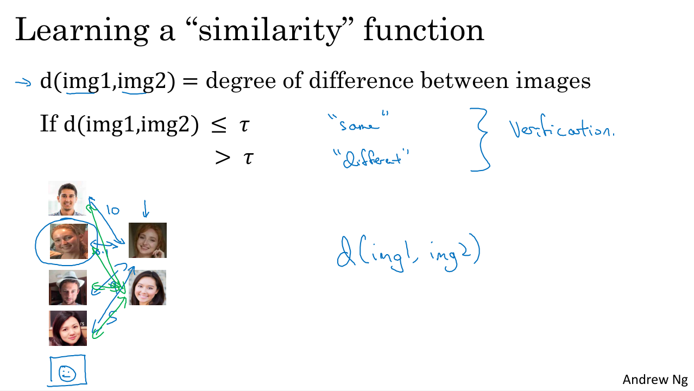

## Why Sequence Models?

In this chapter, you learn about sequence models, one of the most exciting areas in deep learning. Models like recurrent neural networks or RNNs have transformed speech recognition, natural language processing and other areas. Let's start by looking at a few examples of where sequence models can be useful. 
- In speech recognition you are given an input audio clip X and asked to map it to a text transcript Y. Both the input and the output here are sequence data, because X is an audio clip and so that plays out over time and Y, the output, is a sequence of words. So sequence models such as a recurrent neural networks and other variations, have been very useful for speech recognition. 
- Music generation is another example of a problem with sequence data. In this case, only the output Y is a sequence, the input can be the empty set, or it can be a single integer, maybe referring to the genre of music you want to generate or maybe the first few notes of the piece of music you want. 
- In sentiment classification the input X is a sequence, so given the input phrase like, "There is nothing to like in this movie" how many stars do you think this review will be? 
- Sequence models are also very useful for DNA sequence analysis. So your DNA is represented via the four alphabets A, C, G,and T. And so given a DNA sequence can you label which part of this DNA sequence say corresponds to a protein. 
- In machine translation you are given an input sentence, voulez-vou chante avec moi? And you're asked to output the translation in a different language. 
- In video activity recognition you might be given a sequence of video frames and asked to recognize the activity. 
- And in name entity recognition you might be given a sentence and asked to identify the people in that sentence. 

So all of these problems can be addressed as supervised learning with label data X, Y as the training set. But, as you can tell from this list of examples, there are a lot of different types of sequence problems. In some, both the input X and the output Y are sequences, sometimes X and Y can have different lengths, or the same. And in some of these examples only either X or only the opposite Y is a sequence. Sequence models are applicable, so all of these different settings.

## Notation

You saw some of the wide range of applications through which you can apply sequence models. Let's start by defining a notation that we'll use to build up these sequence models. 

### Named-entity recognition

As a motivating example, let's say you want to build a sequence model to input a sentence like this, Harry Potter and Hermione Granger invented a new spell: these are characters by the way, from the Harry Potter sequence of novels by J. K. Rowling. And you want a sequence model to automatically tell you where are the peoples names in this sentence. So, this is a problem called Named-entity recognition and this is used by search engines for example, to index all of say the last 24 hours news of all the people mentioned in the news articles so that they can index them appropriately. And name into the recognition systems can be used to find people's names, companies names, times, locations, countries names, currency names, and so on in different types of text. 

Now, given this input x let's say that you want a model to operate y that has one outputs per input word and the target output the design y tells you for each of the input words if it is that part of a person's name.

Now, the input is the sequence of nine words. So, eventually we're going to have nine sets of features to represent these nine words, and index into the positions and sequence, I'm going to use x and then superscript angle brackets 1, 2, 3 up to nine to index into the different positions: $X=x^{<1>}, x^{<2>}, x^{<3>}, ..., x^{<{t}>}, ..., x^{<9>}$. I'm going to use $x^{<{t}>}$ with t to index into the positions in the sequence and implying that these are temporal sequences

And similarly for the outputs, we're going to refer to these outputs as $Y=y^{<1>}, y^{<2>}, y^{<3>}, ..., y^{<{t}>}, ..., y^{<9>}$. Let's also use $T_{x}=9$ to denote the length of the input sequence, so in this case there are nine words. And we use $T_{y}=9$ to denote the length of the output sequence. 

In the notation we've been using, $x^{(i)<{t}>}$ denotes the i-th training example and $T_{x}^{(i)}$ the length of the i-th training example sequence. Then different examples in your training set can have different lengths. Similarly $y^{(i)<{t}>}$ means the i-th element in the output sequence and $T_{y}^{(i)}$ will be the length of the output sequence in the i-th training example. 

So into this example, $T_{x}^{(i)}=9$ and for a different training example with a sentence of 15 words $T_{x}^{(i)}=15$. 

### Represent individual words in a sentence

Let's next talk about how we would represent individual words in a sentence. 

So, to represent a word in the sentence the first thing you do is come up with a Vocabulary. Sometimes also called a Dictionary and that means making a list of the words that you will use in your representations. So the first word in the vocabulary is "a", the second word is "Aaron" and then a little bit further down is the word "and", and then eventually you get to the words "Harry" then eventually the word "Potter", and then all the way down to maybe the last word in dictionary is "Zulu".

And so, "a" will be word at index one, "Aaron" is word at index two, and in my dictionary the word "and" appears in positional index 367. "Harry" appears in position 4075, "Potter" in position 6830, and "Zulu" is the last word to the dictionary is maybe word 10,000. 

So in this example, I'm going to use a dictionary with size 10,000 words. This is quite small by modern Natural Language Problem (NLP) applications. For commercial applications, dictionary sizes of 30 to 50,000 are more common and 100,000 is not uncommon. Some of the large Internet companies will use dictionary sizes that are maybe a million words or even bigger than that.

### How to chose words in your dictionary

So, if you have chosen a dictionary of 10,000 words, one way to build this dictionary will be to look through your training sets and find the top 10,000 occurring words, also look through some of the online dictionaries that tells you what are the most common 10,000 words in the English Language.

What you can do is then use one hot representations to represent each of these words. For example, $x^{<1>}$ which represents the word "Harry" would be a vector with all zeros except for a 1 in position 4075 because that was the position of "Harry" in the dictionary. And then $x^{<2>}$ will be again similarly a vector of all zeros except for a 1 in position 6830 and then zeros everywhere else. The word "and" was represented as position 367 so $x^{<3>}$ would be a vector with zeros of 1 in position 367 and then zeros everywhere else. And each of these would be a 10,000 dimensional vector if your vocabulary has 10,000 words. 

So in this representation, $x^{<t>}$ for each of the values of t in a sentence will be a one-hot vector, one-hot because there's exactly one 1 and 0 everywhere else, and you will have nine $x^{<t>}$ to represent the nine words in this sentence. 

The goal is given this representation for X to learn a mapping using a sequence model to then target output Y. I will do this as a supervised learning problem.

### Unknown word 

What if you encounter a word that is not in your vocabulary? 
You create a new token or a new fake word called Unknown Word (UNK) or Out Of Vocabulary (OOV) which represents words not in your vocabulary.

## Recurrent Neural Network Model

Now, let's talk about how you can build a neural network to learn the mapping from x to y. 

## Using a standard neural network

One thing you could do is try to use a standard neural network for this task. So, in our previous example, we had nine input words. So, you could imagine trying to take these nine input words, maybe the nine one-hot vectors and feeding them into a standard neural network with few hidden layers. Then the network will output nine values (zero or one) that tell you whether each word is part of a person's name. 

But this turns out not to work well and there are really two main problems of this:
1. the first is that the inputs and outputs can be different lengths over the different examples of the dataset. So, it's not as if every single example had the same input length Tx or the same output length Ty. Maybe if you define that the sentence has a maximum length, then you could pad or zero-pad every inputs up to that maximum length but this still doesn't seem like a good representation. 
2. And then a second and maybe more serious problem is that a naive neural network architecture doesn't share features learned across different positions of texts. For example, if the neural network has learned that the word Harry appears in position one, it would be nice it automatically keeps track of that person name across the text. And this is maybe similar to what you saw in convolutional neural networks where you want things learned for one part of the image to generalize quickly to other parts of the image. We like a similar effects for sequence data as well. And similar to what you saw with ConvNet using a better representation will also let you reduce the number of parameters in your model. Previously, we said that each of the input words is a 10,000 dimensional one-hot vector and so if we were using ConvNet to input the phrase abore, then it would result in a very large input layer if the total input size was maximum number of words times 10,000. A weight matrix of this first layer will end up having an enormous number of parameters. 

### Recurrent Neural Network

A recurrent neural network does not have either of these disadvantages. So, what is a recurrent neural network?

So if you are reading the sentence from left to right, the first word you will read can be denoted as $x^{<1>}$, and we're going to feed it into a neural network layer. We can have the neural network try to predict the output $ŷ^{<1>}$: is this part of the person's name or not? 

Then we feed the network with the second word in the sentence, say $x^{<2>}$, and the RNN will predict $ŷ^{<2>}$ using $x^{<2>}$ and $a^{<1>}$ that corresponds to the activation value from time step one passed to time step two. 

Then at the next time step, recurrent neural network inputs the third word $x^{<3>}$ and it tries to output some prediction, $ŷ^{<3>}$ and so on up until the last time step where it inputs $x^{<{T_{x}}>}$ and then it outputs $ŷ^{<{T_{y}}>}$. At least in this example, $T_{x}$ is equal to $T_{y}$ and the architecture will change a bit if $T_{x}$ and $T_{y}$ are not identical. 

So at each time step, the Recurrent Neural Network passes the activation to the next time step for it to use. And we'll also have some made-up activation at time zero called $a_{0}$, that is is usually a vector of zeros (the most common choice). Some researchers will initialized $a_{0}$ randomly. 

In some research papers or in some books, you see this type of neural network drawn with the following diagram in which at every time step you input x and output y_hat. Maybe sometimes there will be a T index there and then to denote the recurrent connection, sometimes people will draw a loop like that, that the layer feeds back to the cell. Sometimes, they'll draw a shaded box to denote that this is the shaded box here, denotes a time delay of one step. I personally find these recurrent diagrams much harder to interpret and so throughout this course, I'll tend to draw the unrolled diagram like the one you have on the left, but if you see something like the diagram on the right in a textbook or in a research paper, what it really means or the way I tend to think about it is to mentally unroll it into the diagram you have on the left instead. The recurrent neural network scans through the data from left to right. The parameters it uses for each time step are shared. So there'll be a set of parameters which we'll describe in greater detail on the next slide, but the parameters governing the connection from X1 to the hidden layer, will be some set of parameters we're going to write as Wax and is the same parameters Wax that it uses for every time step. I guess I could write Wax there as well. Deactivations, the horizontal connections will be governed by some set of parameters Waa and the same parameters Waa use on every timestep and similarly the sum Wya that governs the output predictions. I'll describe on the next line exactly how these parameters work. So, in this recurrent neural network, what this means is that when making the prediction for y3, it gets the information not only from X3 but also the information from x1 and x2 because the information on x1 can pass through this way to help to prediction with Y3. Now, one weakness of this RNN is that it only uses the information that is earlier in the sequence to make a prediction. In particular, when predicting y3, it doesn't use information about the words X4, X5, X6 and so on. So this is a problem because if you are given a sentence, "He said Teddy Roosevelt was a great president." In order to decide whether or not the word Teddy is part of a person's name, it would be really useful to know not just information from the first two words but to know information from the later words in the sentence as well because the sentence could also have been, "He said teddy bears they're on sale." So given just the first three words is not possible to know for sure whether the word Teddy is part of a person's name. In the first example, it is. In the second example, it is not. But you can't tell the difference if you look only at the first three words. So one limitation of this particular neural network structure is that the prediction at a certain time uses inputs or uses information from the inputs earlier in the sequence but not information later in the sequence. We will address this in a later video where we talk about bi-directional recurrent neural networks or BRNNs. But for now, this simpler unidirectional neural network architecture will suffice to explain the key concepts. We'll just have to make a quick modifications to these ideas later to enable, say, the prediction of y_hat_three to use both information earlier in the sequence as well as information later in the sequence. We'll get to that in a later video. So, let's now write explicitly what are the calculations that this neural network does. Here's a cleaned up version of the picture of the neural network. As I mentioned previously, typically, you started off with the input a_zero equals the vector of all zeros. Next, this is what forward propagation looks like. To compute a1, you would compute that as an activation function g applied to Waa times a0 plus Wax times x1 plus a bias. I was going to write as ba, and then to compute y hat. One, the prediction at times at one, that will be some activation function, maybe a different activation function than the one above but applied to Wya times a1 plus by. The notation convention I'm going to use for the substrate of these matrices like that example, Wax. The second index means that this Wax is going to be multiplied by some X-like quantity, and this a means that this is used to compute some a-like quantity like so. Similarly, you noticed that here, Wya is multiplied by some a-like quantity to compute a y-type quantity. The activation function using or to compute the activations will often be a tanh in the choice of an RNN and sometimes very loose are also used although the tanh is actually a pretty common choice and we have other ways of preventing the vanishing gradient problem, which we'll talk about later this week. Depending on what your output y is, if it is a binary classification problem, then I guess you would use a sigmoid activation function, or it could be a softmax that you have a k-way classification problem that the choice of activation function here will depend on what type of output y you have. So, for the name entity recognition task where y was either 01, I guess a second g could be a sigmoid activation function. Then I guess you could write g2 if you want to distinguish that this could be different activation functions but I usually won't do that. Then more generally, at time t, a<t> will be g of Waa times a from the previous time step plus Wax of x from the current time step plus ba, and y hat t is equal to g. Again, it could be different activation functions but g of Wya times at plus by. So, this equation is defined forward propagation in a neural network where you would start off with a0 is the vector of all zeros, and then using a0 and x1, you will compute a1 and y hat one, and then you take x2 and use x2 and a1 to compute a2 and y hat two, and so on, and you'd carry out forward propagation going from the left to the right of this picture. Now, in order to help us develop the more complex neural networks, I'm actually going to take this notation and simplify it a little bit. So, let me copy these two equations to the next slide. Right, here they are. What I'm going to do is actually take, so to simplify the notation a bit, I'm actually going to take that and write in a slightly simpler way. So, I'm going to write this as a<t> equals g times just a matrix Wa times a new quantity which is going to be 80 minus one comma xt, and then plus ba, and so that underlying quantity on the left and right are supposed to be equivalent. So the way we define Wa is we'll take this matrix Waa, and this matrix Wax, and put them side by side, stack them horizontally as follows, and this will be the matrix Wa. So for example, if a was a 100 dimensional, and in our running example x was 10,000 dimensional, then Waa would have been a 100 by 100 dimensional matrix, and Wax would have been a 100 by 10,000 dimensional matrix. As we're stacking these two matrices together, this would be 100-dimensional. This will be 100, and this would be I guess 10,000 elements. So, Wa will be a 100 by 10100 dimensional matrix. I guess this diagram on the left is not drawn to scale, since Wax would be a very wide matrix. What this notation means, is to just take the two vectors and stack them together. So, when you use that notation to denote that, we're going to take the vector at minus one, so that's a 100 dimensional and stack it on top of at, so, this ends up being a 10100 dimensional vector. So hopefully, you can check for yourself that this matrix times this vector just gives you back the original quantity. Right. Because now, this matrix Waa times Wax multiplied by this at minus one xt vector, this is just equal to Waa times at minus one plus Wax times xt, which is exactly what we had back over here. So, the advantage of this notation is that rather than carrying around two parameter matrices, Waa and Wax, we can compress them into just one parameter matrix Wa, and just to simplify our notation for when we develop more complex models. Then for this in a similar way, I'm just going to rewrite this slightly. I'm going to write this as Wy at plus by, and now we just have two substrates in the notation Wy and by, it denotes what type of output quantity we're computing. So, Wy indicates a weight matrix or computing a y-like quantity, and here at Wa and ba on top indicates where does this parameters for computing like an a an activation output quantity. So, that's it. You now know what is a basic recurrent neural network. Next, let's talk about back propagation and how you will learn with these RNNs.

## Backpropagation Through Time

img_8, img_9

You've already learned about the basic structure of an RNN. In this video, you'll see how backpropagation in a recurrent neural network works. As usual, when you implement this in one of the programming frameworks, often, the programming framework will automatically take care of backpropagation. But I think it's still useful to have a rough sense of how backprop works in RNNs. Let's take a look. You've seen how, for forward prop, you would computes these activations from left to right as follows in the neural network, and so you've outputs all of the predictions. In backprop, as you might already have guessed, you end up carrying backpropagation calculations in basically the opposite direction of the forward prop arrows. So, let's go through the forward propagation calculation. You're given this input sequence x_1, x_2, x_3, up to x_tx. And then using x_1 and say, a_0, you're going to compute the activation, times that one, and then together, x_2 together with a_1 are used to compute a_2, and then a_3, and so on, up to a_tx. All right. And then to actually compute a_1, you also need the parameters. We'll just draw this in green, W_a and b_a, those are the parameters that are used to compute a_1. And then, these parameters are actually used for every single timestep so, these parameters are actually used to compute a_2, a_3, and so on, all the activations up to last timestep depend on the parameters W_a and b_a. Let's keep fleshing out this graph. Now, given a_1, your neural network can then compute the first prediction, y-hat_1, and then the second timestep, y-hat_2, y-hat_3, and so on, with y-hat_ty. And let me again draw the parameters of a different color. So, to compute y-hat, you need the parameters, W_y as well as b_y, and this goes into this node as well as all the others. So, I'll draw this in green as well. Next, in order to compute backpropagation, you need a loss function. So let's define an element-wise loss force, which is supposed for a certain word in the sequence. It is a person's name, so y_t is one. And your neural network outputs some probability of maybe 0.1 of the particular word being a person's name. So I'm going to define this as the standard logistic regression loss, also called the cross entropy loss. This may look familiar to you from where we were previously looking at binary classification problems. So this is the loss associated with a single prediction at a single position or at a single time set, t, for a single word. Let's now define the overall loss of the entire sequence, so L will be defined as the sum overall t equals one to, i guess, T_x or T_y. T_x is equals to T_y in this example of the losses for the individual timesteps, comma y_t. And then, so, just have to L without this superscript T. This is the loss for the entire sequence. So, in a computation graph, to compute the loss given y-hat_1, you can then compute the loss for the first timestep given that you compute the loss for the second timestep, the loss for the third timestep, and so on, the loss for the final timestep. And then lastly, to compute the overall loss, we will take these and sum them all up to compute the final L using that equation, which is the sum of the individual per timestep losses. So, this is the computation problem and from the earlier examples you've seen of backpropagation, it shouldn't surprise you that backprop then just requires doing computations or parsing messages in the opposite directions. So, all of the four propagation steps arrows, so you end up doing that. And that then, allows you to compute all the appropriate quantities that lets you then, take the riveters, respected parameters, and update the parameters using gradient descent. Now, in this back propagation procedure, the most significant message or the most significant recursive calculation is this one, which goes from right to left, and that's why it gives this algorithm as well, a pretty fast full name called backpropagation through time. And the motivation for this name is that for forward prop, you are scanning from left to right, increasing indices of the time, t, whereas, the backpropagation, you're going from right to left, you're kind of going backwards in time. So this gives this, I think a really cool name, backpropagation through time, where you're going backwards in time, right? That phrase really makes it sound like you need a time machine to implement this output, but I just thought that backprop through time is just one of the coolest names for an algorithm. So, I hope that gives you a sense of how forward prop and backprop in RNN works. Now, so far, you've only seen this main motivating example in RNN, in which the length of the input sequence was equal to the length of the output sequence. In the next video, I want to show you a much wider range of RNN architecture, so I'll let you tackle a much wider set of applications. Let's go on to the next video.

## Different Types of RNNs

img_10, img_11, img_12, img_13

So far, you've seen an RNN architecture where the number of inputs, Tx, is equal to the number of outputs, Ty. It turns out that for other applications, Tx and Ty may not always be the same, and in this video, you'll see a much richer family of RNN architectures. You might remember this slide from the first video of this week, where the input x and the output y can be many different types. And it's not always the case that Tx has to be equal to Ty. In particular, in this example, Tx can be length one or even an empty set. And then, an example like movie sentiment classification, the output y could be just an integer from 1 to 5, whereas the input is a sequence. And in name entity recognition, in the example we're using, the input length and the output length are identical, but there are also some problems were the input length and the output length can be different.They're both our sequences but have different lengths, such as machine translation where a French sentence and English sentence can mean two different numbers of words to say the same thing. So it turns out that we could modify the basic RNN architecture to address all of these problems. And the presentation in this video was inspired by a blog post by Andrej Karpathy, titled, The Unreasonable Effectiveness of Recurrent Neural Networks. Let's go through some examples. The example you've seen so far use Tx equals Ty, where we had an input sequence x(1), x(2) up to x(Tx), and we had a recurrent neural network that works as follows when we would input x(1) to compute y hat (1), y hat (2), and so on up to y hat (Ty), as follows. And in early diagrams, I was drawing a bunch of circles here to denote neurons but I'm just going to make those little circles for most of this video, just to make the notation simpler. So, this is what you might call a many-to-many architecture because the input sequence has many inputs as a sequence and the outputs sequence is also has many outputs. Now, let's look at a different example. Let's say, you want to address sentiments classification. Here, x might be a piece of text, such as it might be a movie review that says, "There is nothing to like in this movie." So x is going to be sequenced, and y might be a number from 1 to 5, or maybe 0 or 1. This is a positive review or a negative review, or it could be a number from 1 to 5. Do you think this is a one-star, two-star, three, four, or five-star review? So in this case, we can simplify the neural network architecture as follows. I will input x(1), x(2). So, input the words one at a time. So if the input text was, "There is nothing to like in this movie." So "There is nothing to like in this movie," would be the input. And then rather than having to use an output at every single time-step, we can then just have the RNN read into entire sentence and have it output y at the last time-step when it has already input the entire sentence. So, this neural network would be a many-to-one architecture. Because as many inputs, it inputs many words and then it just outputs one number. For the sake of completeness, there is also a one-to-one architecture. So this one is maybe less interesting. The smaller the standard neural network, we have some input x and we just had some output y. And so, this would be the type of neural network that we covered in the first two courses in this sequence. Now, in addition to many-to-one, you can also have a one-to-many architecture. So an example of a one-to-many neural network architecture will be music generation. And in fact, you get to implement this yourself in one of the primary exercises for this course where you go is have a neural network, output a set of notes corresponding to a piece of music. And the input x could be maybe just an integer, telling it what genre of music you want or what is the first note of the music you want, and if you don't want to input anything, x could be a null input, could always be the vector zeroes as well. For that, the neural network architecture would be your input x. And then, have your RNN output. The first value, and then, have that, with no further inputs, output. The second value and then go on to output. The third value, and so on, until you synthesize the last notes of the musical piece. If you want, you can have this input a(0) as well. One technical now what you see in the later video is that, when you're actually generating sequences, often you take these first synthesized output and feed it to the next layer as well. So the network architecture actually ends up looking like that. So, we've talked about many-to- many, many-to-one, one-to-many, as well as one-to-one. It turns out there's one more interesting example of many-to-many which is worth describing. Which is when the input and the output length are different. So, in the many-to-many example, you saw just now, the input length and the output length have to be exactly the same. For an application like machine translation, the number of words in the input sentence, say a French sentence, and the number of words in the output sentence, say the translation into English, those sentences could be different lengths. So here's an alternative new network architecture where you might have a neural network, first, reading the sentence. So first, reading the input, say French sentence that you want to translate to English. And having done that, you then, have the neural network output the translation. As all those y hat of (Ty). And so, with this architecture, Tx and Ty can be different lengths. And again, you could draw on the a(0) [inaudible]. And so, this that collinear network architecture has two distinct parts. There's the encoder which takes as input, say a French sentence, and then, there's is a decoder, which having read in the sentence, outputs the translation into a different language. So this would be an example of a many-to-many architecture. So by the end of this week, you have a good understanding of all the components needed to build these types of architectures. And then, technically, there's one other architecture which we'll talk about only in week four, which is attention based architectures. Which maybe isn't clearly captured by one of the diagrams we've drawn so far. So, to summarize the wide range of RNN architectures, there is one-to-one, although if it's one-to-one, we could just give it this, and this is just a standard generic neural network. Well, you don't need an RNN for this. But there is one-to-many. So, this was a music generation or sequenced generation as example. And then, there's many-to-one, that would be an example of sentiment classification. Where you might want to read as input all the text with a movie review. And then, try to figure out that they liked the movie or not. There is many-to-many, so the name entity recognition, the example we've been using, was this where Tx is equal to Ty. And then, finally, there's this other version of many-to-many, where for applications like machine translation, Tx and Ty no longer have to be the same. So, now you know most of the building blocks, the building are pretty much all of these neural networks except that there are some subtleties with sequence generation, which is what we'll discuss in the next video. So, I hope you saw from this video that using the basic building blocks of an RNN, there's already a wide range of models that you might be able put together. But as I mentioned, there are some subtleties to sequence generation, which you'll get to implement yourself as well in this week's primary exercise where you implement a language model and hopefully, generate some fun sequences or some fun pieces of text. So, what I want to do in the next video, is go deeper into sequence generation. Let's see the details in the next video.

## Language Model and Sequence Generation

img_14, img_15, img_16, img_17

Language modeling is one of the most basic and important task in natural language processing. It is also one that RNNs do very well. In this video, you'll learn about how to build a language model using an RNN, and this will lead up toward a fun programming exercise at the end of this week, where you build a language model and use it to generate Shakespeare like texts and other types of texts. Let's get started. What is a language model? Let's say you're building a speech recognition system and you hear the sentence, the apple and pear salad was delicious. What did you just hear me say? Did I say the apple and pair salad? Or did I say the apple and pear salad? You probably think the second sentence is much more likely. In fact, that's what a good speech recognition system would output, even though these two sentences sound exactly the same. The way a speech recognition system picks the second sentence is by using a language model which tells it what is the probability of either of these two sentences. For example, a language model might say that the chance of the first sentences is 3.2 by 10 to the negative 13, and the chance of the second sentence is say 5.7 by 10 to the negative 10, and so with these probabilities, the second sentence is much more likely by over a factor of 10^3 compared to the first sentence, and that's why a speech recognition system will pick the second choice. What a language model does is, given any sentence, its job is to tell you what is the probability of that particular sentence, and by probability of sentence, I mean, if you were to pick up a random newspaper, open a random email, or pick a random webpage, or listen to the next thing someone says, the friend of you says, what is the chance that the next sentence you read somewhere out there in the world will be a particular sentence like the apple and pear salad?

This is a fundamental component for both speech recognition systems as you've just seen, as well as for machine translation systems, where translation systems want to output only sentences that are likely. So the basic job of a language model is to input the sentence which I'm going to write as a sequence y^1, y^2 up to y^ty, and for language model, it'll be useful to represent the sentences as outputs y rather than as inputs x. But what a language model does is it estimates the probability of that particular sequence of words.

How do you build a language model? To build such a model using a RNN, you will first need a training set comprising a large corpus of English text or text from whatever language you want to build a language model of. The word corpus is an NLP terminology that just means a large body or a very large tens of English sentences. Let's say you get a sentence in your training set as follows, cats average 15 hours of sleep a day. The first thing you would do is tokenize the sentence, and that means you would form a vocabulary as we saw in an earlier video, and then map each of these words to say one-hot vectors or to indices in your vocabulary. One thing you might also want to do is model when sentences end. So another common thing to do is to add an extra token called EOS that stands for end of sentence, that can help you figure out when a sentence ends. We'll talk more about this later. But the EOS token can be appended to the end of every sentence in your training set if you want your model to explicitly capture when sentences end. We won't use the end-of-sentence token for the problem exercise at the end of this week. But for some applications, you might want to use this, and we'll see later where this comes in handy. In this example, we have y^1, y^2, y^3, 4, 5, 6, 7, 8, 9. Nine inputs in this example if you append the end of sentence token to the end. Doing the tokenization step, you can decide whether or not the period should be a token as well. In this example, I'm just ignoring punctuation, so I'm just using day as another token and omitting the period. If you want to treat the period or other punctuation as the explicit token, then you could add the period to your vocabulary as well. Now, one other detail would be, what if some of the words in your training set are not in your vocabulary? If your vocabulary uses 10,000 words, maybe the 10,000 most common words in English, then the term Mau as a decision, Mau's breed of cat, that might not be in one of your top 10,000 tokens. In that case, you could take the word Mau and replace it with a unique token called UNK, which stands for unknown words, and we just model the chance of the unknown word instead of the specific word, Mau. Having carried out the tokenization step, which basically means taking the input sentence and map here to the individual tokens or the individual words in your vocabulary, next, let's build an RNN to model the chance of these different sequences. One of the things we'll see on the next slide is that you end up setting the inputs x^t to be equal to y of t minus 1. But you'll see that in a little bit. Let's go on to build the RNN model, and I'm going to continue to use this sentence as the running example. This will be the RNN architecture. At time zero, you're going to end up computing some activation a_1 as a function of some input x_1, and x_1 would just be set to zero vector. The previous a_0 by convention, also set that to vector zeros. But what a_1 does is it will make a Softmax prediction to try to figure out what is the probability of the first word y, so that's going to be y_1. What this step does is really it has a Softmax, so it's trying to predict what is the probability of any word in a dictionary, what's the chance that the first word is a, what's the chance that the first word is Aaron, and then what's the chance that the first word is cats, all the way up to what's the chance the first word is Zulu, or what's the chance that the first word is an unknown word, or what's the chance that the first words is in a sentence though or shouldn't happen really. Y hat 1 is output according to a Softmax, it just predicts what's the chance that the first word being whatever it ends up being. In our example, one of the bigger the word cats. This would be a 10,000 way Softmax output. If you have 10,000 word vocabulary or 10,002, I guess you can't unknown word and the sentence has two additional tokens. Then the RNN steps forward to the next step and has some activation a_2 in the next step. At this step, it's job is to try to figure out what is the second word. But now we will also give it the correct first word. We'll tell it that G in reality, the first word was actually cats, so that's y_1, so tell it cats. This is why y_1 is equal to x_2. At the second step, the output is again predicted by Softmax, the RNN's job is to predict what's the chance of it being whatever word it is, is it A or Aaron, or cats or Zulu, or unknown word or EOS or whatever, given what had come previously. In this case, I guess the right answer was average since the sentence starts with cats average. Then you go on to the next step of the RNN where you now compute a_3. But to predict what is the third word which is 15, we can now give it the first two words. We're going to tell cats average of the first two words. This next input here, x_3 will be equal to y_2, so the word average is input and its job is to figure out what is the next word in the sequence. Another was trying to figure out what is the probability of any words in the dictionary given that what just came before was cats average? In this case, the right answer is 15 and so on. Until at the end, you end up at I guess time step nine, you end up feeding it x_9 which is equal to y_8 which is the word day. Then this has a_9 and its job is to open y hat nine, and this happens to be the EOS tokens. What's the chance of whatever it is given everything that's come before? Hopefully you'll predict that there's a high chance of EOS in the sentence token. But so, each step in the RNN will look at some set of preceding words such as, given the first three words, what is the distribution over the next word? This RNN learns to predict one word at a time going from left to right. Next, to train this through a network, we're going to define the cost function. At a certain time t, if the true word was yt and your network Softmax predicted some y hat t, then this is the Softmax loss function that you'll already be familiar with, and then the overall loss is just the sum over all time steps of the losses associated with the individual predictions. If you train this RNN on a large training set, what it will be able to do is, given any initial set of words such as cats average 15 or cats average 15 hours of, it can predict what is the chance of the next word. Given a new sentence, say y_1, y_2, y_3, with just three words for simplicity, the way you can figure out what is the chance of this entire sentence would be, well, the first Softmax tells you what's the chance of y_1, that would be this first output. Then the second one can tell you what's the chance of p of y_2 given y_1. Then the third one tells you what's the chance of y_3 given y_1 and y_2, and so it's by multiplying out these three probabilities. You see much more of the details of this in [inaudible] exercise, it's by multiplying out these three that you end up with the probability of this three words sentence. That's the basic structure of how you can train a language model using an RNN. If some of these ideas still seem a little bit abstract, don't worry about it. You get to practice all of these ideas in the coming exercise. But next it turns out, one of the most fun things you can do with a language model is to sample sequences from the model. Let's take a look at that in the next video.

## Sampling Novel Sequences

img_18, img_19

After you train a sequence model, one of the ways you can informally get a sense of what is learned is to have a sample novel sequences. Let's take a look at how you could do that.

So remember that a sequence model, models the chance of any particular sequence of words as follows, and so what we like to do is sample from this distribution to generate noble sequences of words.

So the network was trained using this structure shown at the top. But to sample, you do something slightly different, so what you want to do is first sample what is the first word you want your model to generate. And so for that you input the usual x1 equals 0, a0 equals 0. And now your first time stamp will have some max probability over possible outputs. So what you do is you then randomly sample according to this soft max distribution. So what the soft max distribution gives you is it tells you what is the chance that it refers to this a, what is the chance that it refers to this Aaron? What's the chance it refers to Zulu, what is the chance that the first word is the Unknown word token. Maybe it was a chance it was a end of sentence token. And then you take this vector and use, for example, the numpy command np.random.choice to sample according to distribution defined by this vector probabilities, and that lets you sample the first words. Next you then go on to the second time step, and now remember that the second time step is expecting this y1 as input. But what you do is you then take the y1 hat that you just sampled and pass that in here as the input to the next timestep. So whatever works, you just chose the first time step passes this input in the second position, and then this soft max will make a prediction for what is y hat 2. Example, let's say that after you sample the first word, the first word happened to be "the", which is very common choice of first word. Then you pass in "the" as x2, which is now equal to y hat 1. And now you're trying to figure out what is the chance of what the second word is given that the first word is "the". And this is going to be y hat 2. Then you again use this type of sampling function to sample y hat 2. And then at the next time stamp, you take whatever choice you had represented say as a one hard encoding. And pass that to next timestep and then you sample the third word to that whatever you chose, and you keep going until you get to the last time step. And so how do you know when the sequence ends? Well, one thing you could do is if the end of sentence token is part of your vocabulary, you could keep sampling until you generate an EOS token. And that tells you you've hit the end of a sentence and you can stop. Or alternatively, if you do not include this in your vocabulary then you can also just decide to sample 20 words or 100 words or something, and then keep going until you've reached that number of time steps. And this particular procedure will sometimes generate an unknown word token. If you want to make sure that your algorithm never generates this token, one thing you could do is just reject any sample that came out as unknown word token and just keep resampling from the rest of the vocabulary until you get a word that's not an unknown word. Or you can just leave it in the output as well if you don't mind having an unknown word output. So this is how you would generate a randomly chosen sentence from your RNN language model. Now, so far we've been building a words level RNN, by which I mean the vocabulary are words from English. Depending on your application, one thing you can do is also build a character level RNN. So in this case your vocabulary will just be the alphabets. Up to z, and as well as maybe space, punctuation if you wish, the digits 0 to 9. And if you want to distinguish the uppercase and lowercase, you can include the uppercase alphabets as well, and one thing you can do as you just look at your training set and look at the characters that appears there and use that to define the vocabulary. And if you build a character level language model rather than a word level language model, then your sequence y1, y2, y3, would be the individual characters in your training data, rather than the individual words in your training data. So for our previous example, the sentence cats average 15 hours of sleep a day. In this example, c would be y1, a would be y2, t will be y3, the space will be y4 and so on. Using a character level language model has some pros and cons. One is that you don't ever have to worry about unknown word tokens. In particular, a character level language model is able to assign a sequence like mau, a non-zero probability. Whereas if mau was not in your vocabulary for the word level language model, you just have to assign it the unknown word token. But the main disadvantage of the character level language model is that you end up with much longer sequences. So many english sentences will have 10 to 20 words but may have many, many dozens of characters. And so character language models are not as good as word level language models at capturing long range dependencies between how the the earlier parts of the sentence also affect the later part of the sentence. And character level models are also just more computationally expensive to train. So the trend I've been seeing in natural language processing is that for the most part, word level language model are still used, but as computers gets faster there are more and more applications where people are, at least in some special cases, starting to look at more character level models. But they tend to be much hardware, much more computationally expensive to train, so they are not in widespread use today. Except for maybe specialized applications where you might need to deal with unknown words or other vocabulary words a lot. Or they are also used in more specialized applications where you have a more specialized vocabulary. So under these methods, what you can now do is build an RNN to look at the purpose of English text, build a word level, build a character language model, sample from the language model that you've trained. So here are some examples of text thatwere examples from a language model, actually from a culture level language model. And you get to implement something like this yourself in the [INAUDIBLE] exercise. If the model was trained on news articles, then it generates texts like that shown on the left. And this looks vaguely like news text, not quite grammatical, but maybe sounds a little bit like things that could be appearing news, concussion epidemic to be examined. And it was trained on Shakespearean text and then it generates stuff that sounds like Shakespeare could have written it. The mortal moon hath her eclipse in love. And subject of this thou art another this fold. When besser be my love to me see sabl's. For whose are ruse of mine eyes heaves.

So that's it for the basic RNN, and how you can build a language model using it, as well as sample from the language model that you've trained. In the next few videos, I want to discuss further some of the challenges of training RNNs, as well as how to adjust some of these challenges, specifically vanishing gradients by building even more powerful models of the RNN. So in the next video let's talk about the problem of vanishing the gradient and we will go on to talk about the GRU, Gate Recurring Unit as well as the LSTM models.

## Vanishing Gradients with RNNs

img_20

You've learned about how RNNs work and how they can be applied to problems like name entity recognition as well as to language modeling. You saw how back propagation can be used to train an RNN. It turns out that one of the problems of the basic RNN algorithm is that it runs into vanishing gradient problems. Let's discuss that and in the next few videos we'll talk about some solutions that will help to address this problem. You've seen pictures of RNNs that look like this. Let's take a language modeling example. Let's say you see this sentence. The cat, which already ate and maybe already ate a bunch of food that was delicious, dot dot, dot, dot, dot was full. To be consistent is because the cat is singular, it should be the cat was where there was the cats, which already ate a bunch of food was delicious and the apples and pears and so on were full. To be consistent, it should be cat was or cats were. This is one example of when language can have very long-term dependencies where it worded as much earlier can affect what needs to come much later in the sentence. But it turns out that the basic RNN we've seen so far is not very good at capturing very long-term dependencies. To explain why, you might remember from our earlier discussions of training very deep neural networks that we talked about the vanishing gradients problem. This is a very, very deep neural network, say 100 years or even much deeper. Then you would carry out forward prop from left to right and then backprop. We said that if this is a very deep neural network, then the gradient from this output y would have a very hard time propagating back to affect the weights of these earlier layers, to affect the computations of the earlier layers. For an RNN with a similar problem, you have forward prop going from left to right and then backprop going from right to left. It can be quite difficult because of the same vanishing gradients problem for the outputs of the errors associated with the later timesteps to affect the computations that are earlier. In practice, what this means is it might be difficult to get a neural network to realize that it needs to memorize. Did you see a singular noun or a plural noun so that later on in the sequence it can generate either was or were, depending on whether it was singular or plural. Notice that in English this stuff in the middle could be arbitrarily long. You might need to memorize the singular plural for a very long time before you get to use that bit of information. Because of this problem, the basic RNN model has many local influences, meaning that the output y hat three is mainly influenced by values close to y hat three and a value here is mainly influenced by inputs that are somewhat close. It's difficult for the output here to be strongly influenced by an input that was very early in the sequence. This is because whatever the output is, whether this got it right, this got it wrong, it's just very difficult for the error to backpropagate all the way to the beginning of the sequence, and therefore to modify how the neural network is doing computations earlier in the sequence. This is a weakness of the basic RNN algorithm, one which will to address in the next few videos. But if we don't address it, then RNNs tend not to be very good at capturing long-range dependencies. Even though this discussion has focused on vanishing gradients, you remember, when we're talking about very deep neural networks that we also talked about exploding gradients. Where doing backprop, the ingredients should not just decrease exponentially they may also increase exponentially with the number of layers you go through. It turns out that vanishing gradients tends to be the biggest problem with training RNNs. Although when exploding gradients happens it can be catastrophic because the exponentially large gradients can cause your parameters to become so large that your neural network parameters get really messed up. It turns out that exploding gradients are easier to spot because the parameter has just blow up. You might often see NaNs, not a numbers, meaning results of a numerical overflow in your neural network computation. If you do see exploding gradients, one solution to that is apply gradients clipping. All that means is, look at your gradient vectors, and if it is bigger than some threshold, re-scale some of your gradient vectors so that it's not too big, so that is clipped according to some maximum value. If you see exploding gradients, if your derivatives do explore the resilience, just apply gradient clipping. That's a relatively robust solution that will take care of exploding gradients. But vanishing gradients is much harder to solve and it will be the subject of the next few videos. To summarize, in an earlier course, you saw how we're training a very deep neural network. You can run into vanishing gradient or exploding gradient problems where the derivative either decreases exponentially, or grows exponentially as a function of the number of layers. An RNN, say an RNN processing data over 1,000 times sets, or over 10,000 times sets, that's basically a 1,000 layer or like a 10,000 layer neural network. It too runs into these types of problems. Exploding gradients you could solve address by just using gradient clipping, but vanishing gradients will take way more to address. What we'll do in the next video is talk about GRUs, a greater recurrent units, which is a very effective solution for addressing the vanishing gradient problem and will allow your neural network to capture much longer range dependencies. Let's go on to the next video.

## Gated Recurrent Unit (GRU)

img_21, img_22, img_23, img_24 

You've seen how a basic RNN works. In this video, you learn about the gated recurrent unit, which has a modification to the RNN hidden layer that makes it much better at capturing long-range connections and helps a lot with the vanishing gradient problems. Let's take a look. You've already seen the formula for computing the activations at time t of an RNN. It's the activation function applied to the parameter W_a times the activations for a previous time sediment the current input and then plus the bias. I'm going to draw this as a picture. The RNN units I'm going to draw as a picture, drawn as a box which inputs a of t minus 1, deactivation for the last timestep and also inputs x^t, and these two go together, and after some weights and after this type of linear calculation, if g is a tanh activation function, then after the tanh, it computes the output of activation, a. The output activation a^t might also be parsed to say a softmax unit or something that could then be used to outputs y hat ^t. This is maybe a visualization of the RNN unit of the hidden layer of the RNN in terms of a picture. I want to show you this picture because we're going to use a similar picture to explain the GRU or the gated recurrent unit. A lot of ideas of GRUs were due to these two papers respectively by Junyoung Chung, Caglar, Gulcehre, KyungHyun Cho, and Yoshua Bengio. Sometime is going to refer to this sentence, which we'd seen in the last video, to motivate that given a sentence like this, you might need to remember the cat was singular to make sure you understand why that was rather than were as of the cat was for the cats were full. As we read in this sentence from left to right, the GRU unit is going to have a new variable called C, which stands for cell, for memory cell. What the memory cell do is it will provide a bit of memory. Remember, for example, whether cat was singular or plural, so that when it gets much further into the sentence, it can still work on the consideration whether the subject of the sentence was singular or plural. At time t, the memory cell will have some value c of t. What we'll see is that the GRU unit will actually output an activation value a of t that's equal to c of t. For now I wanted to use different symbols c and a to denote the memory cell value and the output activation value even though they're the same and I'm using this notation because when we talked about LSTMs a little bit later, these will be two different values. But for now, for the GRU c of t is equal to the output activation a of t. These are the equations that govern the computations of a GRU unit. At every time step, we're going to consider an overwriting the memory cell with a value c tilde of t. This going to be a candidate for replacing c of t. We're going to compute this using an activation function, tanh of w_c, and so that's the parameter matrix w_c and we'll pass it as parameter matrix. The previous value of the memory cell, the activation value, as well as the current input value x^t and then plus a bias. C tilde of t is going to be a candidate for replacing c^t. Then the key, really the important idea of the GRU, it will be that we'll have a gate. The gate I'm going to call Gamma_u. This is the capital Greek alphabet, Gamma_u, and u stands for update gate. This would be a value between 0 and 1. To develop your intuition about how GRUs work, think of Gamma_u this gate value as being always 0 or 1. Although in practice, your computer with a sigmoid function applied to this. Remember that the sigmoid function looks like this, as value is always between 0 and 1. For most of the possible ranges of the input, the sigmoid function is either very, very close to 0 or very, very close to 1. For intuition, think of Gamma as being either 0 or 1 most of the time.

I chose the alphabet Gamma for this because if you look at a gated fence, it looks a bit like this, I guess. Then there are a lot of Gammas in this fence. That's why your Gamma_u we're going to use to denote the gate. Also Greek alphabet G, like G for gate, so G for Gamma and G for gate. Then next the key part of the GRU is this equation, which is that we have come up with a candidate where we're thinking of updating C using c tilde and then the gate will decide whether or not we actually update it. The way to think about it is maybe this memory cell C is going to be set to either zero or one depending on whether the word you're conserving, really the subject of the sentence is singular or plural. Because it's singular, let's say that we set this to one and if it was plural, maybe we'll set this as a zero and then the GRU unit will memorize the value of the C^t all the way until here, where this is still equal to one and so that tells it was singular so use the choice was. The job of the gate, of gamma u, is to decide when do you update this value. In particular, when you see the phrase the cat, you know that you're talking about a new concept, the subject of the sentence cat. That would be a good time to update this bit and then maybe when you're done using it the cat was full, then you know I don't need to memorize anymore I can just forget that. The specific equation we'll use for the GRU is the following; which is that the actual value of C^t would be equal to this gate times the candidate value plus one minus the gate times the old value C^t minus one. Notice that if the gate, if this update value of z equal to one, then is saying set the new value of C^t equal to this candidate value so that's like over here, set the gate equal to one so go ahead and update that bit. Then for all of these values in the middle, you should have the gate equal zero so do the same, don't update it, just hang on to the old value because if gamma u is equal to zero, then this would be zero and this will be one and so it's just setting C^t equal to the old value even as you scan the sentence from left to right. When the gate is equal to zero as saying, don't update it, just hang on to the value and don't forget what it's value was and so that way, even when you get all the way down here, hopefully you've just been setting C^t equal C^t minus one all along and still memorizes the cat was singular. Let me also draw a picture to denote the GRU unit. By the way, when you look in online blog posts and textbooks and tutorials, these types of pictures are quite popular for explaining GRUs as well as we'll see later LSTM units. I personally find the equations easier to understand in the pictures so if the picture doesn't make sense don't worry about it, but I'll just draw it in case it helps some of you. The GRU unit inputs C^t minus one for the previous time step and this happens to be equal to 80 minus one so it takes us as input. Then it also takes this input X^t. Then these two things get combined together and with some appropriate waiting and some tonnage. This gives you c tilde t, which is a candidate for replacing C^t and then we have a different set of parameters and through a sigmoid activation function, this gives you gamma u, which is the update gate and then finally, all of these things combined together through another operation. I won't write out the formula but this box here which are shaded in purple, represents this equation which we had down there. That's what this purple operation represents and it takes as input the gate value, the candidate new value, that's the gate value again, and the old value for C^t it takes as input this, this and this, and together they generate the new value for the memory cell. That's C^t equals a. If you wish, you could also use this impulses through a soft-max or something to make some prediction for Y^t so that is the GRU units. These are slightly simplified version of it. What is remarkably good at is through the gate deciding that when you're scanning the sentence from left to right, say that that's a good time to update one to the memory cell and enter, not change it, until you get to the point where you really needed to use this memory cell that you had set even much earlier in the sentence. Now, because the gate is quite easy to set to zero so long as this quantity is a large negative value, then up to numerical round-off, the update gate will be essentially zero, very close to zero. When that's the case, then this update equation and sub setting C^t equals C^t minus one and so this is very good at maintaining the value for the cell and because gamma can be so close to zero, can be 0.000001 or even smaller than that. it doesn't suffer from much of a vanishing gradient problem because in say gamma so close to zero that this becomes essentially C^t equals C^t minus one and the value of C^t is maintained pretty much exactly even across many times that. This can help significantly with the vanishing gradient problem and therefore allowing your network to learn even very long-range dependencies, such as the cat and was are related even if they are separated by a lot of words in the middle. Now, I just want to talk over some more details of how you implement this. In the equations have written, C^t can be a vector. If you have 100-dimensional hidden activation value, then C^t can be 100-dimensional Zai, and so C^t would also be the same dimension and Gamma would also be the same dimension as the other things I'm drawing in boxes. In that case, these asterisks are actually element-wise multiplication. Here, if the gates is 100-dimensional vector, what it is, is really 100-dimensional vector of bits, the value is mostly 0 and 1, that tells you of this 100-dimensional memory cell, which are the bits you want to update. Of course in practice, Gamma won't be exactly`0 and 1, sometimes I'll say values in the middle as well. There is convenient for intuition to think of it as mostly taking on values that are pretty much exactly 0, or pretty much exactly 1. What these element-wise multiplications do is it just tells you GRU which are the dimensions of your memory cell vector to update at every time step. You can choose to keep some bits constant while updating other bits. For example, maybe you'll use one-bit to remember the singular or plural cat, and maybe you'll use some other bits to realize that you're talking about food. Because we talked about eating and talk about foods, then you'd expect to talk about whether the cat is full later. You can use different bits and change only a subset of the bits at every point in time. You now understand the most important ideas that a GRU. What I presented on this slide is actually a slightly simplified GRU unit. Let me describe the full GRU unit. To do that, let me copy the three main equations. This one, this one, and this one to the next slide. Here they are. For the full GRU units, I'm sure they'll make one change to this, which is for the first equation which was calculating the candidate new value for the memory cell, I'm going to add just one term. They pushed that a little bit to the right, and I'm going to add one more gate. This is another gate Gamma r. You can think of r as standing for relevance. This gate Gamma r tells you how relevant is C^t minus 1 to computing the next candidate for C^t. This gate Gamma r is computed pretty much as you expect with a new parameter matrix w _r, and then the same things as input x_t plus b_r.

As you can imagine, there are multiple ways to design these types of neural networks, and why do we have Gamma r? Why not use a simpler version from the previous slides? It turns out that over many years, researchers have experimented with many different possible versions of how to design these units to try to have longer range connections. To try to have model long-range effects and also address vanishing gradient problems. The GRU is one of the most commonly used versions that researchers have converged to and then found as robust and useful for many different problems. If you wish, you could try to invent a new versions of these units if you want, but the GRU is a standard one, is just commonly used. Although you can imagine that researchers have tried other versions that are similar but not exactly the same as what I'm writing down here as well. The other common version is called an LSTM, which stands for Long, Short-term Memory, which we'll talk about in the next video. But GRUs and LSTMs are two specific instantiations of this set of ideas that are most commonly used. Just one note on notation. I tried to define a consistent notation to make these ideas easier to understand. If you look at the academic literature, sometimes you'll see people use an alternative notation, there would be H tilde there, U, R and H to refer to these quantities as well. They try to use a more consistent notation between GRUs and LSTMs as well as using a more consistent notation, Gamma to refer to the gains to hopefully make these ideas easier to understand. That's it for the GRU, for the Gated Recurrent Unit. This is one of the ideas in RNNs that has enabled them to become much better at capturing very long-range dependencies as made RNNs much more effective. Next, as I briefly mentioned, the other most commonly used deviation of this class of ideas is something called the LSTM unit or the Long, Short-term Memory unit. Let's take a look at that in the next video.

## Long Short Term Memory (LSTM)

img_25, img_26, img_27, img_28

In the last video, you learn about the GRU, the Gated Recurring Unit and how that can allow you to learn very long range connections in a sequence. The other type of unit that allows you to do this very well is the LSTM or the long short term memory units. And this is even more powerful than the GRU, let's take a look. Here the equations from the previous video for the GRU and for the GRU we had a t = c t and two gates the update gate and the relevance gate. c(tilde) t, which is a candidate for replacing the memory cell. And then we use the gate, the update gate gamma Wu to decide whether or not to update c t using c(tilde) t. The LSTM is an even slightly more powerful and more general version of the GRU and it's due to set hook writer and Jurgen Schmidt Huber. And this was a really seminal paper, there's a huge impact on sequence modeling, although I think this paper is one of the more difficult ones to read. It goes quite a lot into the theory of vanishing gradients. And so I think more people have learned about the details of LSTM through maybe other places than from this particular paper, even though I think this paper has had a wonderful impact on the deep learning community. But these are the equations that govern the LSTM, so the will continue to the memory cell c and the candidate value for updating it c(tilde) t will be this. And so notice that for the LSTM, we will no longer have the case that a t is equal to c t. So this is what we use and so this is like the equation on the left except that with now more use a t there or a t-1, c t-1 and we are not using this gamma r this relevance. Although you can have a deviation of the LSTM and we put that back in but with a more common version of the LSTM doesn't bother with that. And then we will have an update gate same as before. So w update and I'm going to use a t-1 here, ct +bu and one new property of the LSTM is instead of having one update gate control both of these terms, we're going to have two separate terms. So instead of gamma u and 1- gamma u were going to have gamma u here and for gate k we should call gamma f. So this gate gamma f is going to be sigmoid of, pretty much what you'd expect.

c t plus bf, and then we're going to have a new output gate which is sigmoid of Wo and then again, pretty much what you'd expect plus bo.

And then the update value to the memory cell will be c t equals gamma u then this asterisk in those element wise multiplication. There's a vector vector, element wise multiplication plus and instead of one minus gamma u were going to have a separate for gate gamma f times c t-1. So this gives the memory cell the option of keeping the old value c t-1 and then just adding to it this new value c(tilde) t. So use a separate update and forget gates right? So this stands on update.

Forget and output gates and then finally instead of 80 equals c t. Is a t equal to the output gate element wise multiply with c t. So these are the equations that govern the LSTM. And you can tell it has three gates instead of two. So it's a bit more complicated and places against in slightly different places. So here again are the equations governing the behavior of the LSTM. Once again it's traditional to explain these things using pictures, so let me draw one here. And if these pictures are too complicated don't worry about it, I probably find the equations easier to understand than the picture but just show the picture here for the intuitions it conveys. The particular picture here was very much inspired by a blog post due to Chris Kohler titled Understanding LSTM networks. And the diagram drawn here is quite similar to one that he drew in his blog post. But the key things to take away from this picture or maybe that you use a t-1 and x t to compute all the gate values. So in this picture you have a t-1 and x t coming together to compute a forget gate to compute the update gates and the computer the output gate. And they also go through a tarnish to compute a c(tilde) t. And then these values are combined in these complicated ways with element wise multiplies and so on to get a c t from the previous c t -1. Now one element of this is interesting is if you hook up a bunch of these in parallel so that's one of them and you connect them, connect these temporarily. So there's the input x 1, then x 2, x 3. So you can take these units and just hook them up as follows where the output a for a period of time, 70 input at the next time set. And similarly for C and I've simplified the diagrams a little bit at the bottom. And one cool thing about this, you notice is that this is a line at the top that shows how so long as you said the forget and the update gates, appropriately, it is relatively easy for the LSTM to have some value C0 and have that be passed all the way to the right to have, maybe C3 equals C0. And this is why the LSTM as well as the GRU is very good at memorizing certain values. Even for a long time for certain real values stored in the memory cells even for many, many times steps.

So that's it for the LSTM, as you can imagine, there are also a few variations on this that people use. Perhaps the most common one, is that instead of just having the gate values be dependent only on a t-1, xt. Sometimes people also sneak in there the value c t -1 as well. This is called a peephole connection.

Not a great name maybe, but if you see peephole connection, what that means is that the gate values may depend not just on a t-1 but and on x t but also on the previous memory cell value. And the peephole connection can go into all three of these gates computations. So that's one common variation you see of LSTMs one technical detail is that these are say 100 dimensional vectors. If you have 100 dimensional hidden memory cell union. So is this and so say fifth element of c t-1 affects only the fifth element of the correspondent gates. So that relationship is 1 to 1 where not every element of the 100 dimensional c t-1 can affect all elements of the gates, but instead the first element of c t-1 affects the first element of the gates. Second element affects second elements and so on. But if you ever read the paper and see someone talk about the peephole connection, that's what they mean, that c t -1 is used to affect the gate value as well. So that's it for the LSTM, when should you use a GRU and when should you use an LSTM. There is a widespread consensus in this. And even though I presented GRUs first in the history of deep learning, LSTMs actually came much earlier and then GRUs were relatively recent invention that were maybe derived as partly a simplification of the more complicated LSTM model. Researchers have tried both of these models on many different problems and on different problems the different algorithms will win out. So there isn't a universally superior algorithm, which is why I want to show you both of them. But I feel like when I am using these, the advantage of the GRU is that it's a simpler model. And so it's actually easier to build a much bigger network only has two gates, so computation runs a bit faster so it scales the building, somewhat bigger models. But the LSTM is more powerful and more flexible since there's three gates instead of two. If you want to pick one to use, I think LSTM has been the historically more proven choice. So if you had to pick one, I think most people today will still use the LSTM as the default first thing to try. Although I think the last few years GRUs have been gaining a lot of momentum and I feel like more and more teams are also using GRUs because they're a bit simpler but often were, just as well and it might be easier to scale them to even bigger problems. So that's it for LSTMs with either GRUs or LSTMS, you'll be able to build new networks that can capture much longer range dependencies.

## Bidirectional RNN

img_29, img_30, img_31

By now you've seen most of the key building blocks of our RNN. But there are just two more ideas that let you build much more powerful models. One is bidirectional RNN, which lets you at the point in time to take information from both earlier and later in the sequence. So talk about that in this video. And the second is deep RNN, which you see in the next video. So that starts with bidirectional RNN. So to motivate bidirectional RNN, let's look at this network which you've seen a few times before in the context of named entity recognition. And one of the problems of this network is that, to figure out whether the third word Teddy is a part of a person's name, it's not enough to just look at the first part of the sentence. So to tell if y3 should be 01, you need more information than just the first few words. Because the first three words doesn't tell you if they're talking about Teddy bears, or talk about the former US President, Teddy Roosevelt.
Play video starting at :1:3 and follow transcript1:03
So this is a unidirectional or four directional only RNN. And this comment I just made is true whether these cells are standard RNN blocks, or whether there are GRU units, or whether they're LSTM blocks, right? But all these blocks are in a forward only direction What a bidirection RNN does or a BRNN is fix this issue A birectional RNN works as follows. I'm going to simplify to use a simplified four input sentence So we have four inputs, X1 through X4. So this network's hidden there will have a forward recurring components. So I'm going to call this a1, a2, a3, and a4. And I'm going to draw a right arrow over that to the notices the four recurrent component. And so w connected as follows. And so each of these four recurrent units influence the current X.

And then on feeds in,

To help predict y hat 1, y hat 2, y hat 3, and y hat 4. So far I haven't done anything, right? Basically, we draw on the RNN from the previous slide, but with the arrows place in slightly funny positions. But I drew the arrows in these slightly funny positions because what we're going to do is add a backward recurrent there. That would have a1, left arrow to denote this is a backward connection, and then a2 backwards, a3 backwards, and a4 backwards. So the left arrow denotes it is a backward connection. And so we're then going to connect the network up as follows. And these a backward connections will be connected to each other, going backwards in time. So notice that this network defines a cyclic draft. And so, given an input sequence X1 to X4, the four sequence we first compute a for (1), then use that to compute a for (2), then a for (3), then a for (4). Whereas the backward sequence will start by computing a backward four and then go back and compute a backward three. And notice your computing network activations. This is not background, this is for a problem but the for profit goals has partially but the forward problem has part of the complication going from left to right and positive competition going from right to left in this diagram. But I havent computed a backward three. You can then use those activations completely backward two, and then a backward one. And then finally, you haven't computed all your hidden their activations. You can then make your predictions. And so for example, to make the predictions your network would have something like y hat at time T is an activation function apply to WY with both the forward activation at time T. And the backward activation at time T being fed in, to make that prediction at time T.

So if you look at the prediction at times set 3 for example, then information from X1 can flow through here for one to for 2, that also takes an information here, to for 3, so y had three. So information from X1, X2, X3 are all taking account with information from X4 can flow through a backward four to a backward three 2y. So this allows the production and tie three to take his input both information from the past, as well as information from the present, which goes into both the forward and backward things at this step, as well as information from the future. So in particular, given a phrase like he said Teddy Roosevelt...to predict whether Teddy was part of a person's name. You give to take into account information from the past and from the future.

So this is the bidirectional recurrent neural network. And these blocks here can be not just the standard RNN block, but they can also be GRU blocks, or LSTM blocks. In fact, for a lot of NLP problems, for a lot of text or natural language processing problems, a bidirectional RNN with a LSTM appears to be commonly used. So, if you have an NLP problem, and you have a complete sentence, you're trying to label things in the sentence, a bidirectional RNN with LSTM blocks before then backward would be a pretty reasonable first thing to try. So that's it for the bidirectional RNN. And this is a modification they can make to the basic RNN architecture, or the GRU, or the LSTM. And by making this change, you can have a model that uses RNN, or GRU, LSTM, and is able to make predictions anywhere even in the middle of the sequence, but take into account information potentially from the entire sequence. The disadvantage of the bidirectional RNN is that, you do need the entire sequence of data before you can make predictions anywhere. So, for example, if you're building a speech recognition system then BRNN will let you take into account the entire speech other friends. But if you use this straightforward implementation, you need to wait for the person to stop talking to get the entire utterance before you can actually process it, and make a speech recognition prediction. So the real time speech recognition applications, there is somewhat more complex models as well rather than just using the standard by the rational RNN as you're seeing here. But for a lot of natural language processing applications where you can get the entire sentence all at the same time, the standard BRN and algorithm is actually very effective. So that's it for BRNN in the Nixon final video for this week. Let's talk about how to take all of these ideas RNN, LSTM, GRUz, and bidirectional versions, and construct deep versions of them.

## Deep RNNs

img_32, img_33, img_34

The different versions of RNNs you've seen so far will already work quite well by themselves. But for learning very complex functions sometimes is useful to stack multiple layers of RNNs together to build even deeper versions of these models. In this video, you'll see how to build these deeper RNNs. Let's take a look. So you remember for a standard neural network, you will have an input X. And then that's stacked to some hidden layer and so that might have activations of say, a1 for the first hidden layer, and then that's stacked to the next layer with activations a2, then maybe another layer, activations a3 and then you make a prediction ŷ. So a deep RNN is a bit like this, by taking this network that I just drew by hand and unrolling that in time. So let's take a look. So here's the standard RNN that you've seen so far. But I've changed the notation a little bit which is that, instead of writing this as a0 for the activation time zero, I've added this square bracket 1 to denote that this is for layer one. So the notation we're going to use is a[l] to denote that it's an activation associated with layer l and then <t> to denote that that's associated over time t. So this will have an activation on a, this would be first layer type one, this would be first layer type two, first layer type three, first layer type four. And then we can just stack these things on top and so this will be a new network with three hidden layers. So let's look at an example of how this value is computed. So a[2] 3 has two inputs. It has the input coming from the bottom, and there's the input coming from the left. So the computer has an activation function g applied to a way matrix. This is going to be Wa because computing an a quantity, an activation quantity. And for the second layer, and so I'm going to give this a[2]<2>, there's that thing, comma a[1] 3, there's that thing, plus ba associated to the second layer. And that's how you get that activation value. And so the same parameters Wa[2] and ba[2] are used for every one of these computations at this layer. Whereas, in contrast, the first layer would have its own parameters Wa[1] and ba[1]. So whereas for standard RNNs like the one on the left, you know we've seen neural networks that are very, very deep, maybe over 100 layers. For RNNs, having three layers is already quite a lot. Because of the temporal dimension, these networks can already get quite big even if you have just a small handful of layers. And you don't usually see these stacked up to be like 100 layers. One thing you do see sometimes is that you have recurrent layers that are stacked on top of each other. But then you might take the output here, let's get rid of this, and then just have a bunch of deep layers that are not connected horizontally but have a deep network here that then finally predicts y<1>. And you can have the same deep network here that predicts y<2>. So this is a type of network architecture that we're seeing a little bit more where you have three recurrent units that connected in time, followed by a network, followed by a network after that, as we seen for y<3> and y<4>, of course. There's a deep network, but that does not have the horizontal connections. So that's one type of architecture we seem to be seeing more of. And quite often, these blocks don't just have to be standard RNN, the simple RNN model. They can also be GRU blocks LSTM blocks. And finally, you can also build deep versions of the bidirectional RNN. Because deep RNNs are quite computationally expensive to train, there's often a large temporal extent already, though you just don't see as many deep recurrent layers. This has, I guess, three deep recurrent layers that are connected in time. You don't see as many deep recurrent layers as you would see in a number of layers in a deep conventional neural network. So that's it for deep RNNs. With what you've seen this week, ranging from the basic RNN, the basic recurrent unit, to the GRU, to the LSTM, to the bidirectional RNN, to the deep versions of this that you just saw, you now have a very rich toolbox for constructing very powerful models for learning sequence models. I hope you enjoyed this week's videos. Best of luck with the problem exercises and I look forward to seeing you next week.

