## Word Representation

In the last chapter, we learned about RNNs, GRUs, and LSTMs. In this section, we'll see how many of these ideas can be applied to NLP, to Natural Language Processing. 

One of the key ideas you will learn about are the embeddings, which is a way of representing words. And through these ideas of word embeddings, you'll be able to build NLP applications, even with models trained on relatively small label training sets. 

Finally towards the end of this chapter, you'll see how to de-bias word embeddings: so to reduce undesirable gender or ethnicity or other types of bias that learning algorithms can sometimes pick up. So with that, let's get started with a discussion on word representation. 

### Words represented by a one-hot vector

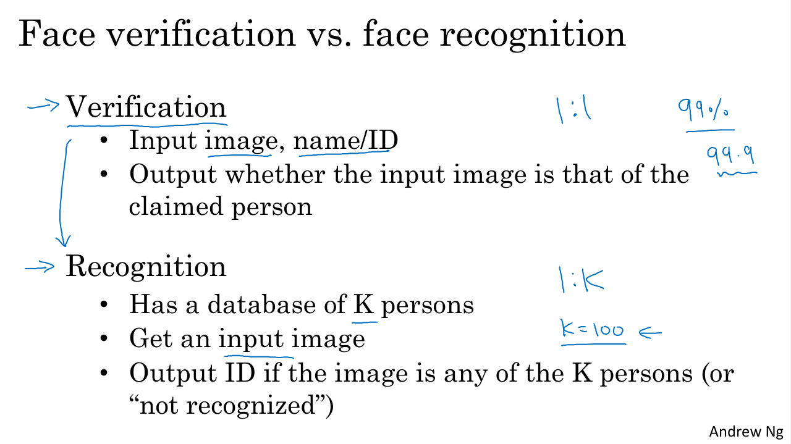

So far, we've been representing words using a vocabulary of words, let's say 10,000 words. And we've been representing words using a one-hot vector. 

So for example, if man is word number 5391 in this dictionary, then you represent it with a vector of zeroes and with one in position 5391. And I'm also going to use $O_{5391}$ to represent this factor, where $O$ here stands for one-hot. And then, if woman is word number 9853, then you represent it with $O_{9853}$ which just has a one in position 9853 and zeros elsewhere. And then other words king, queen, apple, orange will be similarly represented with one-hot vector. 

### Words represented by a one-hot vector: the weaknesses

One of the weaknesses of this representation is that it treats each word as a thing unto itself, and it doesn't allow an algorithm to easily generalize the cross words. 

For example, let's say you have a language model that has learned that when you see "I want a glass of orange ____". Well, very likely the next word will be juice. But even if the learning algorithm has learned that "I want a glass of orange juice" is a likely sentence, if it sees "I want a glass of apple ____": as far as it knows the relationship between apple and orange is not any closer as the relationship between any of the other words man, woman, king, queen, and orange. And so, it's not easy for the learning algorithm to generalize from knowing that orange juice is a popular thing, to recognizing that apple juice might also be a popular thing or a popular phrase. 

And this is because the product between any two different one-hot vector is zero. If you take any two vectors say, queen and king and you do the product of them, the end product is zero. If you take apple and orange and make the product of them, the end product is zero. And you couldn't distance between any pair of these vectors, because in this case the distance will be always the same. 

### Words featurization

So with the curent representation of words, the model doesn't know that somehow apple and orange are much more similar than king and orange or queen and orange. So, won't it be nice if instead of a one-hot presentation we can instead learn a featurized representation of each of these words: man, woman, king, queen, apple, orange.

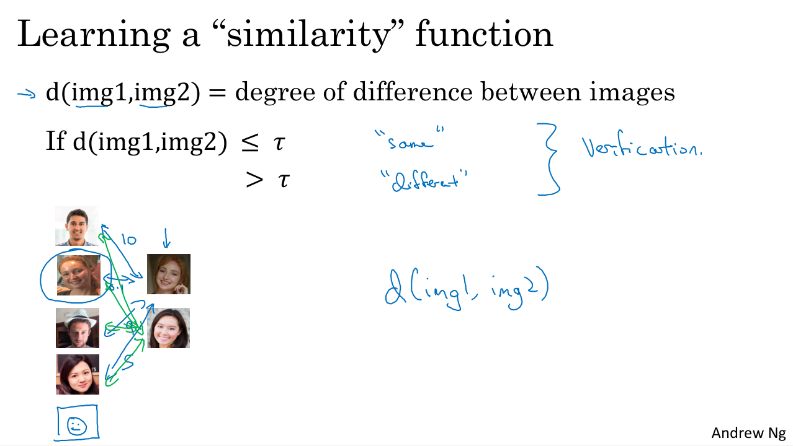

For every word in the dictionary, we could learn a set of features and values for each of them. 

So for example, for each of these words, we want to know what is the gender associated with them. So, if gender goes from -1 for male to +1 for female, then the gender associated with man might be -1, for woman might be +1. And then eventually, for king you get -0.95, for queen +0.97, and for apple and orange sort of genderless. 

Another feature might be, well how royal are these things. And so the terms, man and woman are not really royal, so they might have feature values close to zero. Whereas king and queen are highly royal. And apple and orange are not really royal. 

How about age? Well, man and woman doesn't connotes much about age. Maybe men and woman implies that they're adults, but maybe neither necessarily young nor old. So maybe values close to zero. Whereas kings and queens are almost always adults. And apple and orange might be more neutral with respect to age. 

And then, another feature for here, is this is a food? Well, man is not a food, woman is not a food, neither are kings and queens, but apples and oranges are foods. And they can be many other features as well ranging from, what is the size of this? What is the cost? Is this something that is alive? Is this an action, or is this a noun, or is this a verb, or is it something else? And so on. 

So you can imagine coming up with many features. And for the sake of the illustration let's say, 300 different features: inthe figure there are only four features, but this could be a list of 300 numbers. 

And this representation allows you to represent the word "man" with a list of numbers (column vectors), where each number represent a feture associated to the word "man". THis list of numbs can be 300 dimensional vector if we have 300 features. And I'm going to use the notation $e_{5391}$ to denote a representation like this. 

Similarly, the word "woman" can also be represented by this 300 dimensional vector and I would denote i with $e_{9853}$. And similarly, for the other examples here.

### Words similarity in the features representation

Now, if you use this representation to represent the words "orange" and "apple", then notice that the representations for orange and apple are now quite similar. It could be that some of the 300 features will differ for the words "apple" and "orage" because of the color of an orange, the color an apple, the taste, or some others. But "apple" and "orange" have the majority of the 300 features that are actually the same, or take very similar values. 

And so, this increases the odds of the learning algorithm to figured it out that orange juice is a thing, and so apple juice. This representation of words by features allows the model to generalize better across different words. 

So over the next sections, we'll find a way to learn words embeddings. A high dimensional feature vectors like these, give a better representation than one-hot vectors for representing different words. And the features we'll end up learning, won't have a easy interpretation like haveing as feature the gender, royalty, age, and so on. Exactly what they're representing will be a bit harder to figure out. But nonetheless, the featurized representations we will learn, will allow an algorithm to quickly figure out that "apple" and "orange" are more similar than "king" and "orange" or "queen" and "orange". 

### The embeddings

If we're able to learn a 300 dimensional feature vector or 300 dimensional embedding for each words, one of the popular things to do is also to take this 300 dimensional data and embed it in a two dimensional space so that you can visualize them. 

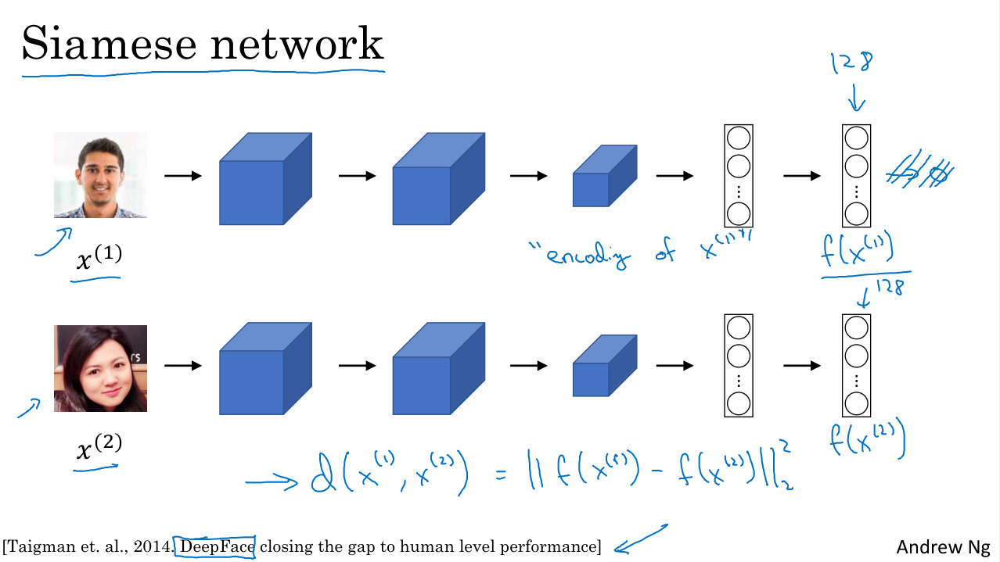

And so, one common algorithm for doing this is the t-SNE algorithm due to Laurens van der Maaten and Geoff Hinton. And if you look at one of these embeddings, one of these representations, you find that words like "man" and "woman" tend to get grouped together, "king" and "queen" tend to get grouped together, and these four are people which tends to get grouped together. 

Those are animals who can get grouped together. Fruits will tend to be close to each other. Numbers like one, two, three, four, will be close to each other. And then, maybe the animate objects as whole will also tend to be grouped together. 

You see plots like these sometimes on the internet to visualize some of these 300 or higher dimensional embeddings. And maybe this gives you a sense that word embeddings algorithms can learn similar features for concepts that they should be more related. 

And these representations will use these sort of featurized representations in maybe a 300 dimensional space, called embeddings. And the reason we call them embeddings is, you take every word like "orange", and have a 300 dimensional feature vector so that word "orange" gets embedded to a point in this 300 dimensional space. And the word "apple", gets embedded to a different point in this 300 dimensional space. 

And of course to visualize it, algorithms like t-SNE, map the embedding space to a much lower dimensional space that you can actually plot in 2D and look at it. And that's what the term embedding comes from. Word embeddings has been one of the most important ideas in NLP, in Natural Language Processing. 
s
## Using Word Embeddings

In this part will see how to take a featurized representations of different words and plug them into NLP applications. Let's start with an example. 

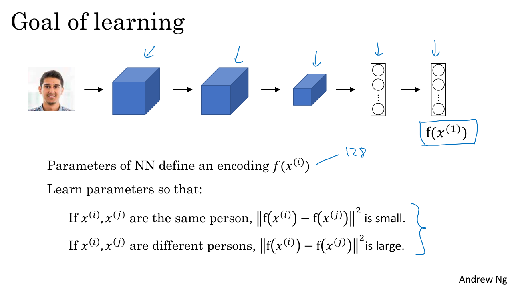

Let's continue with the named entity recognition example to detect people's names. Given a sentence like "Sally Johnson is an orange farmer", hopefully, you'll figure out that "Sally Johnson" is a person's name, hence, the outputs 1 like that. 

And one way to be sure that Sally Johnson has to be a person, rather than say the name of a corporation is that you know that "orange farmer" is a person. So previously, we had talked about one hot representations to represent these words, $x^{<1>}, x^{<2>}$ and so on. 

Let's say that you can now use the featurized representations, the embedding vectors to train a model that uses word embeddings as input. Now if the model sees a new input: "Robert Lin is an apple farmer", the model knowing that "orange" and "apple" are very similar it will be easier for the learning algorithm to generalize that "Robert Lin" is also a human, and a person's name. One of the most interesting cases will be, what if in your test set you see much less common words? What if you see: "Robert Lin is a durian cultivator"?

A durian is a rare type of fruit, popular in Singapore and a few other countries. But if you have a small label training set for the named entity recognition task, you might not even have seen the word durian or the word cultivator in your training set. 

But if you have learned a word embedding that tells you that "durian" is a fruit, so it's like an "orange", and a "cultivator", someone that cultivates is like a "farmer", then you might still be generalize from having seen an "orange farmer" in your training set to knowing that a "durian cultivator" is also probably a person. 

### Embeddings learning from not labeled data

So one of the reasons that word embeddings are able to do this is because the algorithms to learn word embeddings can examine very large text corpuses, maybe a billion words, maybe even up to 100 billion words would be quite reasonable. So very large training sets of just unlabeled text. And by examining tons of unlabeled text, you can figure out that orange and durian are similar. And farmer and cultivator are similar, and therefore, learn embeddings, that groups them together. 

### Transfer learning from embeddings

Now having discovered that orange and durian are both fruits by reading massive amounts of text, what you can do is then take this word embedding and apply it to your named entity recognition task, for which you might have a much smaller training set, maybe just 100,000 words in your training set, or even much smaller.

And so this allows you to carry out transfer learning, where you take information you've learned from huge amounts of unlabeled text to figure out that orange, apple, and durian are fruits. And then transfer that knowledge to a task, such as named entity recognition, for which you may have a relatively small labeled training set. 

For simplicity, in the image there is a unidirectional RNN. If you actually want to carry out the named entity recognition task, you should, of course, use a bidirectional RNN (BRNN).

### Summarizing

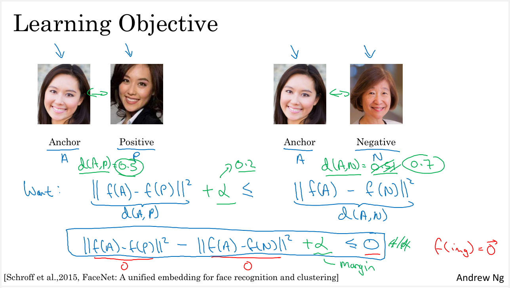

This is how you can carry out transfer learning using word embeddings. 

1. Step 1 is to learn word embeddings from a very large text corpus, or you can also download pre-trained word embeddings online. There are several word embeddings that you can find online under very permissive licenses. 

2. And you can then take these word embeddings and transfer the embedding to new task, where you have a much smaller labeled training sets of 300 dimensional embedding for example. And use this 300 dimensional embedding, to represent your words. One nice thing also about this is you can now use relatively lower dimensional feature vectors. So rather than using a 10,000 dimensional one-hot vector, you can now instead use maybe a 300 dimensional dense vector. Although the one-hot vector is fast and the 300 dimensional vector that you might learn for your embedding will be a dense vector. 

3. And then, finally, train the model on your named entity recognition task with a smaller label data set: one thing you can optionally do is to continue to fine tune and to adjust the word embeddings with the new data. In practice, you would do this only if this task 2 has a pretty big data set. If your label data set for step 2 is quite small, then usually, I would not bother to continue to fine tune the word embeddings. 

So word embeddings tend to make the biggest difference when the task you're trying to carry out has a relatively smaller training set. So it has been useful for many NLP tasks: named entity recognition, for text summarization, for co-reference resolution, for parsing. These are all maybe pretty standard NLP tasks. It has been less useful for language modeling, machine translation, especially if you're accessing a language modeling or machine translation task for which you have a lot of data just dedicated to that task. 

So as seen in other transfer learning settings, if you're trying to transfer from some task A to some task B, the process of transfer learning is just most useful when you happen to have a ton of data for A and a relatively smaller data set for B. And so that's true for a lot of NLP tasks, and just less true for some language modeling and machine translation settings. 

### Word embeddings and face encoding ideas

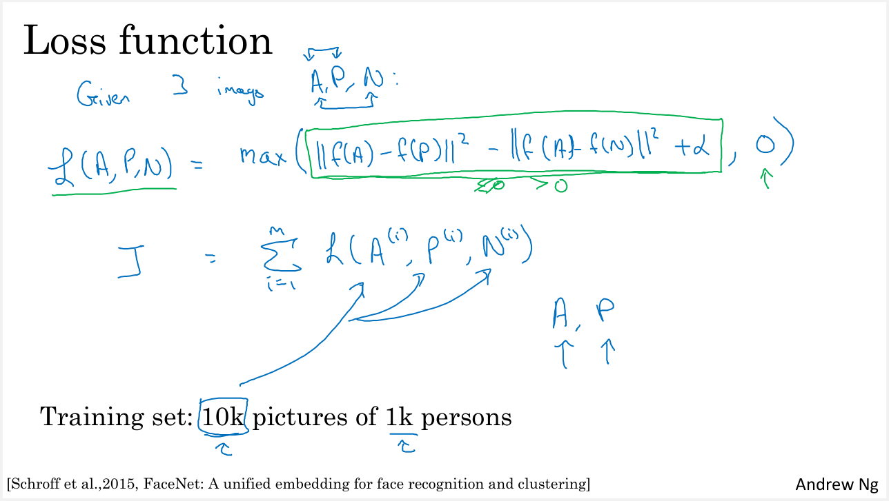

Finally, word embeddings has a interesting relationship to the face encoding ideas. For face recognition, we train this Siamese network architecture that would learn, say, a 128 dimensional representation for different faces. And then you can compare these encodings in order to figure out if these two pictures are of the same face. 

The words encoding and embedding mean fairly similar things. So in the face recognition literature, people also use the term encoding to refer to these vectors, $f(x^{(i)})$ and $f(x^{(j)})$. 

One difference between the face recognition literature and what we do in word embeddings is that, for face recognition, you wanted to train a neural network that can take as input any face picture, even a picture you've never seen before, and have a neural network compute an encoding for that new picture. 

Whereas what we'll do for learning word embeddings is that we'll have a fixed vocabulary of, say, 10,000 words. And we'll learn a vector $e_{1}$ through, say, $e_{1000}$ that just learns a fixed encoding (or fixed embedding) for each of the words in our vocabulary. But the terms encoding and embedding are used somewhat interchangeably. 

So the difference I just described is not represented by the difference in terminologies. It's just a difference in how we need to use these algorithms: 
- in face recognition there's unlimited sea of pictures you could see in the future;
- versus natural language processing, where there might be just a fixed vocabulary, and everything else we'll be declared as an unknown word.

### Conclusion

So in this part, you saw how using word embeddings allows you to implement this type of transfer learning. And how, by replacing the one-hot vectors with the embedding vectors, you can allow your algorithms to generalize much better, or you can learn from much less label data.

## Properties of Word Embeddings

Word embeddings can help you build NLP applications. One of the most fascinating properties of word embeddings is that they can also help with analogy reasoning. And while reasonable analogies may not be by itself the most important NLP application, they might also help convey a sense of what these word embeddings are doing, what these word embeddings can do. 

Here are the featurized representations of a set of words that a word embedding could capture. Let's say I pose a question: "man is to woman as king is to what"? 

Many of you will say: "man is to woman as king is to queen". But is it possible to have an algorithm figure this out automatically? Well, here's how you could do it, let's say that you're using this four dimensional vector to represent "man". So this will be your $e_{5391}=e_{man}$ and you also have the embedding vector for "woman", $e_{woman}$, and similarly for king and queen. For this example, I'm just going to assume you're using four dimensional embeddings, rather than anywhere from 50 to 1,000 dimensional, which would be more typical. 

One interesting property of these vectors is that if you do 

$e_{man}-e_{woman}=[-2 0 0 0]$

And similarly 

$e_{king}-e_{queen}=[-2 0 0 0]$

And so what this is capturing is that the main difference between "man" and "woman" is the gender. And the main difference between "king" and "queen" is also the gender: which is why $e_{man}-e_{woman}=e_{king}-e_{queen}$.

So one way to carry out this analogy reasoning is, if the algorithm is asked, "man is to woman as king is to what"? What it can do is compute $e_{man}-e_{woman}$, and try to find a word so that $e_{king}-e_{NewWord}$ is close to $e_{man}-e_{woman}$. And it turns out that when "queen" is the word plugged in here, then the left hand side is close to the the right hand side. 

So these ideas were first pointed out by Tomas Mikolov, Wen-tau Yih, and Geoffrey Zweig. And it's been one of the most remarkable and surprisingly influential results about word embeddings. And I think has helped the whole community get better intuitions about what word embeddings are doing. 

### Embeddings formalization

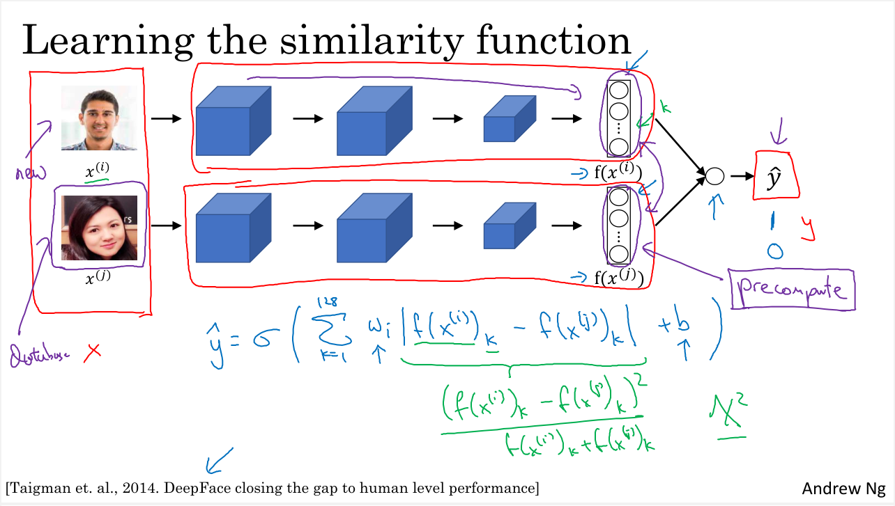

So let's formalize how you can turn this into an algorithm. In pictures, the word embeddings live in maybe a 300 dimensional space. And so the word "man" is represented as a point in the space, and so the words "woman", "king" and "queen". What we pointed out is that the vector difference between man and woman is very similar to the vector difference between king and queen. The arrow in picture is really the vector that represents a difference in gender. And remember, these are points we're plotting in a 300 dimensional space. 

So in order to carry out this kind of analogical reasoning to figure out, "man is to woman is king is to what", you can try to find the word $w$ so that the equation holds true:

${man}-e_{woman}=e_{king}-e_{w}$

so you want to find the word w that maximizes the similarity of $e_{w}$ compared to $e_{king}$.

It is possible to reformulate the equation in this way:

$e_{w}=e_{king}-{man}+e_{woman}$

$\text{Find the word w: } argmax_{w}sim(e_{w},e_{king}-{man}+e_{woman})$

And then the other three terms to the right hand side of this equation. So we have some appropriate similarity function for measuring how similar is the embedding of some word w to this quantity of the right. Then finding the word that maximizes the similarity should hopefully let you pick out the word queen.

And the remarkable thing is, this actually works. If you learn a set of word embeddings and find a word $w$ that maximizes this type of similarity, you can actually get the exact right answer. If you look at research papers, it's not uncommon for research papers to report anywhere from, say, 30% to 75% accuracy on analogy using tasks like these, where you count an anology attempt as correct only if it guesses the exact word right: so only if, in this case, it picks out the word "queen". 

Before moving on, I just want to clarify what this plot on the left is. Previously, we talked about using algorithms like t-SAE to visualize words. What t-SAE does is, it takes 300-D data, and it maps it in a very non-linear way to a 2D space. So the mapping that t-SAE learns, is a very complicated and non-linear mapping. 

So after the t-SAE mapping, you should not expect these types of parallelogram relationships, like the one we saw on the left, to hold true. And it's really in this original 300 dimensional space that you can more reliably count on these types of parallelogram relationships in analogy pairs to hold true. And it may hold true after a mapping through t-SAE, but in most cases, because of t-SAE's non-linear mapping, you should not count on that. And many of the parallelogram analogy relationships will be broken by t-SAE. 

### The Similarity function: cosine similarity

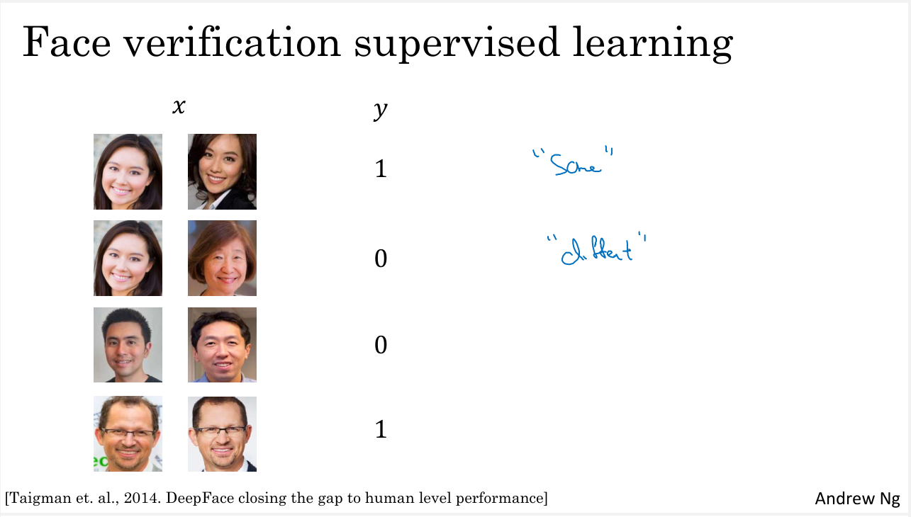

Now before moving on, let me just describe the similarity function that is most commonly used. So the most commonly used similarity function is called cosine similarity. So this is the equation we had from the previous slide. So in cosine similarity, you define the similarity between two vectors u and v as:

$sim(u, v) = \frac{u^{T}v}{||u||_{2}||v||_{2}}$

$u$ transpose $v$ divided by the Euclidean lengths. So ignoring the denominator for now, this is basically the inner product between $u$ and $v$. And so if $u$ and $v$ are very similar, their inner product will tend to be large. And this is called cosine similarity because this is actually the cosine of the angle between the two vectors, $u$ and $v$. So that's the angle $phi$, so this formula is actually the cosine of the angle between them. 

And so you remember from calculus that the cosine of $phi$ looks like the function in figure. So if the angle between them is 0, then the cosine similarity is equal to 1. And if their angle is 90 degrees, the cosine similarity is 0. And then if they're 180 degrees, or pointing in completely opposite directions, it ends up being -1. So that's where the term cosine similarity comes from, and it works quite well for these analogy reasoning tasks. 

### The Similarity function: Euclidian distance

If you want, you can also use square distance or Euclidian distance:

$||u-v||^{2}$ 

Technically, this would be a measure of dissimilarity rather than a measure of similarity. So we need to take the negative of this, and this will work okay as well. Although I see cosine similarity being used a bit more often. And the main difference between these two similarity functions is how it normalizes the lengths of the vectors u and v. 

So one of the remarkable results about word embeddings is the generality of analogy relationships they can learn. So for example, it can learn that man is to woman as boy is to girl, because the vector difference between man and woman, similar to king and queen and boy and girl, is primarily just the gender. It can learn that Ottawa (which is the capital of Canada) is to Canada as Nairobi is to Kenya. So that's the city capital is to the name of the country. It can learn that big is to bigger as tall is to taller, and it can learn things like that. Yen is to Japan, since yen is the currency of Japan, as ruble is to Russia. And all of these things can be learned just by running a word embedding learning algorithm on the large text corpus and spot all of these patterns by itself.

So in this part, you saw how word embeddings can be used for analogy reasoning. And you also saw how cosine similarity can be a way to measure the similarity between two different word embeddings.

## Embedding Matrix

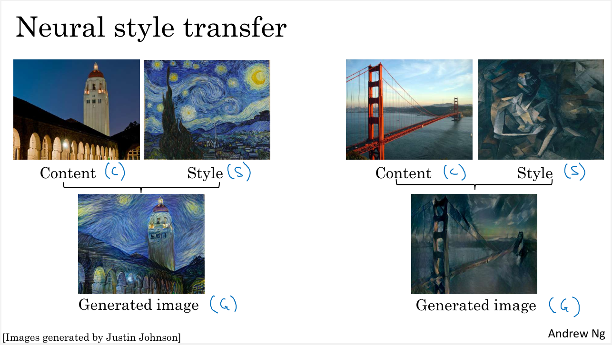

When you implement an algorithm to learn a word embedding, what you end up learning is an embedding matrix. Let's say we're using our 10,000-word vocabulary. So, the vocabulary has A, Aaron, Orange, Zulu, maybe also unknown word as a token. 

What we're going to do is learn embedding matrix E, which is going to be a 300 dimensional by 10,000 dimensional matrix, if you have 10,000 words vocabulary or maybe 10,001 if there is the unknown word token. And the columns of this matrix would be the different embeddings for the 10,000 different words you have in your vocabulary. 

So, Orange was word number 6257 in our vocabulary of 10,000 words. So, in your vocabulary the word "orage" was the one-hot vector (of length 10,000) with zeros everywhere and a one in position 6257: we'll denote "orange" the one-hot vector as $O_{6257}$. And so, this will be a

And if the embedding matrix is called capital $E$ then notice that if you take E and multiply it by $O_{6257}$, then this will be a 300-dimensional vector. So, $E$ is 300 by 10,000 and $O_{6257}$ is 10,000 by 1. So, the product will be 300 by 1.

Notice that to compute the first element of the product vector, what you do is you will multiply the first row of the matrix $E$ with $O_{6257}$. But all of these elements in $O_{6257}$ zero except for element 6257 and so you end up with the first element under the Orange column of the $E$ matrix. And then, for the second element of this 300-dimensional product vector, you would take the vector $O_{6257}$ and multiply it by the second row with the matrix $E$. Finally the embedding matrix $E$ times this one-hot vector $O_{6257}$ ends up selecting the the 300-dimensional column corresponding to the word "orange" in the $E$ matrix. 

So, this is going to be equal to $E_{6257}$ which is the notation we're going to use to represent the embedding vector (300 by 1 dimensional vector) for the word "orange".

## Learning Word Embeddings

In the history of deep learning applied to learning word embeddings, people actually started off with relatively complex algorithms. And then over time, researchers discovered they can use simpler and simpler algorithms and still get very good results, especially for a large dataset. We are going start with some of the slightly more complex algorithms because it's actually easier to develop intuition about why they work, and then we'll move on to simplify these algorithms and show you some of them that also give very good results. 

Let's say you're building a language model and you do it with a neural network. So, during training, you might want your neural network to have in input something like: "I want a glass of orange ____", and then predict the next word in the sequence. 

Below each of these words, I have also written down the index in the vocabulary of the different words. So it turns out that building a neural language model is a reasonable way to learn a set of embeddings. And the ideas presented here are due to Yoshua Bengio, Rejean Ducharme, Pascals Vincent, and Christian Jauvin. So, here's how you can build a neural network to predict the next word in the sequence. 

Let me take the list of words: "I want a glass of orange ____", and let's start with the first word "I". So I'm going to construct the one-hot vector corresponding to the word "I": $O_{4343}$ and this is going to be 10,000 dimensional vector. 

What we're going to do is then have a matrix of parameters $E$, and take $E*o_{4343}$ to get an embedding vector $e_{4343}$. And then we'll do the same for all of the other words. 

So now you have a bunch of three dimensional embedding, so each of this is a 300 dimensional embedding vector. And what we can do, is fill all of them into a neural network. 

And then this neural network feeds to a softmax, which has it's own parameters as well. And the softmax classifies among the 10,000 possible outputs in the vocab for those final word we're trying to predict. 

And so, if in the training set we saw the word "juice" then, the target for the softmax should predict the word "juice" after the word "orange". 

So the input layer, containing all the embeddings ($e_{4343}$ for "orange", $e_{9665}$ for "want", ...) will have his own parameters for example: $W^[1]$ and $b^[1]$. So the softmax as well will have its own parameters $W^[2]$ and $b^[2]$.

We are using 300 dimensional word embeddings, and we have six words. So the input layer will be will be 6 times 300: [1800, 1] dimensional vector obtained by taking your 6 (as the number of words) embedding vectors (with 300 dimensions) and stacking them together. 

### Using a fixed historical window as hyperparameter of the algorithm

What's actually more commonly done is to have a fixed historical window. So for example, you might decide that you always want to predict the next word given the previous 4 words, where 4 is a hyperparameter of the algorithm. So this is how you adjust to either very long or very short sentences, or you decide to always just look at the previous 4 words. And again, using a fixed history, just means that you can deal with even arbitrarily long sentences because the input sizes are always fixed.

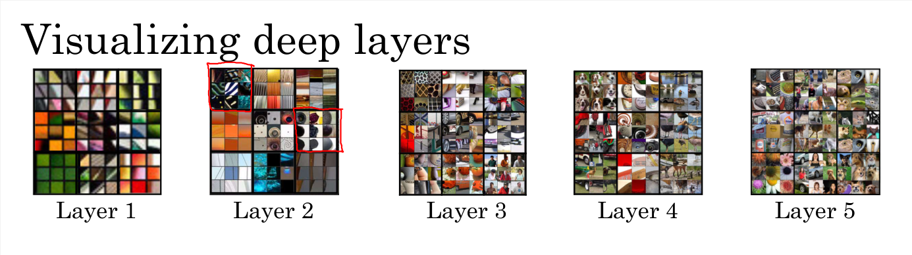

Here, I will still use those four words. And so, let's just get rid of these. And so, if you're always using a 4 word history, this means that your neural network will input a 1,200 dimensional feature vector, then have a softmax and try to predict the output. 

### Model parameters

So, the parameters of this model will be this matrix $E$, used for all the words. And then, these weights $W^[1]$, $W^[2]$ and $b^[1]$, $b^[2]$. You can use backpropagation to perform gradient descent to maximize the likelihood of your training set to just repeatedly predict what is the next word in your text corpus, given 4 words in the sequence.

And it turns out that this algorithm we'll learn pretty decent word embeddings $e_{i}$. 

And the reason is that the algorithm will have the incentive to learn pretty similar word embeddings (and os the matrix E) for orange and apple because doing so allows it to fit the training set better. In fact in the training set the algorithm will see "orange juice" sometimes, and then see "apple juice", and so the algorithm will find that it fits the training set better to associate similar embeddings to the words "orange" and "apple".

So, this is one of the earlier and pretty successful algorithms for learning word embeddings, and so for learning this matrix $E$. But now let's generalize this algorithm and see how we can derive even simpler algorithms.

### Let's derive simpler algorithms

I want to illustrate the other algorithms using a more complex sentence as our example. Let's say that in your training set, you have this longer sentence:

"I want a glass of orange juice to go along with my cereal."

The job of the algorithm was to predict the word "juice", the TARGET word, given some CONTEXT which was the last 4 words. And the goal is to learn a embedding E. 

Researchers have experimented different types of CONTEXT. 

- If it goes to build a language model then is natural for the CONTEXT to be a few words right before the target word. 

- But if your goal isn't to learn the language model per se, then you can choose other contexts. For example, you can pose a learning problem where the CONTEXT is represented by four words on the left and right of the target: in this example the context will be represented by the four words on the left "a glass of orange", and four words on the right "to go along with", and the model should predict the word in the middle. Small note: all words are represented by embeddings.

- Or if you want to use a simpler CONTEXT, maybe you'll just use the last one word: so the word "orange". So this will be a different learning problem where you tell it one word, "orange", and it will predict the next word.

- Or, one thing that works surprisingly well is to take a nearby one word as the CONTEXT. For example the word "glass", is somewhere close by. This is the idea of a Skip-Gram model, a simpler algorithm where the context is just one word rather than four, and this works remarkably well. 

### Summary

The language modeling problem needs the pose of a machines learning problem where you input the context (like the last four words) and predicts some target words: this problem allows you to learn a good word embedding.

## Word2Vec

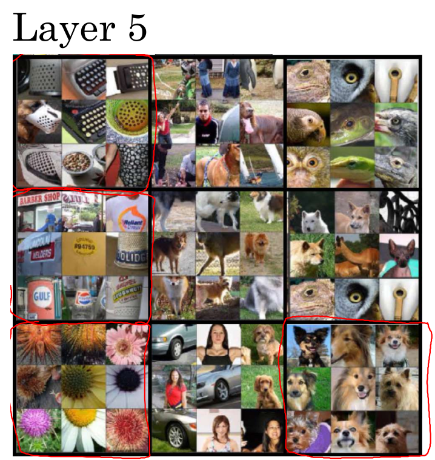
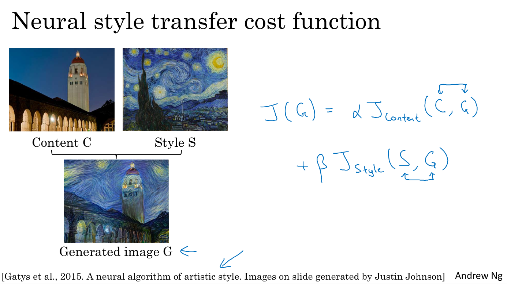
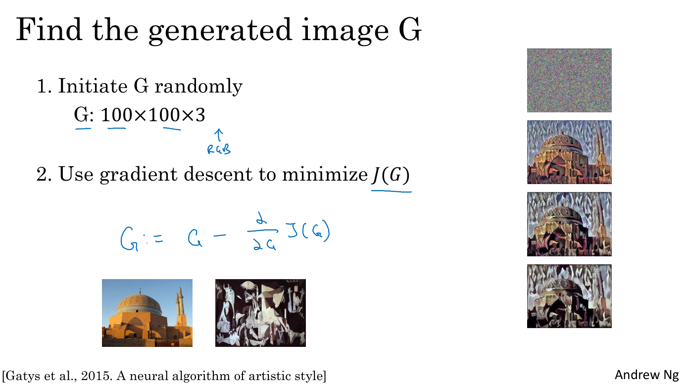

In the last video, you saw how you can learn a neural language model in order to get good word embeddings. In this video, you see the Word2Vec algorithm which is simpler and comfortably more efficient way to learn this types of embeddings. Lets take a look. Most of the ideas I'll present in this video are due to Tomas Mikolov, Kai Chen, Greg Corrado, and Jeff Dean. Let's say you're given this sentence in your training set. In the skip-gram model, what we're going to do is come up with a few context to target errors to create our supervised learning problem.

So rather than having the context be always the last four words or the last end words immediately before the target word, what I'm going to do is, say, randomly pick a word to be the context word. And let's say we chose the word orange.

And what we're going to do is randomly pick another word within some window. Say plus minus five words or plus minus ten words of the context word and we choose that to be target word. So maybe just by chance you might pick juice to be a target word, that's just one word later. Or you might choose two words before. So you have another pair where the target could be glass or,

Maybe just by chance you choose the word my as the target. And so we'll set up a supervised learning problem where given the context word, you're asked to predict what is a randomly chosen word within say, a plus minus ten word window, or plus minus five or ten word window of that input context word. And obviously, this is not a very easy learning problem, because within plus minus 10 words of the word orange, it could be a lot of different words. But a goal that's setting up this supervised learning problem, isn't to do well on the supervised learning problem per se, it is that we want to use this learning problem to learn good word embeddings.

So, here are the details of the model. Let's say that we'll continue to our vocab of 10,000 words. And some have been on vocab sizes that exceeds a million words. But the basic supervised learning problem we're going to solve is that we want to learn the mapping from some Context c, such as the word orange to some target, which we will call t, which might be the word juice or the word glass or the word my, if we use the example from the previous slide. So in our vocabulary, orange is word 6257, and the word

juice is the word 4834 in our vocab of 10,000 words. And so that's the input x that you want to learn to map to that open y. So to represent the input such as the word orange, you can start out with some one hot vector which is going to be write as O subscript C, so there's a one hot vector for the context words. And then similar to what you saw on the last video you can take the embedding matrix E, multiply E by the vector O subscript C, and this gives you your embedding vector for the input context word, so here EC is equal to capital E times that one hot vector. Then in this new network that we formed we're going to take this vector EC and feed it to a softmax unit. So I've been drawing softmax unit as a node in a neural network. That's not an o, that's a softmax unit. And then there's a drop in the softmax unit to output y hat.

So to write out this model in detail. This is the model, the softmax model, probability of different tanka words given the input context word as e to the e, theta t transpose, ec. Divided by some over all words, so we're going to say, sum from J equals one to all 10,000 words of e to the theta j transposed ec. So here theta T is the parameter associated with, I'll put t, but really there's a chance of a particular word, t, being the label.

So I've left off the biased term to solve mass but we could include that too if we wish.

And then finally the loss function for softmax will be the usual.

So we use y to represent the target word. And we use a one-hot representation for y hat and y here. Then the lost would be The negative log liklihood, so sum from i equals 1 to 10,000 of yi log yi hat. So that's a usual loss for softmax where we're representing the target y as a one hot vector. So this would be a one hot vector with just 1 1 and the rest zeros. And if the target word is juice, then it'd be element 4834 from up here. That is equal to 1 and the rest will be equal to 0. And similarly Y hat will be a 10,000 dimensional vector output by the softmax unit with probabilities for all 10,000 possible targets words. So to summarize, this is the overall little model, little neural network with basically looking up the embedding and then just a soft max unit. And the matrix E will have a lot of parameters, so the matrix E has parameters corresponding to all of these embedding vectors, E subscript C. And then the softmax unit also has parameters that gives the theta T parameters but if you optimize this loss function with respect to the all of these parameters, you actually get a pretty good set of embedding vectors. So this is called the skip-gram model because is taking as input one word like orange and then trying to predict some words skipping a few words from the left or the right side. To predict what comes little bit before little bit after the context words. Now, it turns out there are a couple problems with using this algorithm. And the primary problem is computational speed. In particular, for the softmax model, every time you want to evaluate this probability, you need to carry out a sum over all 10,000 words in your vocabulary. And maybe 10,000 isn't too bad, but if you're using a vocabulary of size 100,000 or a 1,000,000, it gets really slow to sum up over this denominator every single time. And, in fact, 10,000 is actually already that will be quite slow, but it makes even harder to scale to larger vocabularies. So there are a few solutions to this, one which you see in the literature is to use a hierarchical softmax classifier. And what that means is, instead of trying to categorize something into all 10,000 carries on one go. Imagine if you have one classifier, it tells you is the target word in the first 5,000 words in the vocabulary? Or is in the second 5,000 words in the vocabulary? And let's say this binary cost that it tells you this is in the first 5,000 words, think of second class to tell you that this in the first 2,500 words of vocab or in the second 2,500 words vocab and so on. Until eventually you get down to classify exactly what word it is, so that the leaf of this tree, and so having a tree of classifiers like this, means that each of the retriever nodes of the tree can be just a binding classifier. And so you don't need to sum over all 10,000 words or else it will capsize in order to make a single classification. In fact, the computational classifying tree like this scales like log of the vocab size rather than linear in vocab size. So this is called a hierarchical softmax classifier. I should mention in practice, the hierarchical softmax classifier doesn't use a perfectly balanced tree or this perfectly symmetric tree, with equal numbers of words on the left and right sides of each branch. In practice, the hierarchical software classifier can be developed so that the common words tend to be on top, whereas the less common words like durian can be buried much deeper in the tree. Because you see the more common words more often, and so you might need only a few traversals to get to common words like the and of. Whereas you see less frequent words like durian much less often, so it says okay that are buried deep in the tree because you don't need to go that deep. So there are various heuristics for building the tree how you used to build the hierarchical software spire.

So this is one idea you see in the literature, the speeding up the softmax classification. And you can read more details of this on the paper that I referenced by Thomas Mikolov and others, on the first slide. But I won't spend too much more time. Because in the next video, where she talk about a different method, called nectar sampling, which I think is even simpler. And also works really well for speeding up the softmax classifier and the problem of needing the sum over the entire cap size in the denominator. So you see more of that in the next video. But before moving on, one quick Topic I want you to understand is how to sample the context C. So once you sample the context C, the target T can be sampled within, say, a plus minus ten word window of the context C, but how do you choose the context C? One thing you could do is just sample uniformly, at random, When we do that, you find that there are some words like the, of, a, and, to and so on that appear extremely frequently. And so, if you do that, you find that in your context to target mapping pairs just get these these types of words extremely frequently, whereas there are other words like orange, apple, and also durian that don't appear that often. And maybe you don't want your training site to be dominated by these extremely frequently or current words, because then you spend almost all the effort updating EC, for those frequently occurring words. But you want to make sure that you spend some time updating the embedding, even for these less common words like e durian. So in practice the distribution of words pc isn't taken just entirely uniformly at random for the training set purpose, but instead there are different heuristics that you could use in order to balance out something from the common words together with the less common words. So that's it for the Word2Vec skip-gram model. If you read the original paper by that I referenced earlier, you find that that paper actually had two versions of this Word2Vec model, the skip gram was one. And the other one is called the CBow, the continuous backwards model, which takes the surrounding contexts from middle word, and uses the surrounding words to try to predict the middle word, and that algorithm also works, it has some advantages and disadvantages. But the key problem with this algorithm with the skip-gram model as presented so far is that the softmax step is very expensive to calculate because needing to sum over your entire vocabulary size into the denominator of the soft packs. In the next video I show you an algorithm that modifies the training objective that makes it run much more efficiently therefore lets you apply this in a much bigger training set as well and therefore learn much better word embeddings. Lets go onto the next video.

## Negative Sampling

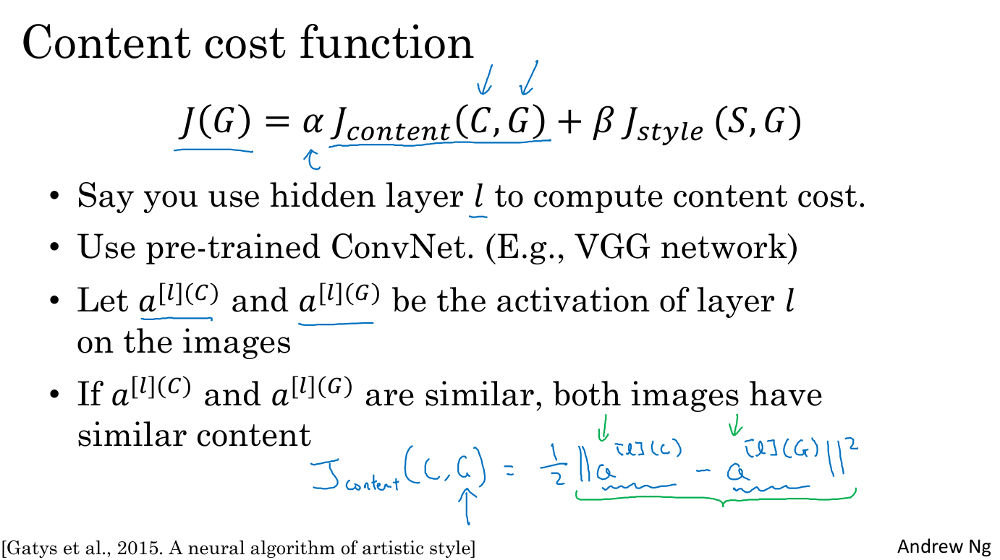

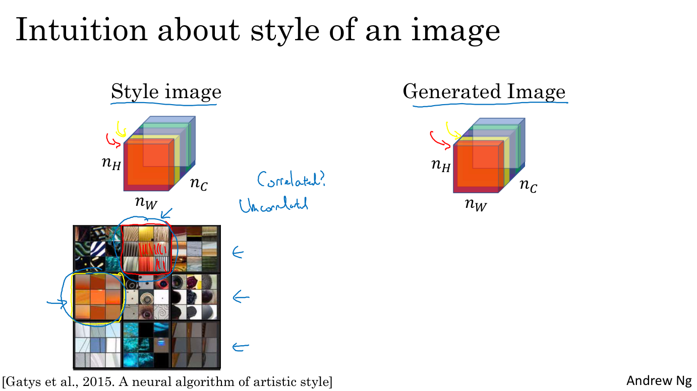

In the last video, you saw how the Skip-Gram model allows you to construct a supervised learning tasks so you map from context to target words and how that allows you to learn a useful word embedding. But the downside of that was the sock max objective was slow to compute. In this video, you see a modified learning problem called negative sampling that allows you to do something similar to the skip-gram model you saw just now, but with a much more efficient learning algorithm. Let's see how you could do that. Most of the ideas presented in this video are due to Thomas Mikolov, Sasaki, Chen Greco, and Jeff Dean. What we're going to do in this algorithm is create a new supervised learning problem. The problem is, given a pair of words like orange and juice, we're going to predict, is this a context target pair? In this example, orange juice was a positive example. How about Orange and King? Well, that's a negative example so I'm going to write zero for the target. What we're going to do is we're actually going to sample a context and a target word. In this case, we had orange and juice and we'll associate that with a Label 1. Let's just put word in the middle. Then having generated a positive example, the positive examples generated exactly how we generated it in the previous videos sample context word, look around a window of say, +-10 words, and pick a target word. That's how you generate the first row of this table with orange juice one. Then to generate the negative examples, you're going to take the same context word and then just pick a word at random from the dictionary. In this case, I chose the word king at random and label that as zero. Then let's take orange and let's pick another random word from the dictionary under the assumption that if we pick a random word, it probably won't be associated with the word orange, so book, zero. Let's pick a few others, orange, maybe just by chance we'll pick the zero, and then orange, and maybe just by chance, we'll pick the word of and we'll put a zero there. Notice that all of these labeled as zero even though the word of actually appears next to orange as well. To summarize the way we generated this dataset is we'll pick a context word and then pick a target word and that is the first row of this table, that gives us a positive example. Context target, and then give that a label of one. Then what we do is for some number of times, say k times, we're going to take the same context words and then pick random words from the dictionary. King, book, the, of, whatever comes out at random from the dictionary and label all those zero, and those will be our negative examples. It's okay if just by chance, one of those words we picked at random from the dictionary happens to appear in a window, in a plus-minus ten-word windows, say next to the context word orange. Then we're going to create a supervised learning problem, where the algorithm inputs x inputs this pair of words, and then has to predict the target label to predict the output Y. The problem is really given a pair of words like orange and juice, do you think they appear together? Do you think I got these two words by sampling two words close to each other? Or do you think I got them as one word from the text and one word chosen at random from the dictionary? Is really to try to distinguish between these two types of distributions from which you might sample a pair of words. This is how you generate the training set. How do you choose Mikolov at all that recommend that maybe k is 5-20 for smaller datasets and if you have a very large dataset, then choose k to be smaller so k=2-5 for larger datasets and larger values of k for smaller datasets. In this example, I've just used k=4. Next, let's describe the supervised learning model for learning and mapping from x-y. Here was the SoftMax model you saw from the previous video and here's the training set we got from the previous slide where again, this is going to be the new input x and this is going to be the value of y you're trying to predict. To define the model, I'm going to use this to denote this with c for the context word, this to denote the possible target word t and this I'll use y to denote 01. This is a context target pair. What we're going to do is define a logistic regression model. We say that the chance that y=1 given the input c,t pair, we're going to model this as basically a logistic regression model. But the specific formula we use is sigmoid applied to Theta t transpose ec.

The parameters are similar as before. You have one parameter vector Theta for each possible target word and a separate parameter vector really the embedding vector for each possible context word. We're going to use this formula to estimate the probability that y=1. If you have k examples here. Then if you can think of this as having a k:1 ratio of negative to positive examples. For every positive examples, you will have k negative examples with which to train this logistic regression model. To draw this as a neural network, if the input word is orange, which is word 6,257, then what you do is input their one hot vector passes through E, do the multiplication to get the embedding vector 6,257. Then what you have is really 10,000 possible logistic regression classification problems where one of these will be the classifier corresponding to. Well, is the target word juice or not. Then there'll be other words. For example, there may be one somewhere down here which is predicting is the word king or not and so on for these are possible words in your vocabulary. Think of this as having 10,000 binary logistic regression classifiers. But instead of training all 10,000 of them on every iteration, we're only going to train five of them. We're going to train the one corresponding to the actual target word we got and then train four randomly chosen negative examples, and this is for the case where K = 4. Instead of having one giant 10,000 way softmax, which is very expensive to compute, we've instead turned it into 10,000 binary classification problems. Each of which is quite cheap to compute and on every iteration, we're only going to train five of them, or more generally, k+1 of them, with k negative examples and one positive examples and this is why the computational cost of this algorithm is much lower because you're updating k+1 binary classification problems, which is relatively cheap to do on every iteration, rather than updating a 10,000 way softmax classifier. This technique is called negative sampling because what you're doing is you had a positive example, the orange and the juice. Then you would go and deliberately generate a bunch of negative examples. We've negative samplings, hence the negative sampling, which to train four more of these binary classifiers, and on every iteration you choose four different random negative words with which to train your algorithm on. Now, before wrapping up, one more important detail of this algorithm is, how do you choose the negative examples? After having chosen the context word orange, how do you sample these words to generate the negative examples? One thing you could do is sample the words in the middle, the candidate target words. One thing you could do is sample it according to the empirical frequency of words in your corpus. Just sample it according to how often different words appears. But the problem with that is that you end up with a very high representation of words like the, of, and, and so on. One other extreme will be let say, you use one over the vocab_size. Sample the negative examples uniformly random. But that's also very non representative of the distribution of English words. The authors [inaudible] reported that empirically what they found to work best was to take this heuristic value, which is a little bit in between the two extremes of sampling from the empirical frequencies, meaning from whatever is the observed distribution in English text to the uniform distribution, and what they did was they sampled proportional to the frequency of a word to the power of three forms. If f(w_i) is the observed frequency of a particular word in the English language or in your training set corpus, then by taking it to the power of 3/4. This is somewhere in between the extreme of taking uniform distribution and the other extreme of just taking whatever was the observed distribution in your training set. I'm not sure this is very theoretically justified, but multiple researchers are now using this heuristic and it seems to work decently well. To summarize, you've seen how you can learn word vectors of a software classified, but it's very competition expensive and in this video, you saw how by changing that to a bunch of binary classification problems, you can very efficiently learn word vectors, and if you run this album, you will be able to learn pretty good word vectors. Now, of course, as is the case in other areas of deep learning as well, there are open source implementations and there are also pretrained word vectors that others have trained and released online under permissive licenses. If you want to get going quickly on a NLP problem, it'd be reasonable to download someone else's word vectors and use that as a starting point. That's it for the skip-gram model. In the next video, I want to share with you yet another version of a word embedding learning algorithm that is maybe even simpler than what you've seen so far. In the next video, let's learn about the GloVe algorithm.

## GloVe Word Vectors

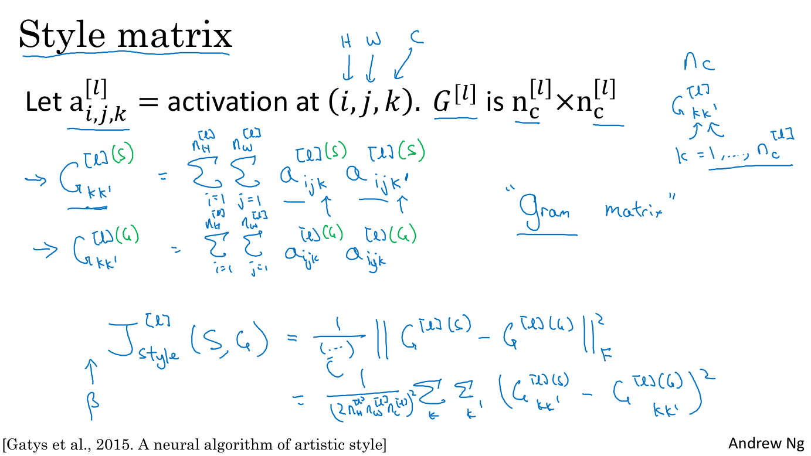
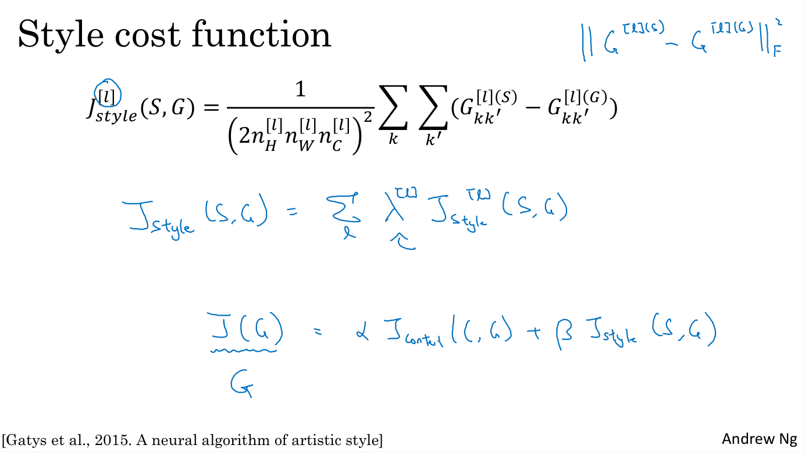
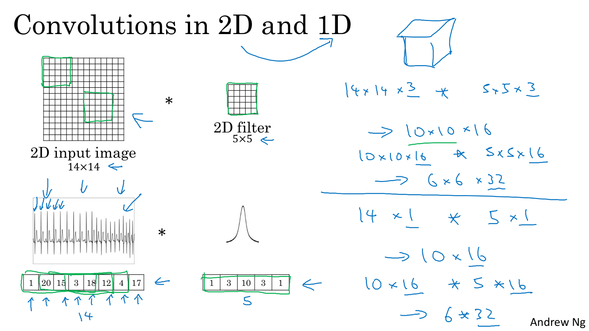

You learn about several algorithms for computing words embeddings. Another algorithm that has some momentum in the NLP community is the GloVe algorithm. This is not used as much as the Word2Vec or the skip-gram models, but it has some enthusiasts. Because I think, in part of its simplicity. Let's take a look. The GloVe algorithm was created by Jeffrey Pennington, Richard Socher, and Chris Manning. And GloVe stands for global vectors for word representation. So, previously, we were sampling pairs of words, context and target words, by picking two words that appear in close proximity to each other in our text corpus. So, what the GloVe algorithm does is, it starts off just by making that explicit. So, let's say X_ij be the number of times that a word i appears in the context of j. And so, here i and j play the role of t and c, so you can think of X_ij as being x subscript tc. But, you can go through your training corpus and just count up how many words does a word i appear in the context of a different word j. How many times does the word t appear in context of different words c. And depending on the definition of context and target words, you might have that X_ij equals X_ji. And in fact, if you're defining context and target in terms of whether or not they appear within plus minus 10 words of each other, then it would be a symmetric relationship. Although, if your choice of context was that, the context is always the word immediately before the target word, then X_ij and X_ji may not be symmetric like this. But for the purposes of the GloVe algorithm, we can define context and target as whether or not the two words appear in close proximity, say within plus or minus 10 words of each other. So, X_ij is a count that captures how often do words i and j appear with each other, or close to each other. So what the GloVe model does is, it optimizes the following. We're going to minimize the difference between theta i transpose e_j minus log of X_ij squared. I'm going to fill in some of the parts of this equation. But again, think of i and j as playing the role of t and c. So this is a bit like what you saw previously with theta t transpose e_c. And what you want is, for this to tell you how related are those two words? How related are words t and c? How related are words i and j as measured by how often they occur with each other? Which is affected by this X_ij. And so, what we're going to do is, solve for parameters theta and e using gradient descent to minimize the sum over i equals one to 10,000 sum over j from one to 10,000 of this difference. So you just want to learn vectors, so that their end product is a good predictor for how often the two words occur together. Now, just some additional details, if X_ij is equal to zero, then log of 0 is undefined, is negative infinity. And so, what we do is, we want sum over the terms where X_ij is equal to zero. And so, what we're going to do is, add an extra weighting term. So this is going to be a weighting term, and this will be equal to zero if X_ij is equal to zero. And we're going to use a convention that zero log zero is equal to zero. So what this means is, that if X_ij is equal to zero, just don't bother to sum over that X_ij pair. So then this log of zero term is not relevant. So this means the sum is sum only over the pairs of words that have co-occurred at least once in that context-target relationship. The other thing that F(X_ij) does is that, there are some words they just appear very often in the English language like, this, is, of, a, and so on. Sometimes we used to call them stop words but there's really a continuum between frequent and infrequent words. And then there are also some infrequent words like durian, which you actually still want to take into account, but not as frequently as the more common words. And so, the weighting factor can be a function that gives a meaningful amount of computation, even to the less frequent words like durian, and gives more weight but not an unduly large amount of weight to words like, this, is, of, a, which just appear lost in language. And so, there are various heuristics for choosing this weighting function F that need or gives these words too much weight nor gives the infrequent words too little weight. You can take a look at the GloVe paper, they are referenced in the previous slide, if you want the details of how F can be chosen to be a heuristic to accomplish this. And then, finally, one funny thing about this algorithm is that the roles of theta and e are now completely symmetric. So, theta i and e_j are symmetric in that, if you look at the math, they play pretty much the same role and you could reverse them or sort them around, and they actually end up with the same optimization objective. One way to train the algorithm is to initialize theta and e both uniformly around gradient descent to minimize its objective, and then when you're done for every word, to then take the average. For a given words w, you can have e final to be equal to the embedding that was trained through this gradient descent procedure, plus theta trained through this gradient descent procedure divided by two, because theta and e in this particular formulation play symmetric roles unlike the earlier models we saw in the previous videos, where theta and e actually play different roles and couldn't just be averaged like that. That's it for the GloVe algorithm. I think one confusing part of this algorithm is, if you look at this equation, it seems almost too simple. How could it be that just minimizing a square cost function like this allows you to learn meaningful word embeddings? But it turns out that this works. And the way that the inventors end up with this algorithm was, they were building on the history of much more complicated algorithms like the newer language model, and then later, there came the Word2Vec skip-gram model, and then this came later. And we really hope to simplify all of the earlier algorithms. Before concluding our discussion of algorithms concerning word embeddings, there's one more property of them that we should discuss briefly. Which is that? We started off with this featurization view as the motivation for learning word vectors. We said, "Well, maybe the first component of the embedding vector to represent gender, the second component to represent how royal it is, then the age and then whether it's a food, and so on." But when you learn a word embedding using one of the algorithms that we've seen, such as the GloVe algorithm that we just saw on the previous slide, what happens is, you cannot guarantee that the individual components of the embeddings are interpretable. Why is that? Well, let's say that there is some space where the first axis is gender and the second axis is royal. What you can do is guarantee that the first axis of the embedding vector is aligned with this axis of meaning, of gender, royal, age and food. And in particular, the learning algorithm might choose this to be axis of the first dimension. So, given maybe a context of words, so the first dimension might be this axis and the second dimension might be this. Or it might not even be orthogonal, maybe it'll be a second non-orthogonal axis, could be the second component of the word embeddings you actually learn. And when we see this, if you have a subsequent understanding of linear algebra is that, if there was some invertible matrix A, then this could just as easily be replaced with A times theta i transpose A inverse transpose e_j. Because we expand this out, this is equal to theta i transpose A transpose A inverse transpose times e_j. And so, the middle term cancels out and we're left with theta i transpose e_j, same as before. Don't worry if you didn't follow the linear algebra, but that's a brief proof that shows that with an algorithm like this, you can't guarantee that the axis used to represent the features will be well-aligned with what might be easily humanly interpretable axis. In particular, the first feature might be a combination of gender, and royal, and age, and food, and cost, and size, is it a noun or an action verb, and all the other features. It's very difficult to look at individual components, individual rows of the embedding matrix and assign the human interpretation to that. But despite this type of linear transformation, the parallelogram map that we worked out when we were describing analogies, that still works. And so, despite this potentially arbitrary linear transformation of the features, you end up learning the parallelogram map for figure analogies still works. So, that's it for learning word embeddings. You've now seen a variety of algorithms for learning these word embeddings and you get to play them more in this week's programming exercise as well. Next, I'd like to show you how you can use these algorithms to carry out sentiment classification. Let's go onto the next video.

